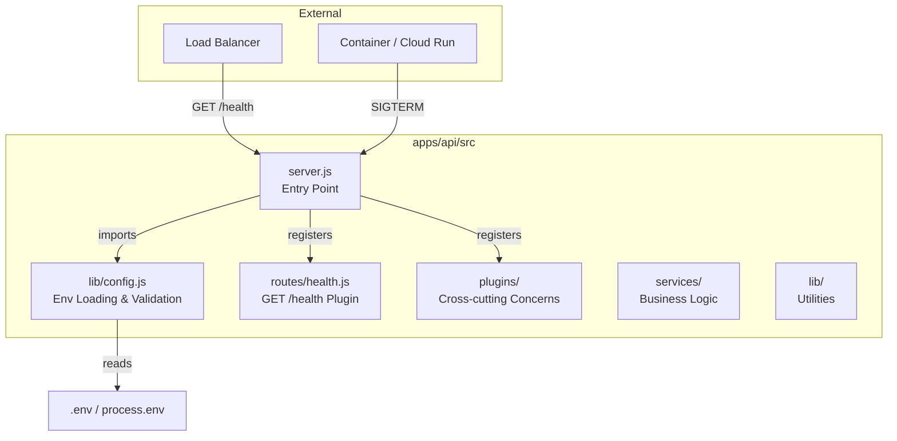
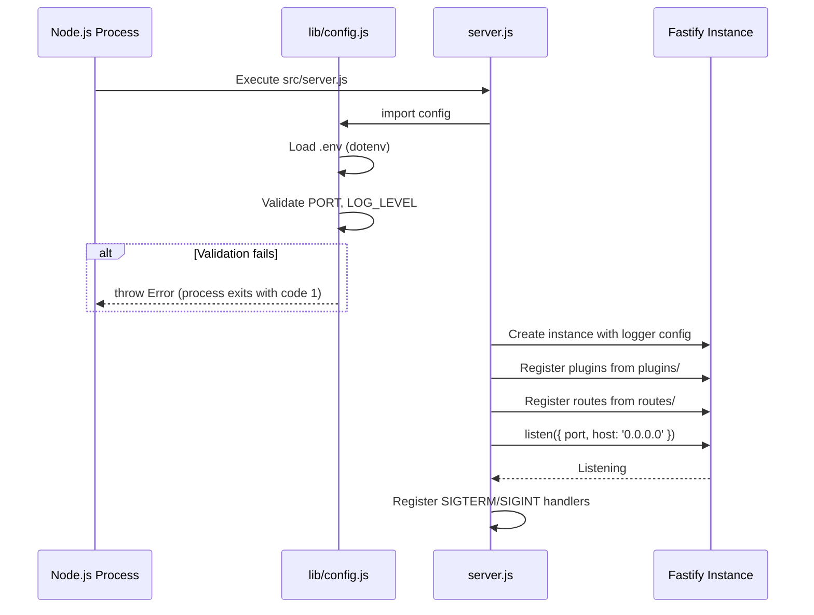
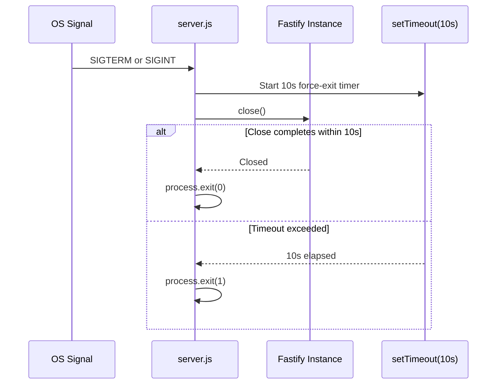

# Design Document: API Service Initialization

## Overview

This design establishes the foundational Fastify backend service for ArcPass at `apps/api`. The service provides a production-ready HTTP server with ESM module configuration, structured JSON logging via Pino, environment variable loading with validation, graceful shutdown handling, a health check endpoint, and a modular directory structure that supports future feature development without refactoring.

The design prioritizes simplicity and operational readiness: no database, no blockchain logic, and no authentication at this stage. It is the skeleton upon which all future API features (eligibility checks, sponsorship requests, etc.) will be built.

### Key Design Decisions

1. **No external graceful shutdown library** — Signal handling and timeout logic are simple enough to implement inline, avoiding an extra dependency for ~15 lines of code.
2. **Config module as a plain ES module (not a Fastify plugin)** — Configuration must be available before the Fastify instance is created (to set the log level), so it cannot be a plugin that registers after instantiation.
3. **Pino's built-in ISO timestamp function** — Uses `pino.stdTimeFunctions.isoTime` rather than a custom formatter to get ISO 8601 timestamps with zero overhead.
4. **`close-with-grace` not used** — The 10-second timeout requirement is straightforward to implement with `setTimeout` + `process.exit(1)`, keeping dependencies minimal per project guidelines.

## Architecture



### Startup Sequence



### Shutdown Sequence



## Components and Interfaces

### 1. Config Module (`src/lib/config.js`)

**Responsibility:** Load environment variables from `.env` file, apply defaults, validate values, and export a frozen configuration object.

```javascript
// Exported interface
export const config = {
  port: Number,      // Validated integer 1–65535, default 4000
  logLevel: String,  // One of: fatal, error, warn, info, debug, trace. Default "info"
}
```

**Behavior:**
- Calls `dotenv.config()` at import time. If `.env` is missing, dotenv silently continues (this is its default behavior).
- Reads `process.env.PORT` and `process.env.LOG_LEVEL`.
- Applies defaults: `PORT=4000`, `LOG_LEVEL=info`.
- Validates `PORT`: must parse to an integer in range [1, 65535]. Throws descriptive error otherwise.
- Validates `LOG_LEVEL`: must be one of the six valid Pino levels. Throws descriptive error otherwise.
- Exports a `Object.freeze()`-ed config object to prevent accidental mutation.

### 2. Server Entry Point (`src/server.js`)

**Responsibility:** Create the Fastify instance, register plugins and routes, start listening, and handle shutdown signals.

```javascript
// Pseudocode interface
import Fastify from 'fastify'
import { config } from './lib/config.js'

const app = Fastify({ logger: { level, timestamp } })

// Register plugins (cross-cutting concerns)
// Register routes
// Listen on config.port / 0.0.0.0
// Register signal handlers for graceful shutdown
```

**Constraints:**
- No business logic, no route handler definitions, no direct database queries.
- Only: instance creation, config import, plugin registration, route registration, listen call, signal handlers.

### 3. Health Route Plugin (`src/routes/health.js`)

**Responsibility:** Register the `GET /health` endpoint as a Fastify plugin.

```javascript
// Exported as a Fastify plugin
export default async function healthRoutes(fastify, opts) {
  fastify.get('/health', async (request, reply) => {
    return {
      status: 'ok',
      uptime: Math.floor(process.uptime())
    }
  })
}
```

**Response Schema:**
- `200 OK`: `{ status: "ok", uptime: <integer seconds> }`
- `503 Service Unavailable`: `{ status: "unavailable" }` (for future use when dependency checks are added)

### 4. Plugins Directory (`src/plugins/`)

**Responsibility:** House cross-cutting Fastify plugins (e.g., CORS, rate limiting, request context). Empty at this stage but the directory and registration pattern are established.

### 5. Services Directory (`src/services/`)

**Responsibility:** House business logic modules. Empty at this stage.

### 6. Lib Directory (`src/lib/`)

**Responsibility:** House stateless utility functions and helpers. Contains `config.js` at this stage.

## Data Models

### Configuration Object

| Field | Type | Default | Validation |
|-------|------|---------|------------|
| `port` | `number` | `4000` | Integer, 1 ≤ port ≤ 65535 |
| `logLevel` | `string` | `"info"` | One of: `fatal`, `error`, `warn`, `info`, `debug`, `trace` |

### Health Response

| Field | Type | Description |
|-------|------|-------------|
| `status` | `string` | `"ok"` when healthy, `"unavailable"` when degraded |
| `uptime` | `number` | Process uptime in whole seconds (non-negative integer) |

### Log Entry Structure (Pino default + ISO timestamp)

| Field | Type | Description |
|-------|------|-------------|
| `level` | `number` | Pino numeric log level (30=info, 40=warn, etc.) |
| `time` | `string` | ISO 8601 timestamp (e.g., `"2024-01-15T10:30:00.000Z"`) |
| `msg` | `string` | Log message |
| `reqId` | `string` | Request ID (present on request-scoped logs) |
| `req` | `object` | Request metadata: `{ method, url }` (on request logs) |
| `res` | `object` | Response metadata: `{ statusCode }` (on response logs) |


## Correctness Properties

*A property is a characteristic or behavior that should hold true across all valid executions of a system — essentially, a formal statement about what the system should do. Properties serve as the bridge between human-readable specifications and machine-verifiable correctness guarantees.*

### Property 1: Port validation accepts only valid integers in [1, 65535]

*For any* value provided as `PORT`, if it is an integer in the range [1, 65535], the Config Module shall accept it without error. *For any* value that is not an integer in that range (negative numbers, zero, numbers > 65535, floats, non-numeric strings, empty strings), the Config Module shall throw a descriptive error.

**Validates: Requirements 2.6**

### Property 2: Log level validation accepts only the six valid Pino levels

*For any* string provided as `LOG_LEVEL`, if it is one of `{fatal, error, warn, info, debug, trace}`, the Config Module shall accept it without error. *For any* string not in that set, the Config Module shall throw a descriptive error.

**Validates: Requirements 2.7, 7.5**

### Property 3: Log entries are well-formed structured JSON

*For any* log message emitted at any valid level, the output shall be a single-line valid JSON object containing at minimum: a numeric `level` field, a `time` field matching ISO 8601 format, and a `msg` field containing the logged message.

**Validates: Requirements 7.1, 7.2**

### Property 4: Log level filtering suppresses messages below the configured threshold

*For any* valid log level configuration L, and *for any* message emitted at level M, the message shall appear in the output if and only if M's severity is greater than or equal to L's severity (using Pino's numeric level ordering: trace=10, debug=20, info=30, warn=40, error=50, fatal=60).

**Validates: Requirements 7.3**

## Error Handling

### Startup Errors

| Error Condition | Behavior | Exit Code |
|----------------|----------|-----------|
| Invalid `PORT` value | Config module throws with message: `"Invalid PORT: <value>. Must be an integer between 1 and 65535."` | 1 |
| Invalid `LOG_LEVEL` value | Config module throws with message: `"Invalid LOG_LEVEL: <value>. Must be one of: fatal, error, warn, info, debug, trace."` | 1 |
| Port already in use | Fastify emits error, logger outputs error message, process exits | 1 |
| Unhandled startup exception | Caught by top-level try/catch, logged, process exits | 1 |

### Runtime Errors

| Error Condition | Behavior |
|----------------|----------|
| Unhandled route error | Fastify's default error handler returns 500 with JSON error response |
| Request timeout | Handled by Fastify's built-in timeout (if configured) |

### Shutdown Errors

| Error Condition | Behavior | Exit Code |
|----------------|----------|-----------|
| `fastify.close()` completes within 10s | Clean exit | 0 |
| `fastify.close()` exceeds 10s timeout | Force exit via `process.exit(1)` | 1 |
| Error during close | Log error, force exit | 1 |

### Error Handling Strategy

```javascript
// Top-level startup pattern in server.js
async function start() {
  try {
    await app.listen({ port: config.port, host: '0.0.0.0' })
  } catch (err) {
    app.log.error(err)
    process.exit(1)
  }
}

// Graceful shutdown pattern
function shutdown(signal) {
  app.log.info({ signal }, 'Received signal, shutting down')
  const forceExit = setTimeout(() => {
    app.log.error('Shutdown timed out, forcing exit')
    process.exit(1)
  }, 10_000)
  forceExit.unref()

  app.close().then(() => {
    clearTimeout(forceExit)
    process.exit(0)
  }).catch((err) => {
    app.log.error(err, 'Error during shutdown')
    clearTimeout(forceExit)
    process.exit(1)
  })
}

process.on('SIGTERM', () => shutdown('SIGTERM'))
process.on('SIGINT', () => shutdown('SIGINT'))
```

## Testing Strategy

### Testing Approach

This feature uses a **dual testing approach**:

1. **Property-based tests** — Verify universal correctness properties (config validation, log structure) using randomized inputs across 100+ iterations per property.
2. **Unit/integration tests** — Verify specific examples, edge cases, startup behavior, and endpoint responses.

### Property-Based Testing

**Library:** [fast-check](https://github.com/dubzzz/fast-check) (the standard PBT library for JavaScript/Node.js)

**Configuration:**
- Minimum 100 iterations per property test
- Each test tagged with: `Feature: api-service-init, Property {number}: {property_text}`

**Properties to implement:**

| Property | What it tests | Generator strategy |
|----------|--------------|-------------------|
| 1: Port validation | Config module accepts/rejects port values | Generate integers in [1, 65535] (valid) and values outside that range (invalid): negatives, zero, >65535, floats, strings |
| 2: Log level validation | Config module accepts/rejects log levels | Generate strings from valid set (accept) and arbitrary strings not in set (reject) |
| 3: Log entry structure | Logger output is well-formed JSON | Generate random message strings at random valid levels, capture stdout, parse JSON, verify fields |
| 4: Log level filtering | Only messages at/above threshold appear | Generate random (configLevel, messageLevel) pairs, verify output presence matches severity comparison |

### Unit / Integration Tests

| Test | Type | What it verifies |
|------|------|-----------------|
| Config defaults | Unit | PORT defaults to 4000, LOG_LEVEL defaults to "info" when env vars unset |
| Config loads .env | Integration | Values from .env file are picked up |
| Config without .env | Edge case | No error thrown when .env is missing |
| Config object shape | Unit | Exported object has `port` and `logLevel` keys |
| Health endpoint 200 | Integration | GET /health returns 200, correct content-type, body with status and uptime |
| Health uptime type | Unit | `uptime` field is a non-negative integer |
| Server binds to configured port | Integration | Server listens on the port from config |
| Server binds to 0.0.0.0 | Integration | Server address is 0.0.0.0 |
| Startup failure exits with code 1 | Integration | Port conflict causes exit(1) |
| Graceful shutdown on SIGTERM | Integration | Server closes cleanly on SIGTERM |
| Graceful shutdown on SIGINT | Integration | Server closes cleanly on SIGINT |
| Request logging | Integration | Incoming request produces log with method and URL |
| Startup log message | Integration | Successful start logs host and port |

### Test Runner

- **Vitest** (or Node.js built-in test runner) — aligns with the ESM-first approach
- Tests located in `apps/api/tests/` or co-located as `*.test.js` files
- Run with `pnpm test` in the `apps/api` workspace

### What Is NOT Tested with PBT

- File system structure (smoke test / CI check)
- Package.json fields (smoke test)
- Signal handling (integration test with child process)
- Plugin registration order (integration test)
- Health endpoint 503 behavior (example-based edge case test, future implementation)
