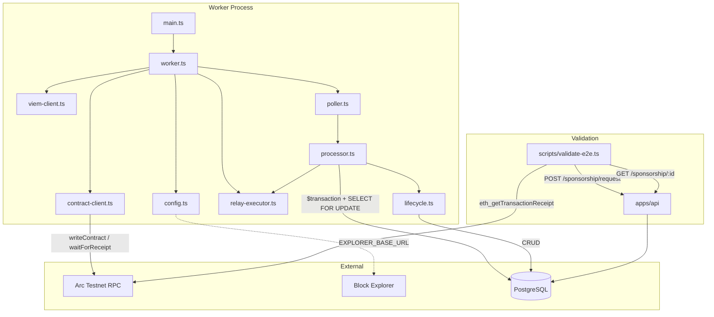
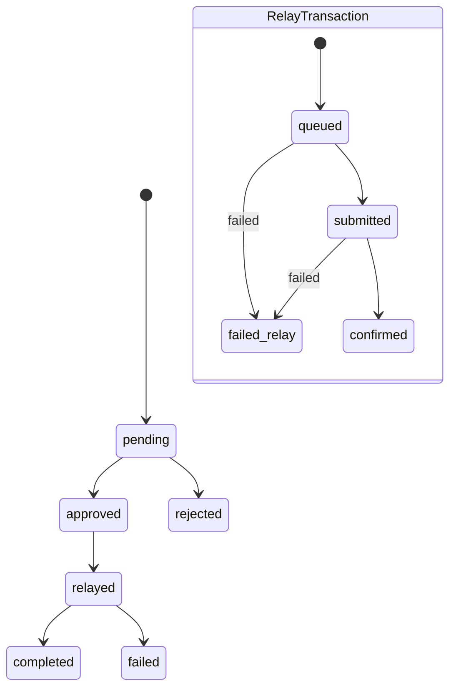
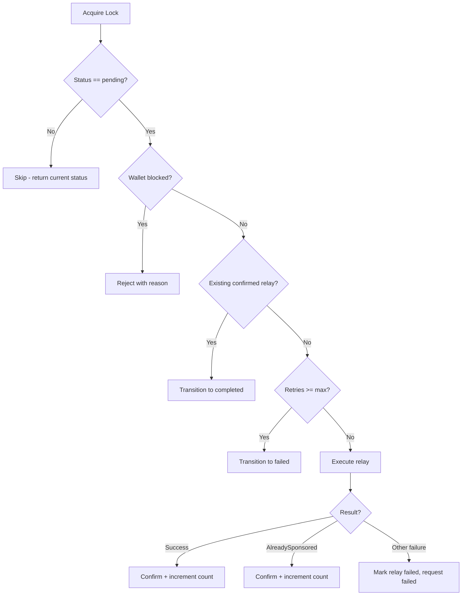

# Design Document: ArcPass E2E Sponsored Execution

## Overview

This design addresses the remaining gaps in the ArcPass worker to achieve complete end-to-end sponsored transaction execution on Arc testnet. The existing infrastructure (worker runtime, Prisma models, relay lifecycle, contract client) is functional but incomplete. This spec fills the gaps: explorer URL generation/persistence, `EXPLORER_BASE_URL` configuration, deterministic retry-safe execution (idempotency guards, `AlreadySponsored` handling, wallet blocked checks), wallet `sponsorshipCount` synchronization, stale relay recovery in the poller, graceful shutdown with force-exit, and an integration validation script.

The design preserves the existing architecture patterns: module-level state initialized at startup, single Prisma `$transaction` with `SELECT FOR UPDATE SKIP LOCKED`, structured JSON logging, and strict state machine transitions.

### Design Constraints

- **No new infrastructure** — No Redis, BullMQ, Kafka, or external queue systems. The existing poller + processor pattern is sufficient.
- **Sequential relay execution** — Relay transactions are processed one at a time for nonce safety. No parallel transaction execution.
- **On-chain receipt is authoritative** — The transaction receipt from the RPC is the single source of truth for execution state.
- **Arc-specific** — No generic blockchain abstraction layer. Implementation targets Arc testnet (chain ID 1942999) directly.
- **No new auth/account systems** — This phase connects existing systems for the grant demo.
- **Poller never mutates confirmed transactions** — The poller query excludes requests with confirmed relays. The processor's idempotency guard provides a second layer of protection.

## Architecture



### Key Architectural Decisions

1. **Explorer URL is computed, not stored redundantly** — The `explorerUrl` field is added to `RelayTransaction` and persisted only on confirmation. It's generated by the contract-client and passed up through the relay result.

2. **Idempotency via existing relay check** — Before creating a new relay, the processor queries for existing `submitted`/`confirmed` relay transactions. If a `confirmed` one exists, it short-circuits to `completed`.

3. **`AlreadySponsored` treated as success** — The on-chain contract already transferred funds. The processor marks the relay as `confirmed` and the request as `completed`, incrementing `sponsorshipCount`.

4. **Wallet blocked check inside the transaction** — After acquiring the row lock, the processor joins to the wallet table and rejects blocked wallets before any relay attempt.

5. **Poller includes stale `relayed` requests** — Requests stuck in `relayed` with no active relay transaction are re-queried for recovery after crashes.

6. **Graceful shutdown with force-exit** — The worker races the poller stop against `SHUTDOWN_TIMEOUT_MS`. If the timeout fires, it calls `process.exit(1)` so the orchestrator can restart the container.

## Components and Interfaces

### 1. Config (`apps/worker/src/config.ts`)

**Change**: Add `explorerBaseUrl` field.

```typescript
export interface WorkerConfig {
  // ... existing fields ...
  explorerBaseUrl: string // New: normalized URL with trailing slash
}
```

**New env var**: `EXPLORER_BASE_URL` (optional, default `https://testnet.arcscan.io/tx/`)

```typescript
// In loadConfig():
const explorerBaseUrl = normalizeTrailingSlash(
  process.env.EXPLORER_BASE_URL || 'https://testnet.arcscan.io/tx/'
)

function normalizeTrailingSlash(url: string): string {
  return url.endsWith('/') ? url : url + '/'
}
```

### 2. Contract Client (`apps/worker/src/contract-client.ts`)

**Change**: `ContractRelayResult` gains `explorerUrl` field. The explorer URL is generated only on success.

```typescript
export interface ContractRelayResult {
  success: boolean
  transactionHash: string | null
  blockNumber: bigint | null
  failureReason: string | null
  explorerUrl: string | null          // New
  eventData: { ... } | null
}
```

**New internal function**:

```typescript
function buildExplorerUrl(hash: string): string {
  return `${explorerBaseUrl}${hash}`
}
```

The module-level state gains `explorerBaseUrl: string` initialized via `initializeContractClient`.

**Updated `initializeContractClient` signature**:

```typescript
export function initializeContractClient(
  viemClients: ViemClients,
  contractConfig: ContractConfig,
  configuredTimeoutMs: number,
  configuredExplorerBaseUrl: string   // New parameter
): void
```

On successful receipt (`receipt.status === 'success'`), the result includes:
```typescript
explorerUrl: buildExplorerUrl(hash)
```

On failure/revert, `explorerUrl` is `null`.

**Updated `RelayContext`** — includes `relayTransactionId` for structured logging:

```typescript
export interface RelayContext {
  sponsorshipRequestId?: string
  relayTransactionId?: string         // New — included in all log entries
  relayAttempt?: number
}
```

### 3. Relay Executor (`apps/worker/src/relay-executor.ts`)

**Change**: `RelayResult` gains `explorerUrl` field, passed through from `ContractRelayResult`. The `executeRelay` function accepts `relayTransactionId` for structured logging.

```typescript
export interface RelayResult {
  success: boolean
  transactionHash: string | null
  failureReason: string | null
  blockNumber?: bigint | null
  explorerUrl?: string | null         // New
  eventData?: { ... } | null
}

export async function executeRelay(
  sponsorshipRequestId: string,
  relayTransactionId: string,         // New — for structured logging
  relayAttempt?: number
): Promise<RelayResult>
```

All log entries from the relay executor include `sponsorshipRequestId`, `relayTransactionId`, `walletAddress`, and `transactionHash` (when available).

### 4. Lifecycle (`apps/worker/src/lifecycle.ts`)

**Change**: `updateRelayTransaction` data parameter gains `explorerUrl` field.

```typescript
export async function updateRelayTransaction(
  tx: PrismaClient,
  relayTransactionId: string,
  status: RelayStatusValue,
  data?: {
    transactionHash?: string
    failureReason?: string
    blockNumber?: bigint | null
    eventName?: string | null
    eventData?: Record<string, unknown> | null
    explorerUrl?: string | null       // New
  }
): Promise<TransitionResult>
```

The function persists `explorerUrl` when provided.

**Change**: `MAX_RELAY_ATTEMPTS` becomes configurable (passed from config rather than hardcoded to 3).

### 5. Processor (`apps/worker/src/processor.ts`)

**Major changes** — the processor gains several new guards and behaviors:

```typescript
export async function processRequest(
  requestId: string,
  config: WorkerConfig
): Promise<ProcessResult> {
  return prisma.$transaction(async (tx) => {
    // 1. SELECT FOR UPDATE SKIP LOCKED (existing)
    // 2. Guard: status must be 'pending' (existing)
    // 3. NEW: Check wallet.isBlocked → reject if true
    // 4. NEW: Check for existing confirmed relay → skip to completed
    // 5. Check retry count (existing, uses config.maxRetries)
    // 6. Transition pending → approved → relayed (existing)
    // 7. Create relay transaction, mark submitted (existing)
    // 8. Execute relay (existing)
    // 9. Handle result:
    //    - Success: update relay confirmed + explorerUrl, transition completed,
    //              increment wallet.sponsorshipCount
    //    - AlreadySponsored: update relay confirmed, transition completed,
    //              increment wallet.sponsorshipCount
    //    - Other failure: update relay failed, transition failed
  })
}
```

**New helper — detect AlreadySponsored**:

```typescript
function isAlreadySponsoredError(failureReason: string | null): boolean {
  return failureReason?.startsWith('AlreadySponsored') ?? false
}
```

**Structured logging** — All relay-stage logs MUST include these fields:
- `sponsorshipRequestId`
- `relayTransactionId`
- `transactionHash` (when available)
- `walletAddress`

**Wallet blocked check** (after acquiring lock):

```typescript
const wallet = await tx.wallet.findUnique({ where: { id: walletId } })
if (wallet?.isBlocked) {
  await transitionSponsorshipStatus(tx, requestId, 'rejected')
  await tx.sponsorshipRequest.update({
    where: { id: requestId },
    data: { eligibilityReason: 'Wallet is blocked' },
  })
  return { requestId, success: true, finalStatus: 'rejected' }
}
```

**Sponsorship count increment** (on completion):

```typescript
await tx.wallet.update({
  where: { id: walletId },
  data: { sponsorshipCount: { increment: 1 } },
})
```

### 6. Poller (`apps/worker/src/poller.ts`)

**Change**: Query includes stale `relayed` requests that have no active relay transaction.

```sql
SELECT sr.id FROM "sponsorship_requests" sr
WHERE sr.status = 'pending'
   OR (sr.status = 'relayed' AND NOT EXISTS (
     SELECT 1 FROM "relay_transactions" rt
     WHERE rt."sponsorshipRequestId" = sr.id
       AND rt.status IN ('submitted', 'confirmed')
   ))
ORDER BY sr."requestedAt" ASC
LIMIT ${config.batchSize}
```

### 7. Worker (`apps/worker/src/worker.ts`)

**Change**: Graceful shutdown force-exits with non-zero code on timeout.

```typescript
export async function stop(): Promise<void> {
  if (!poller) return

  const timeoutMs = config?.shutdownTimeoutMs ?? 10000

  const pollerStop = poller.stop()
  const timeout = new Promise<'timeout'>((resolve) => {
    setTimeout(() => resolve('timeout'), timeoutMs)
  })

  const result = await Promise.race([
    pollerStop.then(() => 'done' as const),
    timeout,
  ])

  await prisma.$disconnect()
  logger.info('Worker stopped')

  poller = null
  config = null

  if (result === 'timeout') {
    logger.error('Shutdown timeout exceeded — force exiting', {
      timeoutMs,
    })
    process.exit(1)
  }
}
```

### 8. Prisma Schema (`packages/shared/prisma/schema.prisma`)

**Change**: Add `explorerUrl` field to `RelayTransaction`.

```prisma
model RelayTransaction {
  // ... existing fields ...
  explorerUrl   String?  @db.VarChar(512)   // New
}
```

### 9. Validation Script (`scripts/validate-e2e.ts`)

**New file** — a standalone TypeScript script that exercises the full flow.

```typescript
// scripts/validate-e2e.ts
interface ValidationConfig {
  apiBaseUrl: string        // e.g. http://localhost:3000/sponsorship
  rpcUrl: string            // Arc testnet RPC
  walletAddress: string     // Target wallet (0x...)
  pollIntervalMs: number    // Default 2000
  timeoutMs: number         // Default 120000
}

async function main(): Promise<void> {
  // 1. POST /sponsorship/request → expect 201 { id, status: 'pending' }
  // 2. Poll GET /sponsorship/:id every 2s until completed/failed or timeout
  // 3. On completed: verify transactionHash format, explorerUrl contains hash
  // 4. Query eth_getTransactionReceipt → verify blockNumber != null, status == 1
  // 5. Print summary: wallet, requestId, txHash, explorerUrl, blockNumber, elapsed
  // 6. On failed: print failureReason to stderr, exit(1)
  // 7. On timeout: print timeout error to stderr, exit(1)
}
```

## Data Models

### RelayTransaction (updated)

| Field | Type | Constraint | Notes |
|-------|------|-----------|-------|
| id | UUID | PK, auto | |
| sponsorshipRequestId | UUID | FK → SponsorshipRequest | |
| transactionHash | String? | unique, varchar(255) | |
| status | Enum | queued/submitted/confirmed/failed | |
| relayAttempt | Int | default 1 | |
| submittedAt | DateTime? | | |
| confirmedAt | DateTime? | | |
| failedAt | DateTime? | | |
| failureReason | String? | varchar(1000) | Truncated to 1000 chars |
| blockNumber | BigInt? | | |
| eventName | String? | varchar(100) | |
| eventData | Json? | | |
| **explorerUrl** | **String?** | **varchar(512)** | **NEW — set only on confirmed** |

### WorkerConfig (updated)

| Field | Type | Default | Validation |
|-------|------|---------|-----------|
| explorerBaseUrl | string | `https://testnet.arcscan.io/tx/` | Must be valid URL, normalized with trailing slash |

### State Machine (unchanged)




## Correctness Properties

*A property is a characteristic or behavior that should hold true across all valid executions of a system — essentially, a formal statement about what the system should do. Properties serve as the bridge between human-readable specifications and machine-verifiable correctness guarantees.*

### Property 1: Explorer URL generation with trailing-slash normalization

*For any* valid explorer base URL (with or without trailing slash) and *for any* valid 66-character hex transaction hash (0x-prefixed), the generated explorer URL SHALL equal the base URL normalized to include exactly one trailing slash concatenated with the transaction hash.

**Validates: Requirements 1.1, 1.4**

### Property 2: Failed relays produce null explorer URL

*For any* relay execution result where `success` is `false`, the `explorerUrl` field SHALL be `null`.

**Validates: Requirements 1.5**

### Property 3: Failure reason truncation

*For any* string of any length, the `truncateReason` function SHALL return a string of at most 1000 characters. If the input is ≤ 1000 characters, the output SHALL equal the input. If the input exceeds 1000 characters, the output SHALL be the first 997 characters followed by `...`.

**Validates: Requirements 3.8, 5.3**

### Property 4: Config validation — format acceptance and rejection

*For any* string value provided as `CHAIN_RPC_URL`, the config loader SHALL accept it if and only if it starts with `http://` or `https://`. *For any* string value provided as `CHAIN_ID`, the config loader SHALL accept it if and only if it parses to a positive integer. *For any* string value provided as `SPONSOR_PRIVATE_KEY`, the config loader SHALL accept it if and only if it is a 64-character hexadecimal string (with or without `0x` prefix). *For any* string value provided as a contract address, the config loader SHALL accept it if and only if it matches `0x` followed by exactly 40 hexadecimal characters (case-insensitive). *For any* integer value provided as `CHAIN_ID_VERIFY_TIMEOUT_MS`, the config loader SHALL accept it if and only if it is in the range [1000, 30000].

**Validates: Requirements 4.1, 4.2, 4.3, 4.4, 4.7**

### Property 5: Relay status transition validity

*For any* pair `(currentStatus, newStatus)` drawn from the `RelayStatus` enum, `isValidRelayTransition(currentStatus, newStatus)` SHALL return `true` if and only if the pair is in the set: {(queued, submitted), (queued, failed), (submitted, confirmed), (submitted, failed)}. All other pairs SHALL return `false`.

**Validates: Requirements 5.6**

### Property 6: Sensitive data filtering

*For any* object containing fields whose keys match sensitive patterns (privatekey, private_key, mnemonic, secret, password, credential, authorization — case-insensitive) or whose string values are credential-bearing URLs (matching `http(s)://user:pass@host`), the `filterSensitiveData` function SHALL replace those values with `[REDACTED]` or `[REDACTED_URL]` respectively, and SHALL preserve all non-sensitive fields unchanged.

**Validates: Requirements 6.6**

### Property 7: Structured log output format

*For any* log call (info, warn, or error) with any component name and any message string, the output SHALL be a valid single-line JSON object containing at minimum the fields: `timestamp` (ISO 8601 format), `level` (one of info/warn/error), `component`, and `message`.

**Validates: Requirements 6.7**

### Property 8: Non-pending requests are skipped without side effects

*For any* sponsorship request whose status is not `pending` (i.e., approved, rejected, relayed, completed, or failed) when the processor acquires the row lock, the processor SHALL not create a new `RelayTransaction` record and SHALL leave the request status unchanged.

**Validates: Requirements 2.3**

### Property 9: Retry limit enforcement

*For any* `maxRetries` value in [1, 10] and *for any* sponsorship request with a count of failed relay transactions ≥ `maxRetries`, the processor SHALL transition the request to `failed` status without initiating a new relay execution.

**Validates: Requirements 2.6**

### Property 10: Blocked wallet rejection

*For any* pending sponsorship request whose associated wallet has `isBlocked = true`, the processor SHALL transition the request to `rejected` status and set `eligibilityReason` to a string indicating the wallet is blocked, without creating a relay transaction.

**Validates: Requirements 7.4**

### Property 11: Sponsorship count invariant

*For any* sponsorship request that transitions to `completed` status (whether via normal confirmation or `AlreadySponsored`), the associated wallet's `sponsorshipCount` SHALL increase by exactly 1 within the same transaction. *For any* request that transitions to `failed` or `rejected`, the wallet's `sponsorshipCount` SHALL remain unchanged.

**Validates: Requirements 5.5, 7.1, 7.2, 7.3**

### Property 12: Custom error decoding

*For any* known SponsorVault custom error (AlreadySponsored, ExceedsLimit, InsufficientBalance, InvalidRecipient, InvalidAmount, Unauthorized) with valid ABI-encoded arguments, the `handleExecutionError` function SHALL produce a failure reason string containing the error name.

**Validates: Requirements 3.6**

### Property 13: Poller query correctness

*For any* set of sponsorship requests in various statuses with various relay transaction states, the poller query SHALL return exactly those requests where: (a) status is `pending`, OR (b) status is `relayed` AND no associated relay transaction has status `submitted` or `confirmed`.

**Validates: Requirements 9.3**

## Error Handling

### Error Categories and Recovery

| Error Type | Source | Handling | Recovery |
|-----------|--------|----------|----------|
| Connection timeout / refused | RPC transport | Return `success: false`, `transactionHash: null` | Retry on next poll cycle |
| Nonce too low | RPC | Return `success: false`, failureReason contains "nonce" | Processor can infer tx already mined |
| TX confirmation timeout | `waitForTransactionReceipt` | Return `success: false`, preserve `transactionHash` | Stale relay recovery on restart |
| Gas estimation failure | `writeContract` pre-flight | Return `success: false`, `transactionHash: null` | Retry on next poll cycle |
| HTTP 429 (rate limited) | RPC transport | Return `success: false`, failureReason "rate limited" | Retry on next poll cycle |
| On-chain revert (known error) | Receipt status `reverted` | Decode via ABI, store error name + args | Depends on error type |
| On-chain revert (unknown) | Receipt status `reverted` | Generic "Transaction reverted on-chain" | Manual investigation |
| `AlreadySponsored` | Contract custom error | Treat as success — mark confirmed, increment count | No retry needed |
| Wallet blocked | DB check | Reject request with eligibility reason | No retry |
| Max retries exceeded | Retry count check | Transition to `failed` | Manual intervention |
| DB transaction failure | Prisma `$transaction` | Full rollback, request stays in previous status | Retry on next poll cycle |
| Shutdown timeout | Process lifecycle | Force `process.exit(1)` | Orchestrator restarts container |

### Error Flow in Processor



### Failure Reason Truncation

All failure reasons are truncated to 1000 characters before persistence to match the `varchar(1000)` database constraint. The truncation preserves the first 997 characters and appends `...` when the input exceeds the limit.

## Testing Strategy

### Testing Philosophy

The primary goal is validating the real end-to-end flow on Arc testnet. Testing priorities (in order):

1. **E2E validation script** — Proves the system works against live contracts
2. **Integration tests** — Verify processor lifecycle, DB atomicity, and recovery
3. **Unit tests** — Cover pure functions (URL generation, truncation, error decoding, config validation)
4. **Property-based tests** — Applied selectively to pure functions with meaningful input variation

### Property-Based Tests (fast-check)

Applied only to pure, deterministic functions where input variation reveals edge cases. Uses vitest + fast-check with 100 iterations.

**Test files:**
```
apps/worker/tests/property/
├── explorer-url.property.test.ts      (Properties 1, 2 — URL generation)
├── truncation.property.test.ts        (Property 3 — failure reason truncation)
├── config-validation.property.test.ts (Property 4 — format acceptance/rejection)
├── state-transitions.property.test.ts (Property 5 — relay transition validity)
├── sensitive-filter.property.test.ts  (Property 6 — redaction)
└── error-decoding.property.test.ts    (Property 12 — custom error decoding)
```

**Configuration:**
- 100 iterations per property (`numRuns: 100`)
- Each test tagged with: `Feature: arcpass-e2e-sponsored-execution, Property {N}: {title}`

### Unit Tests (example-based)

Cover specific scenarios, error paths, and mocked RPC interactions.

**Test files:**
```
apps/worker/tests/unit/
├── contract-client.unit.test.ts   (3.1-3.5, 3.7 — mocked RPC error scenarios)
├── processor.unit.test.ts         (2.2, 2.5 — AlreadySponsored, existing confirmed relay)
├── config.unit.test.ts            (4.5, 4.6 — defaults, error message listing)
├── log-format.unit.test.ts        (6.7, 7 — structured output, required fields)
└── lifecycle.unit.test.ts         (existing)
```

### Integration Tests

Verify the full processor lifecycle with a real PostgreSQL database. These are the highest-priority automated tests.

**Test files:**
```
apps/worker/tests/integration/
├── processor-lifecycle.integration.test.ts  (5.1-5.5, 7.1-7.5 — full DB transaction, count sync)
├── processor-guards.integration.test.ts     (2.1-2.6, 8, 9, 10 — idempotency, retries, blocked)
├── poller-recovery.integration.test.ts      (9.3, 13 — stale relay recovery query)
├── shutdown.integration.test.ts             (9.1, 9.2, 9.4 — graceful shutdown)
└── chain-id-verify.integration.test.ts      (4.8 — mocked RPC chain ID mismatch)
```

### End-to-End Validation (Priority 1)

The `scripts/validate-e2e.ts` script is the primary validation artifact for the Circle grant demo. It exercises the complete flow against live Arc testnet:

1. Creates a sponsorship request via the API
2. Polls until completion or failure
3. Verifies the transaction on-chain via `eth_getTransactionReceipt`
4. Outputs a summary with explorer URL

**Run command:** `npx tsx scripts/validate-e2e.ts`

### Test Execution

```bash
# All tests
pnpm --filter @arcpass/worker test

# Property tests only
pnpm --filter @arcpass/worker test:property

# Unit tests only
pnpm --filter @arcpass/worker test:unit

# Integration tests only (requires DB)
pnpm --filter @arcpass/worker test:integration

# E2E validation (requires running API + worker + Arc testnet)
npx tsx scripts/validate-e2e.ts
```
