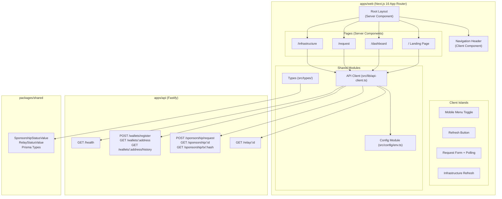

# Design Document: ArcPass Frontend MVP

## Overview

The ArcPass Frontend MVP is a Next.js 16 App Router application (`apps/web`) that provides a dark, infrastructure-style interface for interacting with the existing ArcPass sponsorship API. The frontend serves as a demonstration layer for Circle Grant reviewers, showcasing the end-to-end gas sponsorship flow on Arc Network.

The application consists of four pages (Landing, Dashboard, Request Sponsorship, Infrastructure) connected to the Fastify API at `apps/api` via a typed fetch-based API client. It follows a Server Component-first architecture with Client Component islands for interactivity (polling, forms, refresh buttons).

**Key Design Decisions:**
- Server Components by default for SEO and initial load performance; Client Components only where browser interactivity is required
- Single centralized API client module with typed error handling — no direct `process.env` reads in components
- Reusable UI component library under `src/components/ui/` for consistency across pages
- Import shared types from `@arcpass/shared` rather than redefining locally
- No authentication layer — the MVP is a public demo interface

## Architecture



### Request Flow

1. **Server-side data fetching**: Page-level Server Components call the API client during SSR to fetch initial data (dashboard metrics, health status)
2. **Client-side interactivity**: Client Component islands handle form submission, polling, and manual refresh via the same API client
3. **Error boundaries**: Each page handles API failures gracefully — degraded states rather than crashes

### Component Rendering Strategy

| Component | Type | Rationale |
|-----------|------|-----------|
| Root Layout | Server | Static shell, no interactivity |
| Navigation Header | Client | Mobile menu toggle requires state |
| Landing Page content | Server | Static content, one health fetch |
| Landing status indicator | Client | Fetches with timeout on mount |
| Dashboard metrics | Server | Initial SSR fetch |
| Dashboard refresh | Client | Manual re-fetch button |
| Request form | Client | Form state, submission, polling |
| Infrastructure status | Client | Manual refresh, timeout handling |

## Components and Interfaces

### Folder Structure

```
apps/web/
├── src/
│   ├── app/
│   │   ├── layout.tsx              # Root layout (Server Component)
│   │   ├── page.tsx                # Landing page
│   │   ├── dashboard/
│   │   │   └── page.tsx            # Dashboard page
│   │   ├── request/
│   │   │   └── page.tsx            # Request sponsorship page
│   │   └── infrastructure/
│   │       └── page.tsx            # Infrastructure page
│   ├── components/
│   │   ├── ui/
│   │   │   ├── status-card.tsx     # Status indicator card
│   │   │   ├── data-table.tsx      # Generic typed data table
│   │   │   ├── form-input.tsx      # Form input with validation
│   │   │   ├── button.tsx          # Button with loading state
│   │   │   └── badge.tsx           # Status badge (color-coded)
│   │   ├── layout/
│   │   │   ├── header.tsx          # Navigation header (Client)
│   │   │   └── footer.tsx          # Page footer
│   │   └── features/
│   │       ├── landing-status.tsx  # Landing health indicator (Client)
│   │       ├── dashboard-refresh.tsx # Dashboard refresh (Client)
│   │       ├── request-form.tsx    # Sponsorship request form (Client)
│   │       └── infra-refresh.tsx   # Infrastructure refresh (Client)
│   ├── lib/
│   │   ├── api-client.ts           # Typed API client
│   │   └── utils.ts                # Utility functions
│   ├── types/
│   │   ├── api.ts                  # API response types
│   │   ├── components.ts           # Component prop interfaces
│   │   └── index.ts                # Re-exports
│   └── config/
│       └── env.ts                  # Centralized env config
├── next.config.ts
├── tailwind.config.ts
├── tsconfig.json
└── package.json
```

### API Client Interface

```typescript
// src/lib/api-client.ts

import type { SponsorshipStatusValue, RelayStatusValue } from '@arcpass/shared'

// --- Error Types ---

export class ApiError extends Error {
  constructor(
    public statusCode: number,
    public message: string,
  ) {
    super(message)
    this.name = 'ApiError'
  }
}

export class NetworkError extends Error {
  constructor(message: string = 'Network request failed') {
    super(message)
    this.name = 'NetworkError'
  }
}

export class TimeoutError extends Error {
  constructor(message: string = 'Request timed out') {
    super(message)
    this.name = 'TimeoutError'
  }
}

// --- API Client Functions ---

export async function checkHealth(): Promise<HealthResponse>
export async function registerWallet(walletAddress: string): Promise<WalletResponse>
export async function lookupWallet(address: string): Promise<WalletResponse>
export async function getWalletHistory(address: string, cursor?: string, limit?: number): Promise<WalletHistoryResponse>
export async function createSponsorshipRequest(walletAddress: string): Promise<SponsorshipResponse>
export async function getSponsorshipStatus(id: string): Promise<SponsorshipDetailResponse>
export async function getRelayByHash(hash: string): Promise<RelayResponse>
export async function getRelayById(id: string): Promise<RelayResponse>
```

### Reusable UI Components

```typescript
// StatusCard
interface StatusCardProps {
  label: string
  value: string | number
  status?: 'healthy' | 'degraded' | 'offline'
}

// DataTable
interface DataTableProps<T> {
  data: T[]
  columns: ColumnDef<T>[]
  emptyMessage?: string
}

interface ColumnDef<T> {
  key: keyof T | string
  header: string
  render?: (row: T) => React.ReactNode
}

// FormInput
interface FormInputProps {
  label: string
  name: string
  type?: string
  placeholder?: string
  value: string
  onChange: (value: string) => void
  validationState: 'idle' | 'valid' | 'invalid'
  errorMessage?: string
}

// Button
interface ButtonProps {
  children: React.ReactNode
  onClick?: () => void
  type?: 'button' | 'submit'
  variant?: 'primary' | 'secondary'
  loading?: boolean
  disabled?: boolean
}

// Badge
interface BadgeProps {
  status: SponsorshipStatusValue | RelayStatusValue
}
```

## Data Models

### API Response Types

```typescript
// src/types/api.ts

export interface HealthResponse {
  status: 'ok'
  uptime: number
}

export interface WalletResponse {
  id: string
  walletAddress: string
  firstSeenAt: string   // ISO 8601
  lastSeenAt: string    // ISO 8601
  sponsorshipCount: number
  isBlocked: boolean
}

export interface WalletHistoryResponse {
  requests: SponsorshipSummary[]
  nextCursor: string | null
  total: number
}

export interface SponsorshipSummary {
  id: string
  status: SponsorshipStatusValue
  requestedAt: string
  walletAddress: string
}

export interface SponsorshipResponse {
  id: string
  walletId: string
  status: SponsorshipStatusValue
  requestedAt: string
}

export interface SponsorshipDetailResponse {
  id: string
  walletId: string
  status: SponsorshipStatusValue
  eligibilityReason: string | null
  requestedAt: string
  approvedAt: string | null
  rejectedAt: string | null
  completedAt: string | null
  failedAt: string | null
  relayTransactions: RelayResponse[]
}

export interface RelayResponse {
  id: string
  sponsorshipRequestId: string
  status: RelayStatusValue
  relayAttempt: number
  transactionHash: string | null
  submittedAt: string | null
  confirmedAt: string | null
  failedAt: string | null
  failureReason: string | null
}

// Dashboard-specific aggregated type
export interface DashboardMetrics {
  totalRequests: number
  approvedCount: number
  rejectedCount: number
  pendingCount: number
}

// Error response from API
export interface ApiErrorResponse {
  error: string
  statusCode: number
  retryAfter?: number  // seconds, for rate limit errors
}
```

### Environment Configuration

```typescript
// src/config/env.ts

export interface AppConfig {
  apiUrl: string
  sponsorVaultAddress: string | null
  sponsorshipRegistryAddress: string | null
  explorerUrl: string
  githubUrl: string | null
  chainId: number
}

export const config: AppConfig = {
  apiUrl: process.env.NEXT_PUBLIC_API_URL || 'http://localhost:4000',
  sponsorVaultAddress: process.env.NEXT_PUBLIC_SPONSOR_VAULT_ADDRESS || null,
  sponsorshipRegistryAddress: process.env.NEXT_PUBLIC_SPONSORSHIP_REGISTRY_ADDRESS || null,
  explorerUrl: process.env.NEXT_PUBLIC_EXPLORER_URL || 'https://testnet.arcscan.app/tx/',
  githubUrl: process.env.NEXT_PUBLIC_GITHUB_URL || null,
  chainId: 5042002,
}
```

### UI State Types

```typescript
// src/types/components.ts

export type ComponentStatus = 'healthy' | 'degraded' | 'offline'
export type ValidationState = 'idle' | 'valid' | 'invalid'

export interface PollingState {
  isPolling: boolean
  attempts: number
  maxAttempts: number
  intervalMs: number
  error: string | null
}

export interface InfraComponentStatus {
  name: string
  status: ComponentStatus
  lastChecked: string | null
}
```


## Correctness Properties

*A property is a characteristic or behavior that should hold true across all valid executions of a system — essentially, a formal statement about what the system should do. Properties serve as the bridge between human-readable specifications and machine-verifiable correctness guarantees.*

### Property 1: Wallet address validation accepts only valid addresses

*For any* string, the wallet address validator should accept it if and only if it matches the pattern `^0x[0-9a-fA-F]{40}$`. All other strings (wrong length, missing prefix, non-hex characters, whitespace-only) should be rejected.

**Validates: Requirements 4.1**

### Property 2: Polling stops on terminal sponsorship status

*For any* sponsorship status that is terminal (completed, failed, or rejected), the polling mechanism should cease making further status requests. For any non-terminal status (pending, approved, relayed), polling should continue.

**Validates: Requirements 4.5**

### Property 3: API client POST requests serialize body as JSON with correct headers

*For any* valid request body object passed to a POST API client function, the outgoing fetch request should have `Content-Type: application/json` header set and the body should be the JSON.stringify representation of the input object.

**Validates: Requirements 6.2**

### Property 4: API client throws ApiError for non-2xx responses

*For any* HTTP response with a status code outside the 200-299 range, the API client should throw an `ApiError` instance containing the exact HTTP status code and the error message from the response body.

**Validates: Requirements 6.4**

### Property 5: API client throws NetworkError for fetch failures

*For any* fetch call that fails due to a network error (TypeError thrown by fetch, no response received), the API client should throw a `NetworkError` instance, which is distinguishable from `ApiError` and `TimeoutError` by its class/name.

**Validates: Requirements 6.5**

### Property 6: StatusCard renders label, value, and correct status indicator

*For any* combination of label string, value (string or number), and optional status ('healthy', 'degraded', 'offline'), the StatusCard component should render all three pieces of information, and when a status is provided, display a visually distinct indicator unique to that status state.

**Validates: Requirements 7.1, 5.6**

### Property 7: DataTable renders correct row and column structure

*For any* non-empty array of typed row objects and matching column definitions, the DataTable component should render exactly `rows.length` data rows and `columns.length` columns, with each cell containing the content derived from the corresponding row field or custom render function.

**Validates: Requirements 7.2**

### Property 8: FormInput displays error message only in invalid state

*For any* FormInput component, when `validationState` is 'invalid' and an `errorMessage` is provided, the error message text should be visible below the input. When `validationState` is 'idle' or 'valid', no error message should be rendered regardless of the `errorMessage` prop value.

**Validates: Requirements 7.4**

### Property 9: Button is disabled and shows loading indicator when loading

*For any* Button component with `loading` set to `true`, the rendered button element should have the `disabled` attribute set and display a visual loading indicator. When `loading` is `false` or undefined, the button should be interactive and show no loading indicator.

**Validates: Requirements 7.5**

### Property 10: Badge renders visually distinct indicator per status value

*For any* valid `SponsorshipStatusValue` (pending, approved, rejected, relayed, completed, failed) or `RelayStatusValue` (queued, submitted, confirmed, failed), the Badge component should render with a color class that is unique to that status value, ensuring no two different statuses share the same visual representation.

**Validates: Requirements 7.6, 4.4**

### Property 11: Missing environment variables display "Not configured"

*For any* of the environment variables `NEXT_PUBLIC_SPONSOR_VAULT_ADDRESS`, `NEXT_PUBLIC_SPONSORSHIP_REGISTRY_ADDRESS`, or `NEXT_PUBLIC_GITHUB_URL`, when the value is undefined or an empty string, the UI should display the text "Not configured" in place of the value.

**Validates: Requirements 12.5**

## Error Handling

### API Client Error Strategy

The API client implements a three-tier error classification:

| Error Type | Trigger | Contains |
|-----------|---------|----------|
| `ApiError` | HTTP response with status outside 200-299 | `statusCode`, `message` |
| `NetworkError` | fetch throws (no response received) | `message` |
| `TimeoutError` | AbortController signal fires after 10s | `message` |

All API client functions use a shared internal `fetchWithTimeout` helper that:
1. Creates an `AbortController` with a 10-second timeout
2. Wraps the native `fetch` call in a try/catch
3. On successful response: checks status code, throws `ApiError` if non-2xx
4. On fetch throw: distinguishes `AbortError` (→ `TimeoutError`) from other errors (→ `NetworkError`)

### Page-Level Error Handling

| Page | Error Scenario | Behavior |
|------|---------------|----------|
| Landing | Health endpoint fails/times out | Shows degraded indicator, page continues rendering |
| Dashboard | API unreachable | Shows error state with retry button |
| Dashboard | Partial data failure | Shows available data, error indicator for failed section |
| Request | Validation error (400) | Displays error message below input |
| Request | Rate limit (429) | Displays rate limit message with retry-after time |
| Request | Polling network failure | Retries up to 3 times, then shows manual retry |
| Request | Terminal status | Stops polling, shows final state |
| Infrastructure | Component check fails | Shows degraded/offline per component |
| Infrastructure | All checks fail | Shows all components as offline |

### Graceful Degradation Principles

1. **No page crashes**: API failures never prevent page rendering. Static content always displays.
2. **Isolated failures**: One failed component check doesn't block others.
3. **Clear feedback**: Users always see what's working and what isn't.
4. **Recovery paths**: Retry buttons for all recoverable failures.

## Testing Strategy

### Testing Framework

- **Unit/Component tests**: Vitest + React Testing Library
- **Property-based tests**: [fast-check](https://github.com/dubzzz/fast-check) (minimum 100 iterations per property)
- **Type checking**: TypeScript strict mode (`tsc --noEmit`)
- **Linting**: ESLint with `@typescript-eslint/no-explicit-any`

### Property-Based Tests

Each correctness property maps to a single property-based test using fast-check:

| Property | Test File | Generator Strategy |
|----------|-----------|-------------------|
| 1: Wallet validation | `api-client.property.test.ts` | `fc.string()` for invalid, `fc.hexaString({minLength:40,maxLength:40})` for valid |
| 2: Terminal status polling | `request-form.property.test.ts` | `fc.constantFrom('completed','failed','rejected')` for terminal, `fc.constantFrom('pending','approved','relayed')` for non-terminal |
| 3: POST serialization | `api-client.property.test.ts` | `fc.jsonValue()` for arbitrary JSON-serializable objects |
| 4: ApiError on non-2xx | `api-client.property.test.ts` | `fc.integer({min:300,max:599})` for error status codes |
| 5: NetworkError on fetch failure | `api-client.property.test.ts` | `fc.constantFrom(new TypeError('Failed to fetch'), new TypeError('Network error'))` |
| 6: StatusCard rendering | `status-card.property.test.ts` | `fc.record({label: fc.string({minLength:1}), value: fc.oneof(fc.string({minLength:1}), fc.nat()), status: fc.constantFrom('healthy','degraded','offline')})` |
| 7: DataTable structure | `data-table.property.test.ts` | `fc.array(fc.record(...), {minLength:1, maxLength:50})` with matching column defs |
| 8: FormInput error display | `form-input.property.test.ts` | `fc.record({validationState: fc.constantFrom('idle','valid','invalid'), errorMessage: fc.string()})` |
| 9: Button loading state | `button.property.test.ts` | `fc.boolean()` for loading prop |
| 10: Badge status colors | `badge.property.test.ts` | `fc.constantFrom(...allStatusValues)` |
| 11: Missing env fallback | `config.property.test.ts` | `fc.constantFrom(undefined, '', null)` for missing values |

**Tag format**: Each test includes a comment: `// Feature: arcpass-frontend-mvp, Property {N}: {title}`

### Unit Tests (Example-Based)

Focus areas for example-based tests:
- Page metadata (title length, OG tags)
- Navigation link presence and active state
- Dashboard table column rendering
- Explorer URL construction
- Mobile menu toggle behavior
- Retry button re-fetch behavior

### Integration Tests

- API client against mocked Fastify server (verifying full request/response cycle)
- Page-level rendering with mocked API responses
- Polling lifecycle (start → status updates → terminal stop)

### Smoke Tests

- TypeScript compilation (`tsc --noEmit`)
- ESLint pass (no `any` types)
- Directory structure validation
- Server/Client component boundary verification (no "use client" in page.tsx files)
- Font loading (Geist CSS variables present)
- Environment config module exports

### Test Configuration

```typescript
// vitest.config.ts (apps/web)
import { defineConfig } from 'vitest/config'
import react from '@vitejs/plugin-react'

export default defineConfig({
  plugins: [react()],
  test: {
    environment: 'jsdom',
    globals: true,
    setupFiles: ['./src/test/setup.ts'],
    include: ['src/**/*.{test,spec,property.test}.{ts,tsx}'],
  },
  resolve: {
    alias: { '@': './src' },
  },
})
```

Property tests run with minimum 100 iterations:
```typescript
fc.assert(fc.property(/* ... */), { numRuns: 100 })
```
