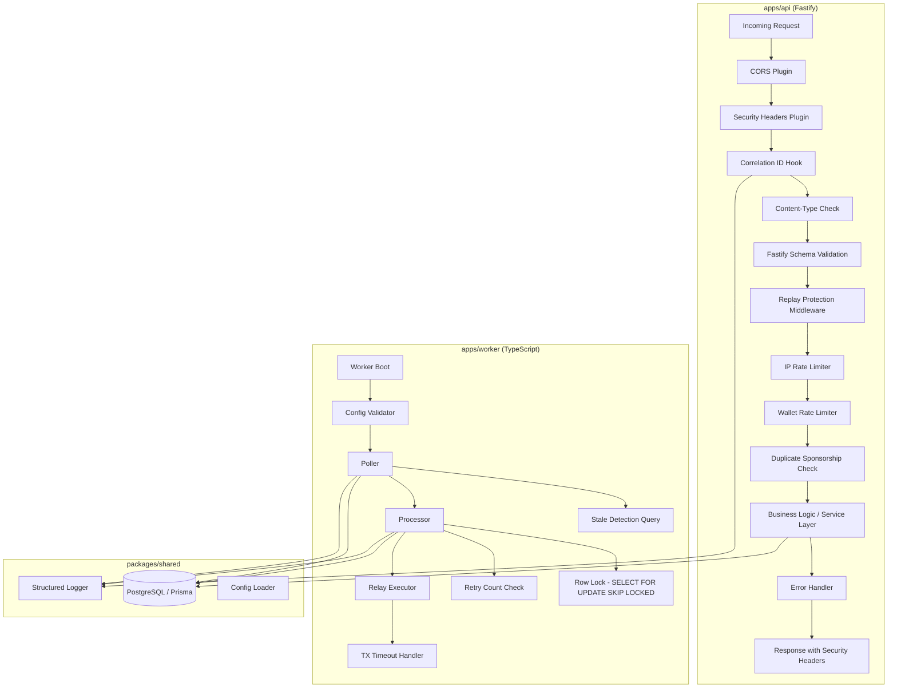

# Design Document: ArcPass Production Hardening

## Overview

This design document specifies the technical architecture for hardening the ArcPass API and Worker services for production deployment. The scope covers 19 requirement areas spanning error handling, input validation, abuse protection, environment safety, worker resilience, observability, and security headers.

The design operates within the existing monorepo architecture (`apps/api`, `apps/worker`, `packages/shared`) and introduces no new infrastructure components. All changes are additive middleware, plugins, configuration enhancements, and behavioral refinements to existing modules.

### Design Principles

1. **Defense in depth** — Multiple layers of validation and protection (schema → middleware → service)
2. **Fail fast** — Invalid configuration terminates at boot; invalid requests rejected before business logic
3. **No information leakage** — Error responses, logs, and headers reveal nothing about internals
4. **Resilience over perfection** — Worker recovers from transient failures rather than crashing
5. **Observability** — Every request traceable via correlation IDs and structured JSON logs

## Architecture



### Request Lifecycle (API)

1. **CORS Plugin** — Validates origin against allowlist, sets/omits CORS headers
2. **Security Headers Plugin** — Attaches all security headers to every response via `onSend` hook
3. **Correlation ID Hook** — Generates or validates `X-Request-ID`, attaches to request context
4. **Content-Type Check** — Rejects non-JSON bodies on POST routes (via `preHandler`)
5. **Fastify Schema Validation** — JSON Schema validation with `additionalProperties: false`
6. **Replay Protection** — Checks 5-second deduplication window for wallet+IP
7. **IP Rate Limiter** — Sliding window counter with auto-block
8. **Wallet Rate Limiter** — Per-wallet throttle on sponsorship endpoint
9. **Duplicate Sponsorship Check** — Existing active/completed sponsorship guard
10. **Business Logic** — Service layer processing
11. **Error Handler** — Centralized error mapping to `{error, statusCode}` shape
12. **Response** — Includes security headers, correlation ID, and CORS headers

### Worker Lifecycle

1. **Config Validation** — All env vars validated with aggregated error reporting
2. **Poller** — Queries pending + stale-relayed requests with error recovery
3. **Processor** — Row-level locking, retry count enforcement, relay execution
4. **Relay Executor** — Bounded timeout with configurable `TX_TIMEOUT_MS`
5. **Recovery** — Stale executions re-entered into processing pipeline

## Components and Interfaces

### API Components

#### 1. Error Handler (`apps/api/src/plugins/error-handler.js`)

Replaces the inline `setErrorHandler` in `server.js` with a Fastify plugin.

```typescript
interface ErrorResponse {
  error: string      // Human-readable error message
  statusCode: number // Matches HTTP response status code
}
```

**Behavior:**
- Maps known error classes to specific HTTP status codes
- JSON parse errors → 400 with "Invalid JSON in request body"
- Schema validation errors → 400 with field-level description (no raw JSON Schema keywords)
- Unknown errors → 500 with "Internal server error" (logged internally with full stack)
- Production mode: only `{error, statusCode}` — no additional fields
- Development mode: adds `errorName` field but never stack traces or paths

#### 2. Security Headers Plugin (`apps/api/src/plugins/security-headers.js`)

Fastify plugin registered via `onSend` hook to attach headers to every response.

```typescript
interface SecurityHeadersConfig {
  enableHsts: boolean // true when behind HTTPS termination
}
```

**Headers applied:**
| Header | Value |
|--------|-------|
| `X-Content-Type-Options` | `nosniff` |
| `X-Frame-Options` | `DENY` |
| `X-XSS-Protection` | `0` |
| `Content-Security-Policy` | `default-src 'none'; frame-ancestors 'none'` |
| `Cache-Control` | `no-store` |
| `Strict-Transport-Security` | `max-age=31536000; includeSubDomains` (when HTTPS) |

Also removes `X-Powered-By` via Fastify's built-in `exposeHeadRoutes: true` and `app.removeAllContentTypeParsers` pattern, or simply `app.server` configuration.

#### 3. CORS Plugin (`apps/api/src/plugins/cors.js`)

Custom CORS implementation (not `@fastify/cors`) for strict allowlist control.

```typescript
interface CorsConfig {
  allowedOrigins: string[] // Parsed from CORS_ALLOWED_ORIGINS env var
  allowedMethods: string[] // ['GET', 'POST', 'OPTIONS']
  allowedHeaders: string[] // ['Content-Type', 'Authorization']
}
```

**Behavior:**
- Parses `CORS_ALLOWED_ORIGINS` as comma-separated list, trims whitespace
- Empty/unset → no CORS headers on any response (blocks all cross-origin)
- Origin not in list → omit all `Access-Control-*` headers
- Never sends `Access-Control-Allow-Credentials: true`
- Preflight (OPTIONS) from allowed origin → 204 with CORS headers

#### 4. Correlation ID Hook (`apps/api/src/plugins/correlation-id.js`)

Fastify `onRequest` hook that establishes request tracing.

```typescript
interface CorrelationIdConfig {
  headerName: string        // 'X-Request-ID'
  maxLength: number         // 128
  generateId: () => string  // crypto.randomUUID()
}
```

**Behavior:**
- Reads `X-Request-ID` from request headers
- Valid (1-128 printable ASCII chars) → use as-is
- Invalid (empty, >128 chars, non-printable) → generate UUID v4
- Attaches to `request.correlationId` for use in logging
- Adds to response headers via `onSend` hook

#### 5. Request Validation Schemas

Enhanced Fastify JSON Schema definitions with strict validation:

```typescript
// Shared schema components
const walletAddressSchema = {
  type: 'string',
  pattern: '^0x[0-9a-fA-F]{40}$',
  maxLength: 42,
}

const uuidParamSchema = {
  type: 'string',
  format: 'uuid', // RFC 4122
}

// All body schemas include:
// - additionalProperties: false
// - maxLength: 1024 on string fields (unless field-specific)
// - required fields explicitly listed
```

#### 6. Content-Type Validation (`apps/api/src/plugins/content-type-check.js`)

`preHandler` hook on POST routes:

```typescript
// Rejects requests where Content-Type is not application/json
// Returns 400: { error: "Content-Type must be application/json", statusCode: 400 }
```

#### 7. Replay Protection Middleware (`apps/api/src/plugins/replay-protection.js`)

`preHandler` hook on `POST /sponsorship/request`:

```typescript
interface ReplayProtectionConfig {
  windowMs: number // 5000 (5 seconds)
}
```

**Behavior:**
- Checks RateLimit table for matching wallet+IP within 5-second window
- Uses `identifierType: 'wallet'` and `identifierType: 'ip'` records
- Duplicate detected → 429 with `Retry-After` header (remaining seconds)
- Not duplicate → records timestamp for future comparison

#### 8. Duplicate Sponsorship Guard (`apps/api/src/lib/sponsorship-validation.js`)

Enhanced validation replacing the current `validateNoPendingRequest`:

```typescript
// Checks for ANY active sponsorship (pending, approved, relayed)
// Also checks for completed sponsorship (already sponsored)
// Only allows new request if most recent is failed/rejected with no completed
```

#### 9. 404/405 Handlers (`apps/api/src/plugins/not-found-handler.js`)

```typescript
// 404: { error: "Not found", statusCode: 404 }
// 405: { error: "Method not allowed", statusCode: 405 } + Allow header
```

### Worker Components

#### 10. Config Validator (`apps/worker/src/config.ts` — enhanced)

Already implements aggregated validation. Enhancements:
- Never logs sensitive values (only variable names)
- Validates all format constraints per requirements
- Returns frozen config object

#### 11. Poller Recovery (`apps/worker/src/poller.ts` — enhanced)

Already implements error recovery in `pollCycle`. The existing try/catch with `scheduleNextCycle()` satisfies resilience requirements. No structural changes needed — behavior is already correct.

#### 12. Relay Executor Timeout (`apps/worker/src/relay-executor.ts` — enhanced)

The timeout is already handled by the contract client layer. Enhancement:
- Explicit `AbortController` with `TX_TIMEOUT_MS` deadline
- On timeout: log at error level with hash, elapsed time, request ID
- Return `RelayResult` with `failureReason: "Transaction confirmation timeout"`

#### 13. Structured Logger (`apps/worker/src/logger.ts` — enhanced)

Already implements structured JSON logging with sensitive data filtering. Enhancements:
- Add max recursion depth (10 levels) to `filterSensitiveData`
- Add message truncation at 10,000 characters
- Ensure credential URL pattern covers all cases

### Shared Components

#### 14. API Config Loader (`apps/api/src/lib/config.js` — rewrite)

Rewrite to match worker pattern with aggregated validation:

```typescript
interface ApiConfig {
  port: number              // 1-65535, default 4000
  logLevel: string          // fatal|error|warn|info|debug|trace, default "info"
  databaseUrl: string       // postgresql:// or postgres:// prefix
  corsAllowedOrigins: string[] // Parsed from CORS_ALLOWED_ORIGINS
  nodeEnv: string           // NODE_ENV value
  rateLimitIpMax: number    // default 10
  rateLimitWindowMs: number // default 3600000
  rateLimitBlockDurationMs: number // default 900000
  rateLimitWalletMax: number // default 5
}
```

**Behavior:**
- Validates all required vars are present and correctly formatted
- Collects all failures, reports in single error message
- Exits with code 1 on any failure
- Never logs sensitive values
- Returns frozen config object

## Data Models

### Existing Models (No Schema Changes Required)

The existing Prisma schema already supports all hardening requirements:

| Model | Role in Hardening |
|-------|-------------------|
| `RateLimit` | IP throttling, wallet throttling, replay protection |
| `SponsorshipRequest` | Duplicate protection (status checks), stale detection |
| `RelayTransaction` | Retry counting, timeout tracking, stale detection |
| `Wallet` | Wallet-level validation and blocking |

### RateLimit Usage Patterns

| `identifierType` | `identifier` | Purpose |
|-------------------|--------------|---------|
| `ip` | Client IP address | IP rate limiting (Req 3) |
| `wallet` | Wallet address | Wallet throttling (Req 4) |
| `ip` | `{wallet}:{ip}` | Replay protection (Req 6) — composite key |

### Query Patterns

**Stale Execution Detection (Poller):**
```sql
SELECT sr.id FROM sponsorship_requests sr
WHERE sr.status = 'pending'
   OR (sr.status = 'relayed' AND NOT EXISTS (
     SELECT 1 FROM relay_transactions rt
     WHERE rt."sponsorshipRequestId" = sr.id
       AND rt.status IN ('submitted', 'confirmed')
   ))
ORDER BY sr."requestedAt" ASC
LIMIT :batchSize
```

**Duplicate Sponsorship Check:**
```sql
SELECT id, status FROM sponsorship_requests
WHERE "walletId" = :walletId
  AND status IN ('pending', 'approved', 'relayed', 'completed')
LIMIT 1
```

**Replay Protection Check:**
```sql
SELECT id, "windowStart" FROM rate_limits
WHERE identifier = :compositeKey
  AND "identifierType" = 'ip'
  AND "windowStart" > NOW() - INTERVAL '5 seconds'
LIMIT 1
```

## Correctness Properties

*A property is a characteristic or behavior that should hold true across all valid executions of a system — essentially, a formal statement about what the system should do. Properties serve as the bridge between human-readable specifications and machine-verifiable correctness guarantees.*

### Property 1: Error Response Shape Invariant

*For any* error produced by the API (validation errors, rate limit errors, not found errors, internal errors, schema failures, or unknown exceptions), the HTTP response body SHALL be valid JSON containing exactly two fields: `error` (non-empty string) and `statusCode` (integer), and the `statusCode` value SHALL equal the HTTP response status code.

**Validates: Requirements 1.1, 1.6, 14.3**

### Property 2: Error Sanitization — No Internal Leakage

*For any* error response returned by the API, the response body SHALL NOT contain stack traces, file system paths, environment variable values, database query strings, or internal module names, regardless of the error type or message content of the original exception.

**Validates: Requirements 1.2, 1.5, 14.2**

### Property 3: Request Payload Validation Rejects Invalid Input

*For any* request body containing a `walletAddress` field that does not match `^0x[0-9a-fA-F]{40}$`, OR containing properties not defined in the route schema, OR containing string fields exceeding 1024 characters, OR with a `Content-Type` header that is not `application/json` on POST routes, OR with a UUID route parameter not matching RFC 4122 format, the API SHALL reject the request with a 400 status code and a JSON body containing an `error` field.

**Validates: Requirements 2.1, 2.2, 2.4, 2.5, 2.6**

### Property 4: IP Rate Limit State Machine Correctness

*For any* IP address and configured rate limit parameters (max requests M, window W, block duration B): when the request count reaches M within window W, the IP SHALL be blocked for duration B; while blocked (blockedUntil > now), all requests SHALL receive 429 with `Retry-After` equal to `ceil((blockedUntil - now) / 1000)`; when the window expires without a block, the counter SHALL reset to 1 on the next request; when blockedUntil passes, the block SHALL clear and the counter SHALL reset.

**Validates: Requirements 3.1, 3.2, 3.4, 3.5**

### Property 5: Wallet Rate Limit State Machine Correctness

*For any* wallet address and configured wallet rate limit parameters (max requests M, window W, block duration B): the wallet rate limiter SHALL exhibit identical state machine behavior to the IP rate limiter — blocking at threshold M, rejecting while blocked with correct Retry-After, resetting on window expiry, and clearing blocks after blockedUntil passes.

**Validates: Requirements 4.1, 4.2, 4.4, 4.5**

### Property 6: Sponsorship Eligibility Based on Existing Status

*For any* wallet, if there exists a sponsorship request in `pending`, `approved`, or `relayed` status, a new sponsorship request SHALL be rejected with 400; if there exists a `completed` sponsorship, a new request SHALL be rejected with 400; if the only existing sponsorships have `failed` or `rejected` status (and none are `completed`), a new request SHALL be accepted.

**Validates: Requirements 5.1, 5.2, 5.3**

### Property 7: Replay Protection Window

*For any* wallet address and IP address combination, if a sponsorship request was submitted within the preceding 5 seconds, a subsequent request from the same wallet+IP SHALL be rejected with 429 and a `Retry-After` header indicating remaining seconds; if the 5-second window has elapsed, the request SHALL be accepted; requests from the same wallet but a different IP SHALL NOT trigger replay rejection.

**Validates: Requirements 6.1, 6.2, 6.4**

### Property 8: API Config Validation Rejects Invalid Inputs

*For any* set of environment variable values where at least one required variable is missing or fails format validation (DATABASE_URL without postgresql:// prefix, PORT outside 1-65535, LOG_LEVEL not in allowed set), the Config_Loader SHALL report ALL failures in a single error message listing every invalid variable name and terminate with exit code 1.

**Validates: Requirements 7.1, 7.2, 7.3, 7.4, 7.5, 7.6**

### Property 9: Worker Config Validation Rejects Invalid Inputs

*For any* set of environment variable values where at least one required variable is missing or fails format validation (CHAIN_RPC_URL without http(s):// prefix, SPONSOR_PRIVATE_KEY not 64-char hex, contract addresses not matching 0x+40 hex, CHAIN_ID not positive integer), the Config_Loader SHALL report ALL failures in a single error message and terminate with exit code 1.

**Validates: Requirements 8.1, 8.2, 8.3, 8.4, 8.5, 8.6, 8.7**

### Property 10: Poller Resilience to Errors

*For any* exception thrown during a poll cycle (database connection errors, query timeouts, unhandled exceptions from request processing), the Poller SHALL catch the exception, log the error, and schedule the next poll cycle after `POLL_INTERVAL_MS` without crashing or terminating the process.

**Validates: Requirements 9.1, 9.6**

### Property 11: Max Retries Boundary Enforcement

*For any* sponsorship request where the number of existing relay transactions is greater than or equal to the configured `MAX_RETRIES` value, the Worker SHALL transition the sponsorship request to `failed` status and SHALL NOT create a new relay transaction.

**Validates: Requirements 9.3, 9.5, 11.3**

### Property 12: Stale Execution Detection and Recovery

*For any* sponsorship request in `relayed` status where none of its associated relay transactions have status `submitted` or `confirmed`, the Poller SHALL include that request in the poll batch alongside pending requests, ordered by `requestedAt` ascending; and if the relay transaction count is below `MAX_RETRIES`, the Worker SHALL create a new relay transaction with `relayAttempt` set to previous count + 1.

**Validates: Requirements 9.4, 11.1, 11.2**

### Property 13: Transaction Timeout Produces Failed Result

*For any* relay execution where the transaction receipt is not received within `TX_TIMEOUT_MS` after broadcast, the Relay_Executor SHALL return a failed `RelayResult` with `failureReason` containing "timeout", and the relay transaction record SHALL be updated with status `failed`, `failedAt` set to current timestamp, and `failureReason` set to "Transaction confirmation timeout".

**Validates: Requirements 10.1, 10.2, 10.3, 10.5**

### Property 14: Structured Log Format

*For any* log call with any message and any set of contextual fields, the Logger SHALL output a single-line valid JSON object containing `timestamp` (ISO 8601), `level` (info|warn|error), `component` (module identifier), and `message` (string, max 10000 chars), with contextual fields as additional top-level properties; error-level entries SHALL be written to stderr, info/warn to stdout.

**Validates: Requirements 12.1, 12.2, 12.6**

### Property 15: Sensitive Data Redaction in Logs

*For any* object passed to the Logger, fields whose keys match sensitive patterns (privatekey, private_key, mnemonic, secret, password, credential, authorization — case-insensitive) SHALL have their values replaced with `[REDACTED]`; string values matching credential-bearing URL patterns (http(s)://user:pass@host) SHALL be replaced with `[REDACTED_URL]`; this filtering SHALL apply recursively to nested objects up to depth 10.

**Validates: Requirements 12.3, 12.4, 12.5, 14.1, 14.6**

### Property 16: Correlation ID Lifecycle

*For any* HTTP request, if the `X-Request-ID` header contains 1-128 printable ASCII characters, that value SHALL be used as the correlation ID; otherwise a new UUID v4 SHALL be generated; the correlation ID SHALL appear in the `X-Request-ID` response header on every response (including errors) and SHALL be included in every structured log entry produced during request processing.

**Validates: Requirements 13.1, 13.2, 13.3, 13.5**

### Property 17: Security Headers Present on All Responses

*For any* HTTP response returned by the API (success, error, 404, 405), the response SHALL include `X-Content-Type-Options: nosniff`, `X-Frame-Options: DENY`, `X-XSS-Protection: 0`, `Content-Security-Policy: default-src 'none'; frame-ancestors 'none'`, and `Cache-Control: no-store`; and SHALL NOT include `X-Powered-By`.

**Validates: Requirements 15.1, 15.2, 15.4, 15.5, 15.6, 15.7**

### Property 18: CORS Origin Allowlist Enforcement

*For any* cross-origin request, if the request's `Origin` header matches an entry in the configured allowlist (from `CORS_ALLOWED_ORIGINS`), the response SHALL include `Access-Control-Allow-Origin` set to that origin; if the origin is NOT in the allowlist or `CORS_ALLOWED_ORIGINS` is empty/unset, the response SHALL NOT include any `Access-Control-Allow-*` headers; `Access-Control-Allow-Credentials` SHALL never be `true`.

**Validates: Requirements 16.1, 16.2, 16.3, 16.7**

### Property 19: 405 Method Not Allowed Handling

*For any* request targeting a defined route with an HTTP method not supported by that route, the API SHALL return 405 (not 404) with a JSON body `{error: "Method not allowed", statusCode: 405}` and an `Allow` header listing the supported methods for that route.

**Validates: Requirements 17.1, 17.2, 17.3**

### Property 20: 404 Not Found Consistency

*For any* request targeting a path not defined in the API router, regardless of HTTP method used, the API SHALL return an identical response: status 404, Content-Type `application/json`, body `{"error": "Not found", "statusCode": 404}` with no additional fields, path echo, route suggestions, or internal identifiers.

**Validates: Requirements 18.1, 18.2, 18.3**

### Property 21: Concurrent Duplicate Sponsorship — At Most One Accepted

*For any* two concurrent sponsorship requests for the same wallet address that both pass initial validation, at most one SHALL be accepted and create a new `SponsorshipRequest` record; the other SHALL be rejected with a 400 error.

**Validates: Requirements 5.4**

## Error Handling

### API Error Handling Strategy

| Error Type | HTTP Status | Response Message | Logged? |
|-----------|-------------|------------------|---------|
| `ValidationError` | 400 | Error message from validation | No |
| Fastify schema validation | 400 | Field-level description | No |
| JSON parse error | 400 | "Invalid JSON in request body" | No |
| Content-Type mismatch | 400 | "Content-Type must be application/json" | No |
| `BlockedWalletError` | 403 | "Wallet is blocked" | No |
| `WalletNotFoundError` | 404 | "Wallet not found" | No |
| `SponsorshipNotFoundError` | 404 | "Sponsorship request not found" | No |
| Route not found | 404 | "Not found" | No |
| Method not allowed | 405 | "Method not allowed" | No |
| `RateLimitError` | 429 | "Too many requests..." | No |
| Replay detected | 429 | "Duplicate request detected..." | No |
| Unknown/unhandled | 500 | "Internal server error" | Yes (full stack) |

### Worker Error Handling Strategy

| Error Context | Behavior | Recovery |
|--------------|----------|----------|
| Poller DB connection error | Log error, schedule next cycle | Automatic |
| Poller query exception | Log error, schedule next cycle | Automatic |
| Processor row lock miss | Skip (already locked), return success | Automatic |
| Relay timeout | Mark relay failed, mark sponsorship failed | Retry on next poll if < MAX_RETRIES |
| Relay RPC error | Mark relay failed, mark sponsorship failed | Retry on next poll if < MAX_RETRIES |
| Max retries exceeded | Mark sponsorship failed | Terminal — no further retries |
| Unhandled processor error | Log error, return failure result | Poller continues with next item |

### Error Response Sanitization Rules

1. **Never include in responses:** stack traces, file paths, env var values, DB queries, internal module names
2. **Production mode (`NODE_ENV=production`):** Only `{error, statusCode}` — no error names, no validation details beyond field identification
3. **Development mode:** Include `error`, `statusCode`, and `errorName` — still no stack traces or paths
4. **Logging:** Full error details (message, stack, context) logged internally at error level

## Testing Strategy

### Testing Approach

This feature uses a **dual testing approach**:

- **Property-based tests** — Verify universal properties across generated inputs (minimum 100 iterations per property)
- **Unit/integration tests** — Verify specific examples, edge cases, and integration points

### Property-Based Testing Configuration

- **Library:** [fast-check](https://github.com/dubzzz/fast-check) (TypeScript/JavaScript PBT library)
- **Minimum iterations:** 100 per property test
- **Tag format:** `Feature: arcpass-production-hardening, Property {N}: {title}`
- **Location:** `tests/validation/properties/`

### Properties to Implement as PBT

| Property | Test Focus | Generator Strategy |
|----------|-----------|-------------------|
| P1: Error Response Shape | Generate random error types/messages | Arbitrary error classes, random messages |
| P2: Error Sanitization | Generate errors with paths/stacks/env values | Strings containing file paths, stack traces, env patterns |
| P3: Payload Validation | Generate invalid wallet addresses, extra fields | Random strings, objects with extra keys |
| P4: IP Rate Limit State Machine | Generate request sequences with timing | Sequences of (timestamp, IP) pairs |
| P5: Wallet Rate Limit State Machine | Generate wallet request sequences | Sequences of (timestamp, wallet) pairs |
| P6: Sponsorship Eligibility | Generate wallet states with various sponsorship statuses | Random status combinations |
| P7: Replay Protection Window | Generate (wallet, IP, timestamp) sequences | Pairs within/outside 5s window |
| P8: API Config Validation | Generate env var combinations | Mix of valid/invalid/missing values |
| P9: Worker Config Validation | Generate env var combinations | Mix of valid/invalid/missing values |
| P14: Structured Log Format | Generate log messages and context objects | Random strings, nested objects |
| P15: Sensitive Data Redaction | Generate objects with sensitive keys at various depths | Nested objects with sensitive patterns |
| P16: Correlation ID Lifecycle | Generate X-Request-ID header values | Random ASCII strings of various lengths |
| P17: Security Headers | Generate various request types | Different methods, paths, error conditions |
| P18: CORS Allowlist | Generate origin/allowlist combinations | Random URLs and allowlists |
| P19: 405 Handling | Generate method/route combinations | All HTTP methods × defined routes |
| P20: 404 Consistency | Generate random paths and methods | Random URL paths, all HTTP methods |

### Unit/Integration Tests

| Area | Test Type | Location |
|------|-----------|----------|
| Error handler mapping | Unit | `apps/api/tests/error-handler.test.js` |
| Schema validation edge cases | Unit | `apps/api/tests/validation.test.js` |
| Rate limit service logic | Unit | `apps/api/tests/rate-limit.test.js` |
| Duplicate sponsorship guard | Integration | `apps/api/tests/sponsorship-guard.test.js` |
| Worker config loading | Unit | `apps/worker/tests/config.test.ts` |
| Poller recovery | Unit | `apps/worker/tests/poller.test.ts` |
| Relay timeout handling | Unit | `apps/worker/tests/relay-executor.test.ts` |
| Stale execution detection | Integration | `apps/worker/tests/stale-detection.test.ts` |
| Security headers (HSTS conditional) | Example | `tests/validation/api.validation.test.ts` |
| CORS methods/headers | Example | `tests/validation/api.validation.test.ts` |
| HEAD method behavior | Example | `tests/validation/api.validation.test.ts` |
| Validation test suite (Req 19) | Integration | `tests/validation/hardening.validation.test.ts` |

### Test Execution

```bash
# Property-based tests
npx vitest run tests/validation/properties/

# Unit tests
npx vitest run apps/api/tests/ apps/worker/tests/

# Full validation suite
npx vitest run tests/validation/
```
