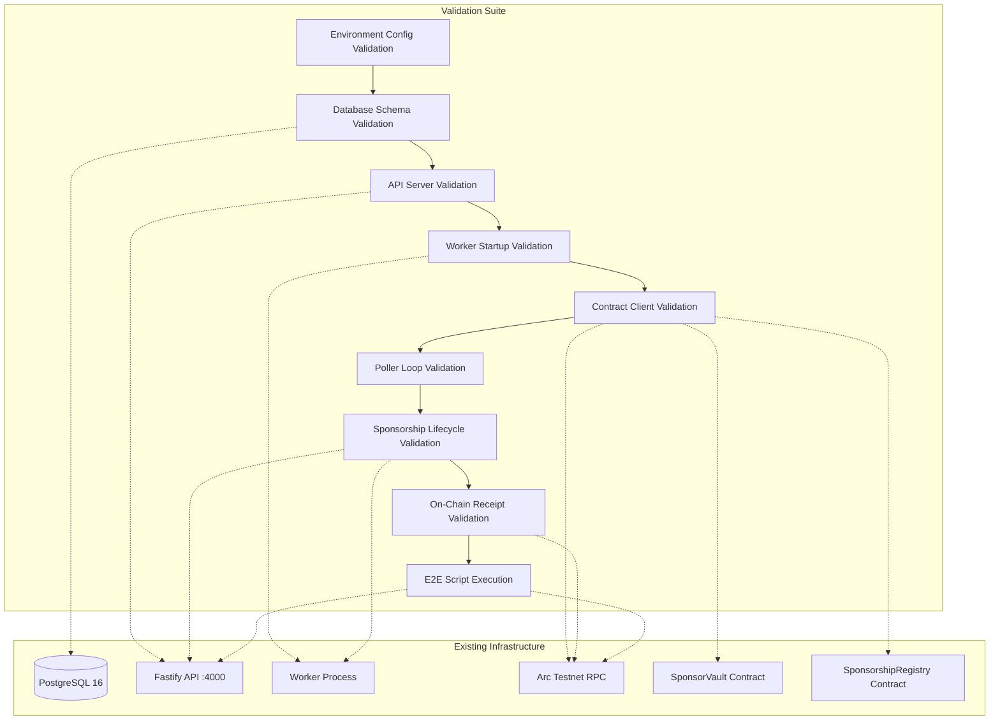

# Design Document: ArcPass Runtime Validation

## Overview

This design describes the validation architecture for verifying that the ArcPass sponsored execution runtime operates correctly. The validation suite confirms that all runtime components — PostgreSQL database, Fastify API server, worker process, contract client, and the end-to-end sponsorship flow — function as expected after deployment.

This is a validation-only design. No new features, services, or infrastructure are introduced. All validation tasks exercise existing code paths and reuse the existing `scripts/validate-e2e.ts` script.

### Design Rationale

The validation suite is structured as a layered set of checks that mirror the system's startup and execution order:

1. **Environment validation** — Fail fast on misconfiguration before touching any service
2. **Database schema validation** — Confirm migrations applied correctly
3. **API server validation** — Confirm HTTP endpoints respond correctly
4. **Worker subsystem validation** — Confirm each worker module initializes
5. **Contract client validation** — Confirm on-chain contract connectivity
6. **Poller loop validation** — Confirm request processing is active
7. **Lifecycle validation** — Confirm the full sponsorship state machine works
8. **On-chain receipt validation** — Confirm blockchain finality
9. **E2E script execution** — Run the existing validation script as a final gate

Each layer depends on the previous layer passing. If environment validation fails, there is no point testing the database.

## Architecture



### Validation Execution Model

All validation tests run as Vitest test suites. The tests are organized into:

- **Smoke tests** — Single-execution checks (config present, service responds)
- **Integration tests** — Tests that hit real services (database queries, API calls, RPC calls)
- **E2E tests** — Full flow tests that exercise the complete sponsorship pipeline

Tests that require live infrastructure (database, API, worker, blockchain) are gated behind environment variable checks and skip gracefully when infrastructure is unavailable.

## Components and Interfaces

### 1. Environment Validator (`tests/validation/env.validation.test.ts`)

Validates all required and optional environment variables before any service interaction.

**Interface:**
```typescript
// Pure validation functions (already exist in apps/worker/src/config.ts)
function loadConfig(): WorkerConfig  // throws on invalid config

// Validation test assertions:
// - DATABASE_URL starts with postgresql://
// - CHAIN_RPC_URL starts with http:// or https://
// - CHAIN_ID equals 1942999
// - CONTRACT_ADDRESS_* matches /^0x[0-9a-fA-F]{40}$/
// - SPONSOR_PRIVATE_KEY (stripped of 0x) matches /^[0-9a-fA-F]{64}$/
// - Optional numerics within configured ranges
```

### 2. Database Schema Validator (`tests/validation/db-schema.validation.test.ts`)

Queries PostgreSQL information_schema to confirm table structure matches Prisma schema.

**Interface:**
```typescript
// Uses Prisma raw queries against information_schema
// Validates: tables exist, columns have correct types, indexes exist, enums exist
```

### 3. API Server Validator (`tests/validation/api.validation.test.ts`)

Makes HTTP requests to the running API server and asserts response structure.

**Interface:**
```typescript
// Uses fetch() against http://localhost:4000
// Validates: /health returns 200, POST /sponsorship/request returns 201,
//            GET /sponsorship/:id returns 200, invalid input returns 400
```

### 4. Worker Startup Validator (`tests/validation/worker.validation.test.ts`)

Validates that each worker subsystem initializes without error.

**Interface:**
```typescript
// Imports and calls worker modules directly:
// - loadConfig() completes without process.exit
// - createViemClients() derives valid account address
// - verifyChainId() confirms chain ID 1942999
// - initializeContractClient() completes without throwing
// - initializeRelayExecutor() completes without throwing
// - createPoller() returns a valid Poller instance
```

### 5. Contract Client Validator (`tests/validation/contract.validation.test.ts`)

Verifies deployed contract bytecode on Arc testnet via RPC.

**Interface:**
```typescript
// Uses viem publicClient.getCode() for each contract address
// Validates: bytecode is non-empty (not "0x"), explorer base URL is valid
```

### 6. Poller Validator (`tests/validation/poller.validation.test.ts`)

Confirms the poller executes a poll cycle without crashing.

**Interface:**
```typescript
// Creates a poller instance and runs one cycle
// Validates: query executes without error, returns result set,
//            subsequent cycles are scheduled via setTimeout
```

### 7. Lifecycle Validator (`tests/validation/lifecycle.validation.test.ts`)

Exercises the full sponsorship request state machine via API calls.

**Interface:**
```typescript
// POST /sponsorship/request → poll GET /sponsorship/:id
// Validates: pending → approved → relayed → completed transitions,
//            transactionHash present on completion, RelayTransaction record exists
```

### 8. Receipt Validator (`tests/validation/receipt.validation.test.ts`)

Verifies on-chain transaction receipts via JSON-RPC.

**Interface:**
```typescript
// Uses eth_getTransactionReceipt RPC call
// Validates: receipt exists, status is 0x1, blockNumber is valid hex,
//            logs contain SponsorshipGranted event topic
```

### 9. E2E Script Runner (`tests/validation/e2e-script.validation.test.ts`)

Executes the existing `scripts/validate-e2e.ts` as a child process.

**Interface:**
```typescript
// Spawns: npx tsx scripts/validate-e2e.ts
// Validates: exit code 0, output contains tx hash, explorer URL, block number
```

## Data Models

No new data models are introduced. The validation suite reads from existing models defined in the Prisma schema:

### Existing Models (Read-Only Validation)

| Model | Table | Validation Purpose |
|-------|-------|--------------------|
| `Wallet` | `wallets` | Confirm table exists |
| `SponsorshipRequest` | `sponsorship_requests` | Confirm table, indexes, lifecycle transitions |
| `RelayTransaction` | `relay_transactions` | Confirm columns (explorerUrl, blockNumber, eventName, eventData), tx hash persistence |
| `RateLimit` | `rate_limits` | Confirm table exists |

### Key Column Validations

| Table | Column | Expected Type | Constraint |
|-------|--------|---------------|------------|
| `relay_transactions` | `explorerUrl` | VARCHAR(512) | nullable |
| `relay_transactions` | `blockNumber` | BIGINT | nullable |
| `relay_transactions` | `eventName` | VARCHAR(100) | nullable |
| `relay_transactions` | `eventData` | JSONB | nullable |

### Key Index Validations

| Table | Index Columns | Type |
|-------|---------------|------|
| `sponsorship_requests` | `(walletId, status)` | composite |
| `sponsorship_requests` | `(walletId)` | single-column |


## Correctness Properties

*A property is a characteristic or behavior that should hold true across all valid executions of a system — essentially, a formal statement about what the system should do. Properties serve as the bridge between human-readable specifications and machine-verifiable correctness guarantees.*

While this is primarily a validation spec (most criteria are smoke/integration tests against live infrastructure), several acceptance criteria test pure validation logic that is well-suited to property-based testing. These pure functions exist in the codebase and can be tested with generated inputs.

### Property 1: Explorer URL Construction Correctness

*For any* valid transaction hash (0x-prefixed, 64 lowercase hex characters) and any valid explorer base URL (http/https scheme, ending with trailing slash), the `buildExplorerUrl` function SHALL produce a URL that:
- Contains the exact transaction hash as a substring
- Starts with the base URL
- Has total length ≤ 512 characters
- Contains no query parameters, fragment identifiers, or additional path segments beyond the base URL and hash

**Validates: Requirements 4.3, 8.1, 8.2, 8.3, 8.5**

### Property 2: Transaction Hash Format Validation

*For any* string, the transaction hash validation function SHALL return true if and only if the string is exactly 66 characters long, starts with "0x", and the remaining 64 characters are all valid hexadecimal digits (case-insensitive).

**Validates: Requirements 7.1**

### Property 3: URL Scheme Validation

*For any* string, the DATABASE_URL validation SHALL accept strings starting with `postgresql://` or `postgres://` and reject all others. The CHAIN_RPC_URL validation SHALL accept strings starting with `http://` or `https://` and reject all others.

**Validates: Requirements 11.1, 11.2**

### Property 4: Contract Address Format Validation

*For any* string, the contract address validation SHALL return true if and only if the string matches the pattern `^0x[0-9a-fA-F]{40}$` (exactly 42 characters: "0x" prefix followed by 40 hexadecimal digits).

**Validates: Requirements 11.4, 11.5**

### Property 5: Private Key Format Validation

*For any* string, after stripping an optional "0x" prefix, the private key validation SHALL accept the string if and only if the remaining characters form a valid 64-character hexadecimal string matching `^[0-9a-fA-F]{64}$`.

**Validates: Requirements 11.6**

### Property 6: Configuration Error Aggregation

*For any* non-empty subset of required environment variables that are missing or malformed, the `loadConfig()` function SHALL produce a single error message that mentions every invalid variable name from that subset.

**Validates: Requirements 11.7**

### Property 7: Numeric Range Validation

*For any* optional numeric environment variable (POLL_INTERVAL_MS, BATCH_SIZE, MAX_RETRIES, LOCK_TIMEOUT_MS, SHUTDOWN_TIMEOUT_MS, CONFIRMATION_BLOCKS, TX_TIMEOUT_MS, CHAIN_ID_VERIFY_TIMEOUT_MS) and *for any* numeric value, the range validation SHALL accept values within the configured [min, max] range and reject values outside that range.

**Validates: Requirements 11.8**

## Error Handling

### Validation Failure Modes

| Failure Type | Behavior | Exit Code |
|---|---|---|
| Missing/malformed env var | Report all invalid vars in single stderr message | 1 |
| Database connection failure | Report host:port and timeout details | 1 |
| Missing database table/column | Report specific missing element | 1 |
| API server unreachable | Report connection refused / timeout | 1 |
| API returns unexpected status | Report endpoint, expected vs actual status | 1 |
| Worker subsystem init failure | Report subsystem name and error | 1 |
| Contract bytecode missing | Report contract address with no bytecode | 1 |
| Chain ID mismatch | Report expected vs actual chain ID | 1 |
| RPC timeout | Report endpoint and timeout duration | 1 |
| Sponsorship lifecycle timeout | Report last observed status and elapsed time | 1 |
| Transaction receipt missing | Report tx hash and retry count | 1 |
| Transaction reverted | Report tx hash and receipt status | 1 |
| E2E script failure | Report exit code and captured stderr | 1 |

### Error Reporting Strategy

- All validation failures write to stderr with structured context
- Each failure identifies the specific requirement being validated
- Failures are reported with enough context to diagnose without re-running
- The validation suite uses Vitest's built-in assertion messages for clear failure output
- Integration tests that depend on live infrastructure skip gracefully when services are unavailable (using `describe.skipIf` or `test.skipIf`)

### Timeout Strategy

| Operation | Timeout | Retry |
|---|---|---|
| Database connection | 5s | No |
| API health check | 10s | No |
| Chain ID verification | 10s (configurable) | No |
| Contract bytecode check | 10s | No |
| First poll cycle | 10s | No |
| Sponsorship lifecycle | 120s | Poll at 2s intervals |
| Transaction receipt | 30s | Poll at 2s intervals |
| E2E script execution | 180s | No |

## Testing Strategy

### Test Organization

```
tests/
  validation/
    env.validation.test.ts          # Requirement 11 - Environment config
    db-schema.validation.test.ts    # Requirement 1 - Database schema
    api.validation.test.ts          # Requirement 2 - API server
    worker.validation.test.ts       # Requirement 3 - Worker startup
    contract.validation.test.ts     # Requirement 4 - Contract client
    poller.validation.test.ts       # Requirement 5 - Poller loop
    lifecycle.validation.test.ts    # Requirements 6, 7, 8 - Sponsorship lifecycle
    receipt.validation.test.ts      # Requirement 9 - On-chain receipt
    e2e-script.validation.test.ts   # Requirement 10 - E2E script
    properties/
      explorer-url.property.test.ts # Property 1 - Explorer URL construction
      format-validation.property.test.ts # Properties 2-5 - Format validations
      config-errors.property.test.ts    # Properties 6-7 - Config error handling
```

### Test Types

**Smoke Tests** (Requirements 1, 2.1, 3.1-3.4, 11.3):
- Single-execution checks that verify infrastructure is configured
- No retries, fast timeout, deterministic pass/fail
- Run first in the validation sequence

**Integration Tests** (Requirements 2.2-2.5, 3.3, 4.1-4.2, 5.1-5.3, 6.1-6.4, 7.2-7.4, 9.1-9.4, 10.1-10.3):
- Tests that hit live services (database, API, RPC)
- 1-3 representative examples per criterion
- Gated behind service availability checks
- Longer timeouts for blockchain operations

**Property-Based Tests** (Properties 1-7):
- Test pure validation logic with generated inputs
- Minimum 100 iterations per property
- Use `fast-check` library for TypeScript property-based testing
- Each test tagged with property reference

**Edge Case Tests** (Requirements 1.5, 2.4, 3.5-3.6, 4.4-4.5, 5.4-5.5, 6.5, 7.5-7.6, 8.4, 9.5-9.7, 10.4-10.5):
- Example-based tests for specific failure conditions
- Use mocks where needed to simulate failures
- Verify error messages and exit behavior

### Property-Based Testing Configuration

- **Library**: `fast-check` (TypeScript PBT library)
- **Runner**: Vitest
- **Iterations**: Minimum 100 per property
- **Tag format**: `Feature: arcpass-runtime-validation, Property {number}: {property_text}`

Each property test imports the pure validation functions from the source modules and tests them with generated inputs. No live infrastructure is required for property tests.

### Test Execution Order

1. Property tests (pure logic, no infrastructure needed)
2. Environment validation (fail fast on bad config)
3. Database schema validation (requires PostgreSQL)
4. API server validation (requires running API)
5. Worker validation (requires running worker)
6. Contract validation (requires Arc testnet RPC)
7. Poller validation (requires database + worker)
8. Lifecycle validation (requires full stack)
9. Receipt validation (requires completed transaction)
10. E2E script execution (final gate)

### Infrastructure Requirements

Tests are organized so that:
- Property tests run anywhere (CI, local, no services needed)
- Smoke tests require only environment variables
- Integration tests require live services (controlled via `VALIDATION_MODE` env var)
- E2E tests require the full stack running (API + worker + database + blockchain)
