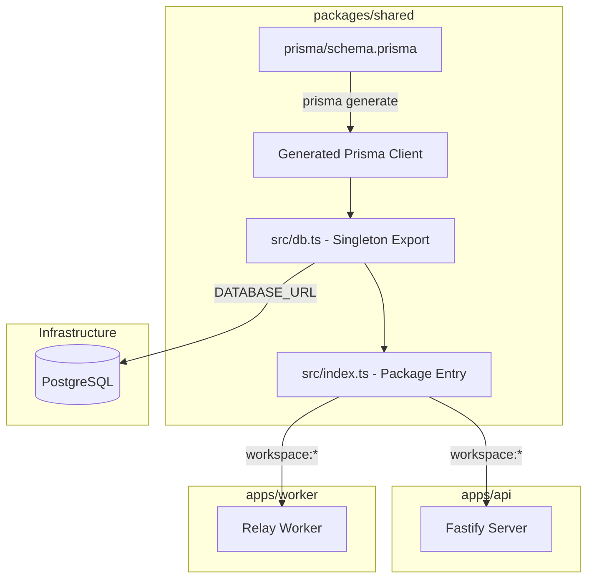
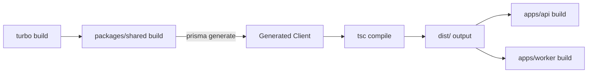
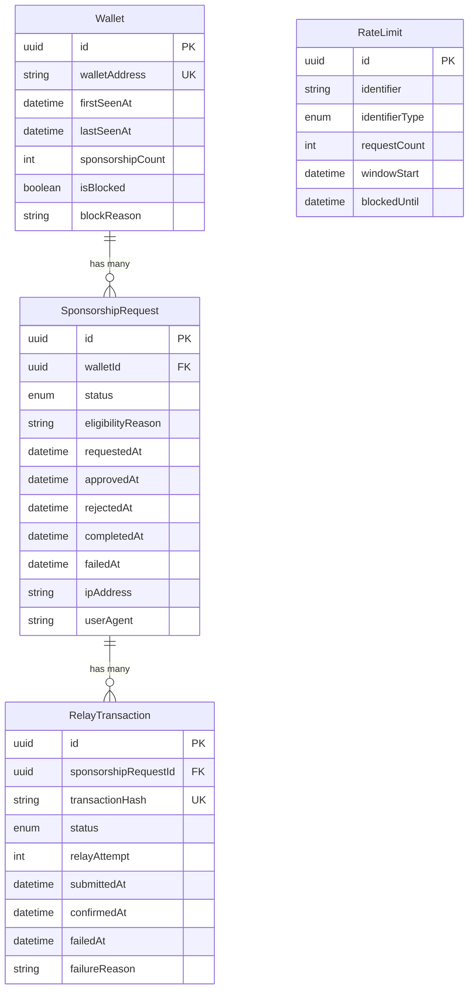

# Design Document: Database Foundation

## Overview

This design establishes the PostgreSQL database layer for ArcPass using Prisma ORM, housed in the `packages/shared` workspace package. The scope is strictly foundational: schema definition, client generation, singleton export, migration workflow, and monorepo integration. No business logic, no relay logic, no API routes.

The design prioritizes:
- **Single source of truth**: One schema, one client, shared across all consumers
- **Developer ergonomics**: Type-safe imports via workspace protocol, no internal path references
- **Hot-reload safety**: globalThis singleton prevents connection pool exhaustion during development
- **Pipeline correctness**: Prisma generate runs before dependent builds via Turborepo topology

## Architecture



### Build Pipeline Flow



Turborepo's `"dependsOn": ["^build"]` ensures `packages/shared` builds (and generates the Prisma client) before any consuming app. The `outputs: ["dist/**"]` configuration enables build caching.

## Components and Interfaces

### Package Structure

```
packages/shared/
├── prisma/
│   ├── schema.prisma          # Schema definition
│   └── migrations/            # Generated migration files
├── src/
│   ├── db.ts                  # Singleton PrismaClient instance
│   └── index.ts               # Package entry point (re-exports)
├── dist/                      # Compiled output (gitignored)
├── package.json
├── tsconfig.json
├── .env.example
└── .gitignore
```

### Module: `src/db.ts` — Singleton Client

```typescript
import { PrismaClient } from '@prisma/client'

function validateDatabaseUrl(): string {
  const url = process.env.DATABASE_URL
  if (!url || url.trim() === '') {
    throw new Error(
      'DATABASE_URL environment variable is not set. ' +
      'Expected format: postgresql://<user>:<password>@<host>:<port>/<database>?schema=public'
    )
  }
  return url
}

function createPrismaClient(): PrismaClient {
  const url = validateDatabaseUrl()
  return new PrismaClient({
    datasources: {
      db: { url },
    },
  })
}

const globalForPrisma = globalThis as unknown as {
  prisma: PrismaClient | undefined
}

export const prisma = globalForPrisma.prisma ?? createPrismaClient()

if (process.env.NODE_ENV !== 'production') {
  globalForPrisma.prisma = prisma
}
```

**Design decisions:**
- `globalThis` singleton prevents multiple PrismaClient instances during hot-reload (Node.js module cache invalidation in dev)
- In production, the module cache is stable so the singleton is naturally maintained
- Validation runs eagerly at import time — fail fast rather than fail on first query

### Module: `src/index.ts` — Package Entry

```typescript
export { prisma } from './db'
export * from '@prisma/client'
```

Re-exports the singleton client and all generated types/enums so consumers never import from `@prisma/client` directly.

### Package Configuration: `package.json`

```json
{
  "name": "@arcpass/shared",
  "version": "0.1.0",
  "type": "module",
  "main": "./dist/index.js",
  "types": "./dist/index.d.ts",
  "exports": {
    ".": {
      "import": "./dist/index.js",
      "types": "./dist/index.d.ts"
    }
  },
  "scripts": {
    "generate": "prisma generate",
    "build": "prisma generate && tsc",
    "migrate:dev": "prisma migrate dev",
    "migrate:deploy": "prisma migrate deploy",
    "db:push": "prisma db push"
  },
  "dependencies": {
    "@prisma/client": "^6.9.0"
  },
  "devDependencies": {
    "prisma": "^6.9.0",
    "typescript": "^5.7.0"
  }
}
```

**Design decisions:**
- Package name `@arcpass/shared` provides a clean import specifier
- `build` script chains `prisma generate` before `tsc` so types are available for compilation
- Separate `migrate:dev` and `migrate:deploy` scripts for development vs production workflows
- `exports` field provides explicit module resolution for ESM consumers

### TypeScript Configuration: `tsconfig.json`

```json
{
  "compilerOptions": {
    "target": "ES2022",
    "module": "ESNext",
    "moduleResolution": "bundler",
    "declaration": true,
    "outDir": "./dist",
    "rootDir": "./src",
    "strict": true,
    "esModuleInterop": true,
    "skipLibCheck": true,
    "forceConsistentCasingInFileNames": true
  },
  "include": ["src/**/*"],
  "exclude": ["node_modules", "dist", "prisma"]
}
```

### Consumer Integration

Apps declare a workspace dependency:

```json
{
  "dependencies": {
    "@arcpass/shared": "workspace:*"
  }
}
```

And import directly:

```typescript
import { prisma, Wallet, SponsorshipRequestStatus } from '@arcpass/shared'
```

## Data Models

### Prisma Schema

```prisma
generator client {
  provider = "prisma-client-js"
}

datasource db {
  provider = "postgresql"
  url      = env("DATABASE_URL")
}

// --- Enums ---

enum SponsorshipRequestStatus {
  pending
  approved
  rejected
  relayed
  completed
  failed
}

enum RelayTransactionStatus {
  queued
  submitted
  confirmed
  failed
}

enum RateLimitIdentifierType {
  ip
  wallet
  user_agent
}

// --- Models ---

model Wallet {
  id               String   @id @default(uuid())
  walletAddress    String   @unique @db.VarChar(255)
  firstSeenAt      DateTime @default(now())
  lastSeenAt       DateTime @default(now())
  sponsorshipCount Int      @default(0)
  isBlocked        Boolean  @default(false)
  blockReason      String?  @db.VarChar(500)

  sponsorshipRequests SponsorshipRequest[]

  @@map("wallets")
}

model SponsorshipRequest {
  id                String                    @id @default(uuid())
  walletId          String
  status            SponsorshipRequestStatus  @default(pending)
  eligibilityReason String?                   @db.VarChar(500)
  requestedAt       DateTime                  @default(now())
  approvedAt        DateTime?
  rejectedAt        DateTime?
  completedAt       DateTime?
  failedAt          DateTime?
  ipAddress         String?                   @db.VarChar(45)
  userAgent         String?                   @db.VarChar(1024)

  wallet            Wallet                    @relation(fields: [walletId], references: [id], onDelete: Restrict)
  relayTransactions RelayTransaction[]

  @@map("sponsorship_requests")
}

model RelayTransaction {
  id                     String                  @id @default(uuid())
  sponsorshipRequestId   String
  transactionHash        String?                 @unique @db.VarChar(255)
  status                 RelayTransactionStatus  @default(queued)
  relayAttempt           Int                     @default(1)
  submittedAt            DateTime?
  confirmedAt            DateTime?
  failedAt              DateTime?
  failureReason          String?                 @db.VarChar(1000)

  sponsorshipRequest     SponsorshipRequest      @relation(fields: [sponsorshipRequestId], references: [id], onDelete: Restrict)

  @@map("relay_transactions")
}

model RateLimit {
  id             String                  @id @default(uuid())
  identifier     String                  @db.VarChar(255)
  identifierType RateLimitIdentifierType
  requestCount   Int                     @default(0)
  windowStart    DateTime                @default(now())
  blockedUntil   DateTime?

  @@index([identifier, identifierType])
  @@map("rate_limits")
}
```

### Entity Relationship Diagram



### Design Decisions

| Decision | Rationale |
|----------|-----------|
| UUID primary keys | Avoids sequential ID enumeration, safe for distributed systems |
| `@@map` to snake_case table names | PostgreSQL convention, Prisma models stay PascalCase |
| `onDelete: Restrict` on relations | Prevents accidental cascade deletion of audit data |
| Composite index on RateLimit `[identifier, identifierType]` | Optimizes the most frequent query pattern for rate limiting |
| `@db.VarChar(N)` constraints | Enforces field length at database level, not just application |
| Wallet address normalization | Handled at application layer before write (Prisma doesn't support DB-level transforms in schema) |
| Separate `RateLimit` entity (no FK) | Rate limiting is infrastructure-level, independent of wallet/sponsorship lifecycle |

## Correctness Properties

*A property is a characteristic or behavior that should hold true across all valid executions of a system — essentially, a formal statement about what the system should do. Properties serve as the bridge between human-readable specifications and machine-verifiable correctness guarantees.*

### Property 1: DATABASE_URL validation rejects all invalid values

*For any* DATABASE_URL value that is undefined, null, empty string, or composed entirely of whitespace characters, the `validateDatabaseUrl` function SHALL throw an error whose message contains the string "DATABASE_URL" and the expected connection string format.

**Validates: Requirements 1.7, 4.6, 5.4**

### Property 2: Wallet address normalization is idempotent lowercase

*For any* string input representing a wallet address, the normalization function SHALL produce output that equals `input.toLowerCase()`, and applying normalization twice SHALL produce the same result as applying it once (idempotence).

**Validates: Requirements 2.8**

## Error Handling

### Client Instantiation Errors

| Scenario | Behavior |
|----------|----------|
| `DATABASE_URL` not set | Throw `Error` with message naming the variable and expected format |
| `DATABASE_URL` is empty/whitespace | Same as above — treated as unset |
| Prisma generate not run | TypeScript compilation fails (missing generated types) |
| Invalid connection string format | Prisma throws at first query (runtime), not at instantiation |

### Migration Errors

| Scenario | Behavior |
|----------|----------|
| Missing `DATABASE_URL` | `prisma migrate` exits non-zero with connection error |
| Invalid connection string | Same — Prisma reports connection failure |
| SQL conflict in migration | Prisma halts, reports failed migration file, exits non-zero |
| Schema syntax error | `prisma generate` fails, build pipeline halts |

### Runtime Connection Errors

| Scenario | Behavior |
|----------|----------|
| Database unreachable | Prisma throws on first query attempt (lazy connection) |
| Connection pool exhausted | Prisma queues requests, eventually times out |
| Connection dropped mid-query | Prisma throws, consumer handles retry logic |

**Design decision**: Prisma uses lazy connections — the client doesn't connect until the first query. This means instantiation succeeds even if the database is down. Connection errors surface at query time, which is appropriate for this foundation layer (business logic in consumers will handle retries).

## Testing Strategy

### Approach

This feature uses a **dual testing approach**:
- **Property-based tests** for the two universal properties (DATABASE_URL validation, wallet address normalization)
- **Unit tests** for specific examples and edge cases
- **Integration tests** for Prisma CLI behavior and database connectivity (run against a real PostgreSQL instance)
- **Smoke tests** for static configuration verification

### Property-Based Testing

**Library**: `fast-check` (already available in the monorepo as a devDependency in apps/api)

**Configuration**:
- Minimum 100 iterations per property test
- Each test tagged with property reference

**Tests**:

1. **Feature: database-foundation, Property 1: DATABASE_URL validation rejects all invalid values**
   - Generator: `fc.oneof(fc.constant(undefined), fc.constant(''), fc.stringOf(fc.constant(' ')))`
   - Assertion: `validateDatabaseUrl()` throws, error message includes "DATABASE_URL"

2. **Feature: database-foundation, Property 2: Wallet address normalization is idempotent lowercase**
   - Generator: `fc.string()` and `fc.hexaString()` (wallet addresses are hex)
   - Assertions:
     - `normalize(input) === input.toLowerCase()`
     - `normalize(normalize(input)) === normalize(input)`

### Unit Tests (Example-Based)

| Test | Validates |
|------|-----------|
| Singleton returns same reference on multiple imports | Req 1.4, 4.2 |
| Package entry exports `prisma` named export | Req 4.1 |
| Re-exports include model types and enums | Req 4.5 |
| Valid DATABASE_URL does not throw | Req 1.7 (happy path) |

### Smoke Tests (Configuration Verification)

| Test | Validates |
|------|-----------|
| `schema.prisma` exists at correct path | Req 1.1 |
| Schema contains `env("DATABASE_URL")` | Req 1.2, 5.1 |
| `package.json` has correct dependencies | Req 1.3 |
| `package.json` has generate/build/migrate scripts | Req 1.6, 3.1 |
| `.env.example` contains placeholder format | Req 3.6, 5.3 |
| `.gitignore` excludes `.env` | Req 5.5 |
| No hardcoded connection strings in source | Req 5.2 |
| Schema defines all four models with correct fields | Req 2.1–2.4 |
| Schema defines all three enums | Req 2.7 |
| Schema has composite index on RateLimit | Req 2.9 |
| Schema has onDelete: Restrict on relations | Req 2.5, 2.6 |

### Integration Tests (Require PostgreSQL)

| Test | Validates |
|------|-----------|
| `prisma migrate dev` creates timestamped migration | Req 3.2 |
| `prisma migrate deploy` applies pending migrations | Req 3.3 |
| Migration fails gracefully with invalid DATABASE_URL | Req 3.4 |
| Consumer apps can import client via workspace protocol | Req 4.3, 4.4 |
| `prisma generate` failure causes non-zero exit | Req 6.5 |

### Test File Organization

```
packages/shared/
├── tests/
│   ├── db.property.test.ts      # Property-based tests (fast-check)
│   ├── db.unit.test.ts          # Unit tests (singleton, exports)
│   └── schema.smoke.test.ts     # Static configuration checks
```

Integration tests live in a separate CI step that requires a PostgreSQL service container.

