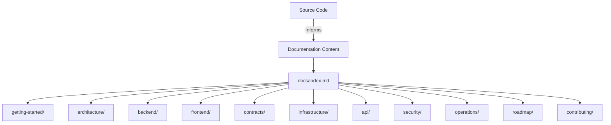
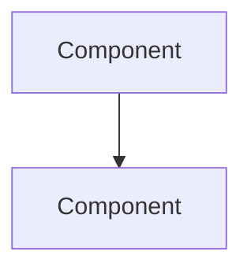

# Design Document: Documentation System

## Overview

This design describes the implementation of a comprehensive professional documentation system for the ArcPass monorepo. The documentation resides entirely in the `/docs` directory as structured Markdown files with Mintlify-compatible frontmatter, Mermaid diagrams, and cross-linked navigation.

The system is not a software application — it is a curated set of documentation artifacts that describe the ArcPass architecture, API, infrastructure, security model, operations, and developer onboarding. The design focuses on content organization, structural conventions, and accuracy guarantees rather than runtime behavior.

### Design Decisions

1. **Flat section directories**: Each top-level section (`getting-started`, `architecture`, etc.) contains Markdown files directly — no nested subdirectories. This keeps navigation simple and Mintlify migration straightforward.
2. **Single index.md entry point**: The root `/docs/index.md` serves as the navigation hub with cross-links to all sections, matching Mintlify's `mint.json` navigation model.
3. **Mermaid for all diagrams**: All architectural and sequence diagrams use Mermaid code blocks, which render natively in GitHub and are supported by Mintlify.
4. **Mintlify frontmatter on every page**: Each `.md` file includes YAML frontmatter with `title` (≤60 chars) and `description` (≤160 chars) for future hosted documentation migration.
5. **Content derived from source code**: All documented endpoints, environment variables, database models, and CLI commands are verified against the actual repository state.

## Architecture

The documentation system is a static file tree with no runtime components. Its "architecture" is the directory layout and the conventions that govern content creation.

```
docs/
├── index.md                          # Landing page and navigation hub
├── getting-started/
│   ├── installation.md               # Local dev setup, prerequisites, env vars
│   └── project-structure.md          # Monorepo layout and workspace relationships
├── architecture/
│   ├── system-overview.md            # Full request flow, Docker networking, lifecycle
│   └── runtime-flow.md              # Sequence diagrams, worker mechanics
├── backend/
│   ├── api-architecture.md           # Fastify plugins, validation, error handling
│   └── database.md                   # Prisma schema, migrations, status transitions
├── frontend/
│   └── frontend-architecture.md      # Next.js App Router, proxy pattern, state
├── contracts/
│   └── contracts-overview.md         # SponsorVault, SponsorshipRegistry, deployment
├── infrastructure/
│   ├── docker-architecture.md        # Docker Compose services, networking, env vars
│   └── gcp-deployment.md            # VPS deployment, domain routing, TLS
├── api/
│   └── endpoints.md                  # Full endpoint reference with schemas
├── security/
│   └── security-model.md            # Rate limiting, replay protection, trust boundaries
├── operations/
│   └── runbooks.md                   # Operational procedures, troubleshooting, recovery
├── roadmap/
│   └── technical-roadmap.md          # Milestones, planned work, production readiness
└── contributing/
    └── development-guidelines.md     # Coding standards, commit conventions, testing
```

### Content Flow



## Components and Interfaces

Since this is a documentation system (not a software application), "components" are the documentation sections and "interfaces" are the conventions that connect them.

### Component: Index Page (`docs/index.md`)

**Purpose**: Entry point and navigation hub for all documentation.

**Content structure**:
- Mintlify frontmatter (`title`, `description`)
- Project overview paragraph (ArcPass as onboarding infrastructure for Arc Network)
- Vision statement and core goals (cold-start gas problem, relay execution, developer integration)
- High-level architecture Mermaid diagram showing: Frontend (web) → API → PostgreSQL → Worker → Smart Contracts
- Navigation links to all 11 top-level sections using relative paths

### Component: Getting Started Section

**Files**: `installation.md`, `project-structure.md`

**installation.md content**:
- Prerequisites with version-check commands (Node.js 22+, pnpm 10.33+, Docker, Foundry)
- Docker setup steps (≥4 numbered steps): container startup, Prisma generate, migration, service launch
- Environment variable table (≥6 required, ≥10 optional) sourced from `.env.example` and `docker-compose.yml`
- Development workflow commands: `pnpm dev`, `pnpm validate`, `pnpm db:up/down/generate/migrate/reset`
- Verification section with observable success indicator

**project-structure.md content**:
- Workspace responsibility table (apps/api, apps/worker, apps/web, packages/shared, packages/sdk, packages/ui, contracts)
- Mermaid diagram showing runtime relationships between workspaces

### Component: Architecture Section

**Files**: `system-overview.md`, `runtime-flow.md`

**system-overview.md content**:
- Full request flow: client → Fastify API (validation, rate limiting, replay protection) → PostgreSQL → Worker → SponsorVault → confirmation
- Docker networking Mermaid diagram with all containers, ports, dependencies
- Next.js API proxy pattern description
- Sponsorship lifecycle state machine (pending → approved → relayed → completed | failed | rejected)

**runtime-flow.md content**:
- Wallet registration sequence diagram (Client, Fastify API, PostgreSQL)
- Sponsorship execution sequence diagram (Poller, Processor, PostgreSQL, Relay Executor, Arc Network)
- Worker operational mechanics: poll interval, batch size, row-level locking, stale recovery, graceful shutdown, chain ID verification

### Component: Backend Section

**Files**: `api-architecture.md`, `database.md`

**api-architecture.md content**:
- Fastify 5.x plugin architecture with ordered registration sequence:
  1. CORS — handles OPTIONS preflight
  2. Security headers — attaches security headers to all responses
  3. Correlation ID — generates/validates X-Request-ID
  4. Content-type check — validates POST Content-Type
  5. Replay protection — 5s deduplication window
  6. Error handler — structured error responses
  7. Routes — business endpoint handlers
  8. Not-found handler — 404/405 responses (registered after routes)
- JSON Schema validation with `additionalProperties: false`
- Error handling: ValidationError (400), BlockedWalletError (403), WalletNotFoundError (404), SponsorshipNotFoundError (404), RateLimitError (429), InvalidStatusTransitionError (409)
- Service layer pattern: routes/ → services/ → lib/

**database.md content**:
- Prisma ORM usage (schema at `packages/shared/prisma/schema.prisma`)
- Migration workflow
- Status transitions: SponsorshipRequest (pending → approved → relayed → completed | failed | rejected), RelayTransaction (queued → submitted → confirmed | failed)
- ER diagram (Wallet → SponsorshipRequest → RelayTransaction, standalone RateLimit)

### Component: Frontend Section

**File**: `frontend-architecture.md`

- Next.js 16 App Router with `app/` directory
- Client/server component boundary
- API proxy pattern via `app/api/backend/[...path]/route.ts` → `API_URL_INTERNAL`
- State management: React hooks, centralized API client (`lib/api-client.ts`), env config (`config/env.ts`), `router.refresh()`
- Infrastructure dashboard page (health status of API, PostgreSQL, Worker, RPC)
- Directory conventions: `components/ui/`, `components/features/`, `components/layout/`

### Component: Contracts Section

**File**: `contracts-overview.md`

- SponsorVault: treasury management, sponsorTransfer (operator-only), setOperator/setPerTransactionLimit/emergencyWithdraw (owner-only), initializeRegistry (owner-only, one-time)
- SponsorshipRegistry: on-chain accounting, recordSponsorship (vault-only), isSponsored (public view)
- Owner/operator authorization model
- Checks-effects-interactions pattern, AlreadySponsored guard
- Security mechanisms: per-transaction limit, emergency withdrawal, immutable vault address, vault-only write
- Deployment phases: (1) deploy SponsorVault, (2) deploy SponsorshipRegistry with vault address, (3) initializeRegistry, (4) validate
- Two-phase initialization pattern for circular dependency

### Component: Infrastructure Section

**Files**: `docker-architecture.md`, `gcp-deployment.md`

**docker-architecture.md content**:
- All Docker Compose services: postgres (5433:5432), api (4000:4000), worker (no exposed port), web (3000:3000)
- Health checks, volume mounts, dependency order
- Internal networking (service-name resolution)
- Environment variable tables per service
- Multi-stage Dockerfile pattern (deps → build → prod-deps → runtime)

**gcp-deployment.md content**:
- VPS deployment procedures
- Domain routing and HTTPS/TLS configuration
- Deployment checklist: image build → migration → health verification → rollback

### Component: API Section

**File**: `endpoints.md`

All endpoints documented with method, path, purpose, request/response schemas, examples:
- `GET /health` — service health check
- `POST /wallets/register` — register a wallet
- `GET /wallets/:address` — lookup wallet by address
- `GET /wallets/:address/history` — paginated sponsorship history
- `POST /sponsorship/request` — create sponsorship request
- `GET /sponsorship/:id` — get sponsorship by ID
- `GET /sponsorship/tx/:hash` — get relay transaction by hash
- `GET /relay/:id` — get relay transaction by ID

Validation rules: wallet address pattern (`^0x[0-9a-fA-F]{40}$`), UUID format, tx hash max 1024 chars, pagination (cursor UUID, limit 1–100, default 50).

Error response structure: `{ error: string, statusCode: number }` with codes 400, 403, 404, 429, 500.

### Component: Security Section

**File**: `security-model.md`

- Rate limiting: IP (10 req/window, 3600000ms window, 900000ms block), wallet (5 req/window), auto-block with HTTP 429 + Retry-After
- Replay protection: 5s deduplication, composite key `{walletAddress}:{clientIp}`, HTTP 429 on duplicate
- Wallet restrictions: `isBlocked` flag, eligibility checks at API and worker layers, partial unique index
- Trust boundaries: client → API → database → worker → blockchain
- Hardening: security headers, frozen config objects, correlation IDs (128-char max), graceful shutdown (10s timeout), JSON Schema strictness, row-level locking (SELECT FOR UPDATE SKIP LOCKED)

### Component: Operations Section

**File**: `runbooks.md`

Consistent structure per procedure: symptom → diagnostic commands → resolution steps → verification.
- Docker rebuild procedure
- Troubleshooting: crash loops, DB connection failures, health check failures
- Health verification per service
- Recovery: DB migration failures, stuck PENDING requests, worker restart
- Deployment verification checklist

### Component: Roadmap Section

**File**: `technical-roadmap.md`

- Completed milestones: API service, database foundation, wallet registry, sponsorship MVP, worker runtime, relay execution, Docker integration, production hardening, validation suite
- Planned: Infrastructure stabilization (≥3 items)
- Planned: Integrations (Circle, paymaster patterns)
- Planned: SDK development (target consumers, public surface, capabilities)
- Production readiness criteria (≥5 measurable criteria)

### Component: Contributing Section

**File**: `development-guidelines.md`

- Coding standards: TypeScript, modular functions, composition, minimal dependencies
- Architecture principles: service layer separation, no business logic in routes, isolated blockchain logic
- Monorepo rules: shared logic in packages/shared, pnpm workspaces, Turborepo `dependsOn: ["^build"]`
- Commit conventions: type-prefixed (feat, fix, chore, docs, refactor, test), branch naming (feature/, fix/, docs/, chore/)
- Documentation conventions: Mintlify frontmatter, relative cross-links, Mermaid diagrams
- Testing: `pnpm validate` before submitting, no regressions

### Interface: Cross-Link Convention

All inter-page references use relative Markdown links:
```markdown
[API Architecture](../backend/api-architecture.md)
```

### Interface: Frontmatter Convention

Every page starts with:
```yaml
---
title: "Page Title Here"
description: "One-sentence description of the page content, max 160 characters."
---
```

### Interface: Mermaid Diagram Convention

All diagrams use fenced code blocks:
````markdown

````

### Interface: Callout Convention (Mintlify)

```markdown
<Note>Important information here.</Note>
<Warning>Critical warning here.</Warning>
<Info>Helpful context here.</Info>
<Tip>Useful suggestion here.</Tip>
```

## Data Models

This system has no runtime data models. The "data" is the documentation content itself, governed by these structural rules:

### Page Model

| Field | Type | Constraint |
|-------|------|-----------|
| title | string | ≤60 characters, in YAML frontmatter |
| description | string | ≤160 characters, in YAML frontmatter |
| filename | string | lowercase kebab-case, `.md` extension |
| section | string | one of the 11 defined top-level directories |
| content | Markdown | no placeholder text, no TODO markers |

### Cross-Link Model

| Field | Type | Constraint |
|-------|------|-----------|
| source | file path | must exist in `/docs` |
| target | relative path | must resolve to an existing `.md` file |
| format | Markdown link | `[text](relative/path.md)` |

### Diagram Model

| Field | Type | Constraint |
|-------|------|-----------|
| type | string | `mermaid` |
| syntax | code block | ` ```mermaid ... ``` ` |
| content | Mermaid DSL | valid Mermaid graph, sequence, or flowchart |

## Error Handling

Since this is a documentation system (static files), there is no runtime error handling. However, the following validation errors should be caught during authoring:

| Error Condition | Detection Method | Resolution |
|----------------|-----------------|------------|
| Broken cross-link | Manual review or link-checker tool | Fix the relative path to point to an existing file |
| Missing frontmatter | Grep for files without `---` header | Add required `title` and `description` fields |
| Title exceeds 60 chars | Character count check | Shorten the title |
| Description exceeds 160 chars | Character count check | Shorten the description |
| Placeholder/TODO content | Grep for `TODO`, `lorem`, `placeholder` | Replace with actual content |
| Invalid Mermaid syntax | Mermaid renderer validation | Fix diagram syntax |
| Outdated content (stale reference) | PR review against source changes | Update documentation in same changeset |

## Testing Strategy

Property-based testing does **not apply** to this feature. The documentation system produces static Markdown files — there are no pure functions, data transformations, or algorithmic logic to validate with generated inputs. There is no meaningful "for all inputs X, property P(X) holds" statement for documentation content.

### Appropriate Testing Approaches

**1. Structural Validation (Automated)**

A validation script can verify structural requirements:
- All 11 section directories exist under `/docs`
- Each section contains at least one `.md` file
- All `.md` files have valid YAML frontmatter with `title` (≤60 chars) and `description` (≤160 chars)
- All filenames use lowercase kebab-case
- `docs/index.md` exists and contains links to all sections
- No files contain `TODO`, `lorem ipsum`, or placeholder markers

**2. Link Validation (Automated)**

A link-checker script can verify:
- All relative cross-links resolve to existing files
- No broken internal links exist
- All Mermaid code blocks use valid syntax (parseable by Mermaid CLI)

**3. Content Accuracy (Manual + PR Review)**

Content accuracy is verified through:
- PR review process ensuring documentation changes accompany code changes
- Comparison of documented endpoints against route handler source files
- Comparison of documented environment variables against `.env.example` and `docker-compose.yml`
- Comparison of documented database models against `packages/shared/prisma/schema.prisma`

**4. Mintlify Compatibility (Manual)**

- Verify frontmatter format matches Mintlify expectations
- Verify callout syntax uses `<Note>`, `<Warning>`, `<Info>`, `<Tip>` components
- Verify Mermaid blocks render correctly in Mintlify preview

### Recommended Validation Script

A lightweight validation test (using the existing Vitest setup) can be added to the validation suite to check structural requirements. This would run as part of `pnpm validate` and catch regressions like missing frontmatter or broken links.

```typescript
// tests/validation/docs.validation.test.ts
// Checks: directory structure, frontmatter presence, link validity, no placeholders
```

This approach provides confidence in documentation structure without the overhead of property-based testing, which would add no value for static content verification.
