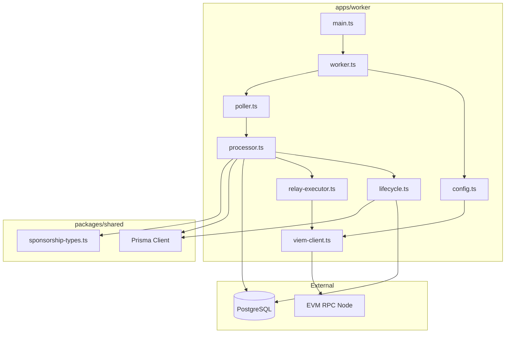
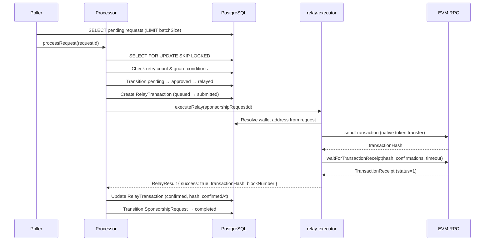
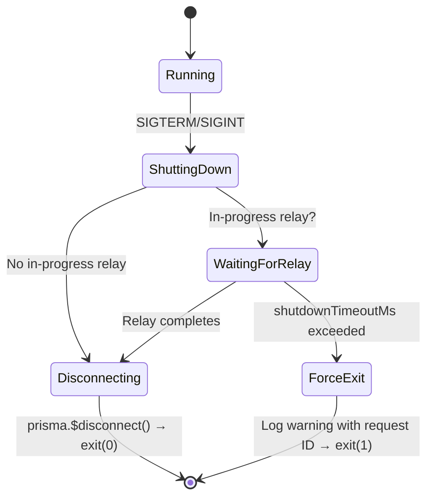

# Design Document: Real Relay Execution

## Overview

This design replaces the mock `relay-simulator.ts` module in `apps/worker` with a production-ready blockchain relay executor powered by [viem](https://viem.sh). The new `relay-executor.ts` module constructs, signs, broadcasts, and confirms real EVM transactions on Arc Network. It integrates into the existing poller → processor → lifecycle architecture without changing the worker's scheduling model, database schema, or Docker build pipeline.

Key design decisions:
- **Drop-in replacement**: The relay executor exports the same function signature as `simulateRelay`, so the processor swap is a single import change.
- **viem over ethers.js**: viem is tree-shakeable, ESM-native, and provides typed transaction receipt polling out of the box via `waitForTransactionReceipt`.
- **Fail-safe by default**: All blockchain errors are caught and returned as structured `RelayResult` failures — the relay executor never throws unhandled exceptions to the processor.
- **Configuration-first startup**: All environment variables are validated before the first poll cycle, so misconfigurations surface immediately rather than on the first relay attempt.

## Architecture



### Module Responsibilities

| Module | Responsibility |
|--------|---------------|
| `config.ts` | Loads and validates all environment variables at startup. Adds new fields for `chainRpcUrl`, `sponsorPrivateKey`, `confirmationBlocks`, `txTimeoutMs`. Removes `relayFailureRate`. |
| `viem-client.ts` | Factory module that creates and exports a configured viem `WalletClient` and `PublicClient` from the validated config. |
| `relay-executor.ts` | Constructs, signs, broadcasts, and confirms EVM transactions. Returns structured `RelayResult`. Never throws. |
| `processor.ts` | Orchestrates the sponsorship lifecycle within a Prisma transaction. Swaps `simulateRelay` import for `executeRelay`. |
| `logger.ts` | Structured JSON logger with `component` field, timestamp, and sensitive-data filtering. |
| `poller.ts` | Unchanged — continues using `setTimeout`-based polling. |
| `worker.ts` | Startup orchestration — validates config, initializes viem client, starts poller. |
| `main.ts` | Process entry point with signal handlers — unchanged structure. |
| `lifecycle.ts` | Database transition helpers — unchanged. |

### Data Flow (Happy Path)



## Components and Interfaces

### config.ts — Updated Configuration

```typescript
export interface WorkerConfig {
  databaseUrl: string
  chainRpcUrl: string
  sponsorPrivateKey: string
  pollIntervalMs: number
  batchSize: number
  maxRetries: number
  lockTimeoutMs: number
  shutdownTimeoutMs: number
  confirmationBlocks: number
  txTimeoutMs: number
}
```

The `relayFailureRate` field is removed. New fields:
- `chainRpcUrl` — validated HTTP/HTTPS URL (required)
- `sponsorPrivateKey` — 64-char hex with optional `0x` prefix (required)
- `confirmationBlocks` — integer 1–50, default 2
- `txTimeoutMs` — integer 10000–600000, default 120000

Validation logic:
- All required vars checked first; missing → `process.exit(1)` with identifying message
- Format validation: URL regex for `chainRpcUrl`, hex regex for `sponsorPrivateKey`
- Range validation for all numeric optionals
- Private key cryptographic validation via `privateKeyToAccount` (throws on invalid curve point)

### viem-client.ts — Client Factory

```typescript
import { createPublicClient, createWalletClient, http } from 'viem'
import { privateKeyToAccount } from 'viem/accounts'
import type { PublicClient, WalletClient, Account, Chain } from 'viem'

export interface ViemClients {
  publicClient: PublicClient
  walletClient: WalletClient
  account: Account
}

export function createViemClients(config: {
  chainRpcUrl: string
  sponsorPrivateKey: string
}): ViemClients
```

Design decisions:
- Uses `http` transport (not WebSocket) for simplicity and compatibility with all RPC providers.
- Does not hardcode a chain definition — uses the RPC's reported chain ID. This allows targeting any EVM-compatible chain without code changes.
- The `account` is derived once at startup and reused for all transactions.

### relay-executor.ts — Relay Executor

```typescript
import type { RelayResult } from './relay-simulator.js'

export { type RelayResult }

/**
 * Executes a real blockchain relay for a sponsorship request.
 * Drop-in replacement for simulateRelay.
 * 
 * @param sponsorshipRequestId - The ID of the sponsorship request to relay
 * @param _failureRate - Accepted for API compatibility, ignored
 * @returns RelayResult with success/failure status and transaction hash
 */
export async function executeRelay(
  sponsorshipRequestId: string,
  _failureRate?: number
): Promise<RelayResult>
```

Extended result type (backward-compatible):

```typescript
export interface RelayResult {
  success: boolean
  transactionHash: string | null
  failureReason: string | null
  blockNumber?: bigint | null
}
```

Internal flow:
1. Query the sponsorship request to get the target wallet address
2. Construct a native token transfer transaction (`value` = configured sponsorship amount, `to` = wallet address)
3. Call `walletClient.sendTransaction(...)` — this signs and broadcasts atomically
4. Record `submittedAt` timestamp
5. Call `publicClient.waitForTransactionReceipt({ hash, confirmations, timeout })`
6. Map receipt status to RelayResult:
   - `status === 'success'` → `{ success: true, transactionHash: hash, blockNumber }`
   - `status === 'reverted'` → `{ success: false, transactionHash: hash, failureReason: 'transaction reverted' }`
7. Catch all errors and return structured failure (never throw)

### logger.ts — Structured Logger

```typescript
export interface LogEntry {
  timestamp: string    // ISO 8601
  level: 'info' | 'warn' | 'error'
  component: 'relay-executor' | 'processor' | 'worker' | 'poller'
  message: string
  [key: string]: unknown
}

export function createLogger(component: LogEntry['component']): Logger

export interface Logger {
  info(message: string, data?: Record<string, unknown>): void
  warn(message: string, data?: Record<string, unknown>): void
  error(message: string, data?: Record<string, unknown>): void
}
```

Design decisions:
- Single-line JSON output via `JSON.stringify` (no pretty-printing)
- Sensitive data filter: strips any field matching patterns for private keys, mnemonics, or credential-bearing URLs before serialization
- `component` field set at logger creation time, not per-call
- Replaces all existing `console.info`/`console.error` calls in the worker

### processor.ts — Updated Processor

Changes from current implementation:
1. Import `executeRelay` from `./relay-executor.js` instead of `simulateRelay` from `./relay-simulator.js`
2. Add guard: check for existing `submitted` or `confirmed` RelayTransaction before creating a new one
3. Use structured logger instead of `console.*`
4. Pass `submittedAt` timestamp to relay transaction before invoking relay executor
5. Handle the extended `RelayResult` (with `blockNumber`)

The processor continues to:
- Use `SELECT FOR UPDATE SKIP LOCKED` for row-level locking
- Execute all transitions within a single `prisma.$transaction`
- Catch all errors and return `ProcessResult` without crashing

## Data Models

No schema changes are required. The existing Prisma models fully support the real relay execution:

### Existing Models (Unchanged)

```prisma
model RelayTransaction {
  id                     String                  @id @default(uuid())
  sponsorshipRequestId   String
  transactionHash        String?                 @unique @db.VarChar(255)
  status                 RelayTransactionStatus  @default(queued)
  relayAttempt           Int                     @default(1)
  submittedAt            DateTime?
  confirmedAt            DateTime?
  failedAt              DateTime?
  failureReason          String?                 @db.VarChar(1000)
  sponsorshipRequest     SponsorshipRequest      @relation(...)
}

model SponsorshipRequest {
  id                String                    @id @default(uuid())
  walletId          String
  status            SponsorshipRequestStatus  @default(pending)
  requestedAt       DateTime                  @default(now())
  approvedAt        DateTime?
  completedAt       DateTime?
  failedAt          DateTime?
  wallet            Wallet                    @relation(...)
  relayTransactions RelayTransaction[]
}
```

The `transactionHash` field stores the real on-chain hash (66-char hex `0x`-prefixed string). The `@unique` constraint prevents duplicate hash persistence at the database level.

### Configuration Environment Variables

| Variable | Required | Default | Range | Format |
|----------|----------|---------|-------|--------|
| `DATABASE_URL` | Yes | — | — | PostgreSQL connection string |
| `SPONSOR_PRIVATE_KEY` | Yes | — | — | 64-char hex (with or without `0x`) |
| `CHAIN_RPC_URL` | Yes | — | — | `http://` or `https://` URL |
| `POLL_INTERVAL_MS` | No | 5000 | 1000–60000 | Integer |
| `BATCH_SIZE` | No | 20 | 1–100 | Integer |
| `MAX_RETRIES` | No | 5 | 1–10 | Integer |
| `LOCK_TIMEOUT_MS` | No | 30000 | 5000–120000 | Integer |
| `SHUTDOWN_TIMEOUT_MS` | No | 10000 | 5000–60000 | Integer |
| `CONFIRMATION_BLOCKS` | No | 2 | 1–50 | Integer |
| `TX_TIMEOUT_MS` | No | 120000 | 10000–600000 | Integer |

## Correctness Properties

*A property is a characteristic or behavior that should hold true across all valid executions of a system — essentially, a formal statement about what the system should do. Properties serve as the bridge between human-readable specifications and machine-verifiable correctness guarantees.*

### Property 1: Configuration validation rejects invalid inputs and accepts valid inputs

*For any* environment variable value that does not conform to its defined format (non-hex for private key, non-URL for RPC URL) or range (numeric values outside min–max bounds), the configuration loader SHALL reject it with an error identifying the variable name and constraint. Conversely, *for any* value within the valid format and range, the configuration loader SHALL accept it and return the parsed value.

**Validates: Requirements 2.1, 2.3, 2.4, 2.5, 2.6, 3.3, 12.1, 12.2, 12.3, 12.4, 12.5, 12.6**

### Property 2: RPC errors produce structured failure results without throwing

*For any* RPC error encountered during transaction broadcast or receipt polling, the relay executor SHALL return a `RelayResult` with `success: false` and `failureReason` containing the error message, without throwing an unhandled exception to the caller.

**Validates: Requirements 1.5, 4.5**

### Property 3: Relay result drives correct lifecycle state transitions

*For any* relay execution that returns `success: true`, the processor SHALL transition the RelayTransaction to `confirmed` (with `transactionHash` and `confirmedAt`) and the SponsorshipRequest to `completed` (with `completedAt`). *For any* relay execution that returns `success: false`, the processor SHALL transition the RelayTransaction to `failed` (with `failureReason` and `failedAt`) and the SponsorshipRequest to `failed` (with `failedAt`).

**Validates: Requirements 5.2, 5.3, 5.4, 5.5, 7.1**

### Property 4: Guard conditions prevent relay invocation

*For any* sponsorship request where (a) the status is not `pending` after lock acquisition, OR (b) a RelayTransaction with status `submitted` or `confirmed` already exists, OR (c) the count of existing RelayTransactions equals or exceeds `maxRetries`, the processor SHALL skip relay invocation and not call the relay executor.

**Validates: Requirements 6.3, 6.4, 7.2, 7.3, 7.5**

### Property 5: Batch processing continues after individual request failures

*For any* batch of pending sponsorship requests where one or more requests produce a failure `ProcessResult`, the worker SHALL continue processing subsequent requests in the batch until all items have been attempted or a shutdown signal is received.

**Validates: Requirements 9.1, 9.5**

### Property 6: Structured log format compliance

*For any* log entry emitted by the worker, the output SHALL be a valid single-line JSON object containing at minimum the fields `timestamp` (ISO 8601 format), `level` (one of info/warn/error), `component` (one of relay-executor/processor/worker/poller), and `message` (non-empty string).

**Validates: Requirements 10.6, 10.7**

### Property 7: No sensitive data in log output

*For any* log entry emitted during operations involving sensitive configuration (private keys, mnemonics, credential-bearing RPC URLs), the serialized log output SHALL NOT contain the private key value, any mnemonic phrase, or the full RPC URL with embedded credentials.

**Validates: Requirements 10.8, 3.4**

### Property 8: Transaction receipt status maps to correct RelayResult

*For any* transaction receipt with `status === 'success'`, the relay executor SHALL return `{ success: true, transactionHash, blockNumber }`. *For any* transaction receipt with `status === 'reverted'`, the relay executor SHALL return `{ success: false, transactionHash, failureReason: 'transaction reverted' }`.

**Validates: Requirements 4.2, 4.3**

### Property 9: Timeout failure includes pending hash when available

*For any* timeout that occurs after a transaction hash has been obtained from broadcast, the relay executor SHALL include that hash in the failure result. *For any* timeout that occurs before a hash is obtained, the relay executor SHALL return `transactionHash: null` in the failure result.

**Validates: Requirements 8.3, 4.4**

## Error Handling

### Error Categories and Recovery

| Error Source | Handling Strategy | Recovery |
|---|---|---|
| RPC broadcast failure | Catch in relay-executor, return `RelayResult { success: false }` | Request stays processable for retry on next poll |
| RPC receipt timeout | `waitForTransactionReceipt` timeout → return failure with pending hash | Relay marked failed; request can be retried |
| Transaction reverted | Receipt `status === 'reverted'` → return failure | Relay marked failed; request transitions to failed |
| Prisma transaction error | Caught by processor try/catch → rollback → return `ProcessResult { success: false }` | Request remains in `pending` status for next poll |
| Invalid config at startup | `process.exit(1)` with descriptive message | Operator fixes config and restarts |
| Unexpected exception in relay | Caught by processor → log error → return failure ProcessResult | Request status unchanged from pre-transaction state |

### Graceful Shutdown



- Signal handlers set `isShuttingDown = true` and stop accepting new poll cycles
- Current in-progress relay operation is allowed to complete up to `shutdownTimeoutMs`
- If timeout fires, process exits with code 1 and logs the request ID that may need manual reconciliation
- On clean shutdown, Prisma client is disconnected and process exits with code 0

### Error Propagation Boundaries

1. **relay-executor.ts** — All errors caught internally. Never throws to caller. Returns `RelayResult`.
2. **processor.ts** — Wraps entire flow in try/catch. Returns `ProcessResult`. Never throws to poller.
3. **poller.ts** — Logs failures from processor and continues to next request. Never crashes.
4. **main.ts** — Top-level catch on `start()` failure → `process.exit(1)`.

## Testing Strategy

### Property-Based Testing

The project already has `fast-check` as a dev dependency and a `tests/property/` directory. Property-based tests will use fast-check with a minimum of 100 iterations per property.

**Library**: fast-check ^4.1.1 (already installed)
**Runner**: vitest (already configured)
**Location**: `apps/worker/tests/property/`

Each property test will be tagged with a comment referencing the design property:
```typescript
// Feature: real-relay-execution, Property 1: Configuration validation rejects invalid inputs and accepts valid inputs
```

**Property tests to implement:**

| Property | Test File | What's Generated |
|----------|-----------|-----------------|
| P1: Config validation | `config-validation.property.test.ts` | Random strings for URLs, hex keys, numeric values in/out of range |
| P2: RPC error handling | `relay-executor.property.test.ts` | Random error messages, error types |
| P3: Lifecycle transitions | `processor-lifecycle.property.test.ts` | Random RelayResults (success/failure), transaction hashes, failure reasons |
| P4: Guard conditions | `processor-guards.property.test.ts` | Random request states, retry counts, existing relay statuses |
| P5: Batch resilience | `poller-batch.property.test.ts` | Random batch sizes with random failure positions |
| P6: Log format | `logger.property.test.ts` | Random log messages, data payloads, component values |
| P7: No sensitive data | `logger-security.property.test.ts` | Random private keys, URLs with credentials, log scenarios |
| P8: Receipt mapping | `relay-executor.property.test.ts` | Random transaction hashes, block numbers, receipt statuses |
| P9: Timeout with hash | `relay-executor.property.test.ts` | Random hashes, timeout scenarios (pre/post broadcast) |

### Unit Tests (Example-Based)

**Location**: `apps/worker/tests/unit/`

- `relay-executor.test.ts` — Happy path with mocked viem, specific error scenarios
- `config.test.ts` — Specific valid/invalid config examples, default values
- `viem-client.test.ts` — Client creation with valid config
- `logger.test.ts` — Specific log output format examples, startup log verification
- `processor.test.ts` — Integration of relay executor with lifecycle (mocked DB)

### Integration Tests

**Location**: `apps/worker/tests/integration/`

- `relay-lifecycle.integration.test.ts` — Full flow with real Prisma against test DB, mocked viem
- `concurrent-processing.integration.test.ts` — Two processors competing for same row (lock contention)
- `shutdown.integration.test.ts` — SIGTERM during processing, verify graceful completion

### Smoke Tests

**Location**: `apps/worker/tests/` (existing pattern)

- Existing Docker build smoke tests verify the new dependency doesn't break the build
- ESM compliance verified by existing build process

### Test Configuration

```typescript
// vitest.config.ts — no changes needed
export default defineConfig({
  test: {
    include: [
      'tests/unit/**/*.test.ts',
      'tests/property/**/*.test.ts',
      'tests/integration/**/*.test.ts',
      'tests/*.smoke.test.ts',
    ],
    testTimeout: 10000,
  },
})
```

Property tests may need extended timeout for 100+ iterations with async mocks. Individual property test files can override with `vi.setConfig({ testTimeout: 30000 })` if needed.
