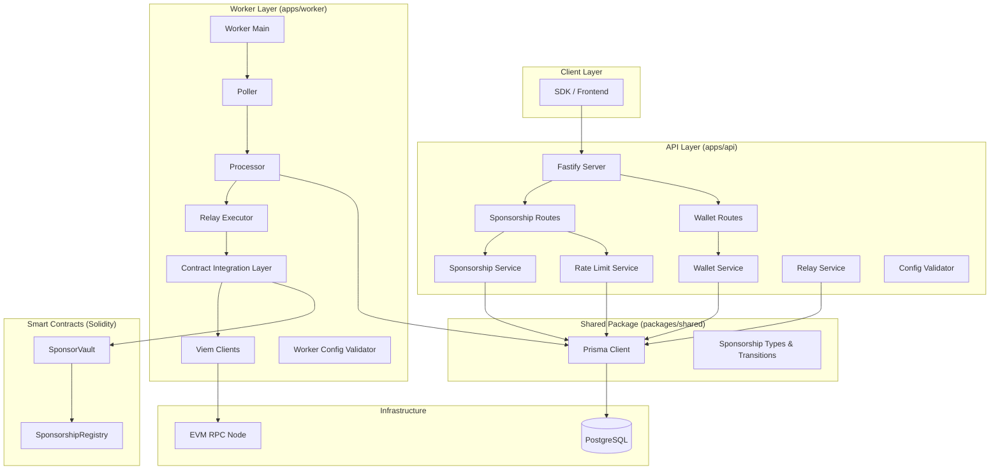
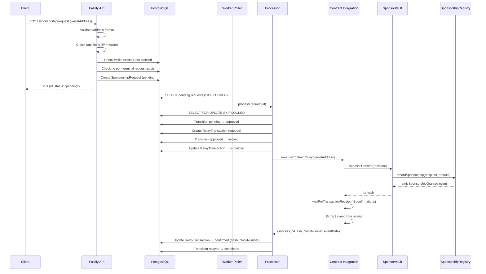

# Design Document: Sponsorship Platform MVP

## Overview

The ArcPass Sponsorship Platform MVP connects the existing API layer, worker relay, wallet registry, and database into a cohesive end-to-end sponsorship system — adding a minimal smart contract layer (SponsorVault + SponsorshipRegistry) and a viem-based contract integration layer to enable real on-chain sponsorship execution on Arc Network testnets.

The system solves the cold-start gas problem: eligible wallets receive a one-time sponsored native token transfer so they can execute their first transaction without holding gas. The MVP targets testnet deployment, grant demonstrations, and investor walkthroughs.

### Key Design Decisions

1. **Extend, don't replace**: The existing Fastify API, Prisma schema, worker poller/processor, and viem relay executor are preserved. New functionality layers on top.
2. **Contract calls replace raw transfers**: The relay executor currently calls `walletClient.sendTransaction` directly. The MVP replaces this with a call to `SponsorVault.sponsorTransfer(recipient)`, which handles authorization, accounting, and event emission.
3. **Minimal Solidity surface**: Two contracts with narrow responsibilities — treasury custody (SponsorVault) and accounting/verification (SponsorshipRegistry). No upgradability, no governance, no token.
4. **Config-driven deployment**: All chain-specific parameters (RPC URL, chain ID, contract addresses) come from environment variables. Zero code changes to switch testnets.
5. **Observability via structured JSON**: Pino in the API, custom structured logger in the worker. Correlation IDs (sponsorship request ID) thread through every log entry in the lifecycle.

## Architecture



### Request Flow (End-to-End)



## Components and Interfaces

### 1. Smart Contracts

#### SponsorVault.sol

Holds native token treasury and executes authorized sponsorship transfers.

```solidity
interface ISponsorVault {
    // State
    function owner() external view returns (address);
    function operator() external view returns (address);
    function registry() external view returns (address);
    function perTransactionLimit() external view returns (uint256);

    // Owner-only
    function setOperator(address newOperator) external;
    function setPerTransactionLimit(uint256 limit) external;
    function emergencyWithdraw(address to, uint256 amount) external;

    // Operator-only
    function sponsorTransfer(address recipient, uint256 amount) external;

    // Events
    event OperatorUpdated(address indexed previousOperator, address indexed newOperator);
    event PerTransactionLimitUpdated(uint256 previousLimit, uint256 newLimit);
    event SponsorshipExecuted(address indexed recipient, uint256 amount);
    event EmergencyWithdrawal(address indexed to, uint256 amount);

    // Receive native tokens
    receive() external payable;
}
```

**Key behaviors:**
- `sponsorTransfer` checks: caller == operator, amount <= perTransactionLimit, balance >= amount, registry.sponsorshipCount(recipient) == 0
- Calls `registry.recordSponsorship(recipient, amount)` before transferring funds
- Reverts with descriptive custom errors: `Unauthorized()`, `ExceedsLimit(uint256 requested, uint256 limit)`, `InsufficientBalance(uint256 requested, uint256 available)`, `AlreadySponsored(address recipient)`

#### SponsorshipRegistry.sol

On-chain accounting and verification of sponsorships.

```solidity
interface ISponsorshipRegistry {
    // State
    function sponsorshipCount(address wallet) external view returns (uint256);
    function vault() external view returns (address);

    // Vault-only
    function recordSponsorship(address recipient, uint256 amount) external;

    // View
    function isSponsored(address wallet) external view returns (bool);

    // Events
    event SponsorshipGranted(address indexed recipient, uint256 amount, uint256 timestamp);
}
```

**Key behaviors:**
- `recordSponsorship` restricted to the vault address only
- Increments `sponsorshipCount[recipient]`
- Emits `SponsorshipGranted` event with indexed recipient

### 2. Contract Integration Layer (apps/worker)

New module: `apps/worker/src/contract-client.ts`

```typescript
interface ContractConfig {
  sponsorVaultAddress: `0x${string}`
  sponsorshipRegistryAddress: `0x${string}`
  sponsorVaultAbi: Abi
  sponsorshipRegistryAbi: Abi
}

interface ContractRelayResult {
  success: boolean
  transactionHash: string | null
  blockNumber: bigint | null
  failureReason: string | null
  eventData: {
    recipient: string
    amount: bigint
    timestamp: bigint
  } | null
}

function initializeContractClient(
  clients: ViemClients,
  contractConfig: ContractConfig,
  timeoutMs: number
): void

async function executeContractRelay(
  recipientAddress: `0x${string}`,
  amount: bigint
): Promise<ContractRelayResult>
```

**Responsibilities:**
- Wraps `writeContract` call to `SponsorVault.sponsorTransfer`
- Waits for receipt with configured confirmations
- Extracts `SponsorshipGranted` event from receipt logs via `decodeEventLog`
- Decodes revert reasons on failure via `decodeErrorResult`
- Enforces timeout via `waitForTransactionReceipt({ timeout })`

### 3. Enhanced Config Validator (apps/worker)

Extends existing `config.ts` with new fields:

```typescript
interface WorkerConfig {
  // Existing fields preserved
  databaseUrl: string
  chainRpcUrl: string
  sponsorPrivateKey: string
  pollIntervalMs: number
  batchSize: number
  maxRetries: number
  lockTimeoutMs: number
  shutdownTimeoutMs: number
  confirmationBlocks: number
  txTimeoutMs: number

  // New fields for MVP
  chainId: number
  contractAddressSponsorVault: `0x${string}`
  contractAddressSponsorshipRegistry: `0x${string}`
  sponsorshipAmount: bigint  // wei
}
```

**New validations at startup:**
- `CHAIN_ID`: required positive integer
- `CONTRACT_ADDRESS_SPONSOR_VAULT`: 42-char hex address (0x + 40 hex chars)
- `CONTRACT_ADDRESS_SPONSORSHIP_REGISTRY`: 42-char hex address
- Chain ID verification: query RPC for `eth_chainId`, compare against configured value
- Private key cryptographic validation via `privateKeyToAccount` (already exists in viem-client.ts)

### 4. New API Endpoints (apps/api)

| Method | Path | Description |
|--------|------|-------------|
| GET | `/sponsorship/:id` | Get sponsorship request with relay details |
| GET | `/sponsorship/tx/:hash` | Lookup sponsorship by transaction hash |
| GET | `/wallets/:address/history` | Wallet sponsorship history (paginated) |
| GET | `/relay/:id` | Get relay transaction details |

#### Wallet History Endpoint

```typescript
// GET /wallets/:address/history?cursor=<uuid>&limit=50
interface WalletHistoryResponse {
  data: SponsorshipRequestSummary[]
  pagination: {
    cursor: string | null  // ID of last item, null if no more
    hasMore: boolean
    limit: number
  }
}
```

#### Relay Details Endpoint

```typescript
// GET /relay/:id
interface RelayDetailResponse {
  id: string
  sponsorshipRequestId: string
  status: RelayStatusValue
  relayAttempt: number
  transactionHash: string | null
  submittedAt: string | null
  confirmedAt: string | null
  failedAt: string | null
  failureReason: string | null
}
```

#### Transaction Hash Lookup

```typescript
// GET /sponsorship/tx/:hash
// Returns the sponsorship request associated with a given on-chain tx hash
interface TxLookupResponse {
  sponsorshipRequest: SponsorshipRequestDetail
  relayTransaction: RelayDetailResponse
}
```

### 5. Enhanced Relay Executor (apps/worker)

The existing `relay-executor.ts` is refactored to use the contract integration layer:

```typescript
// Before (current): walletClient.sendTransaction({ to, value })
// After (MVP): contractClient.executeContractRelay(recipientAddress, amount)
```

The `executeRelay` function signature remains the same for backward compatibility with the processor. Internally it delegates to the contract client.

### 6. Observability Enhancements

**Structured log fields for lifecycle events:**

```typescript
interface LifecycleLogEntry {
  timestamp: string        // ISO 8601
  level: string            // info, warn, error
  component: string        // processor, poller, relay-executor, contract-client
  sponsorshipRequestId: string  // correlation ID
  message: string
  // Context-specific fields
  previousStatus?: string
  newStatus?: string
  relayAttempt?: number
  transactionHash?: string
  outcome?: 'confirmed' | 'reverted' | 'error'
  failureReason?: string
  elapsedMs?: number
}
```

**Routing:** error-level → stderr, all others → stdout (already implemented in worker logger).

## Data Models

### Prisma Schema Changes

The existing schema is preserved. New fields are added to `RelayTransaction`:

```prisma
model RelayTransaction {
  // Existing fields (unchanged)
  id                     String                  @id @default(uuid())
  sponsorshipRequestId   String
  transactionHash        String?                 @unique @db.VarChar(255)
  status                 RelayTransactionStatus  @default(queued)
  relayAttempt           Int                     @default(1)
  submittedAt            DateTime?
  confirmedAt            DateTime?
  failedAt               DateTime?
  failureReason          String?                 @db.VarChar(1000)

  // New fields for MVP
  blockNumber            BigInt?
  eventName              String?                 @db.VarChar(100)
  eventData              Json?                   // Decoded event fields

  sponsorshipRequest     SponsorshipRequest      @relation(fields: [sponsorshipRequestId], references: [id], onDelete: Restrict)

  @@index([sponsorshipRequestId])
  @@map("relay_transactions")
}
```

### Duplicate Prevention Index

Add a partial unique index to enforce one non-terminal sponsorship request per wallet:

```sql
CREATE UNIQUE INDEX "sponsorship_requests_wallet_non_terminal"
ON "sponsorship_requests" ("walletId")
WHERE status IN ('pending', 'approved', 'relayed');
```

This enforces Requirement 1.9 and 9.3 at the database level.

### Environment Variables (New)

| Variable | Required | Format | Default | Description |
|----------|----------|--------|---------|-------------|
| `CHAIN_ID` | Yes | Positive integer | — | Expected chain ID for RPC verification |
| `CONTRACT_ADDRESS_SPONSOR_VAULT` | Yes | 0x + 40 hex chars | — | Deployed SponsorVault address |
| `CONTRACT_ADDRESS_SPONSORSHIP_REGISTRY` | Yes | 0x + 40 hex chars | — | Deployed SponsorshipRegistry address |
| `SPONSORSHIP_AMOUNT_WEI` | No | Positive integer string | 1000000000000000 (0.001 ETH) | Amount to sponsor per wallet |
| `CHAIN_ID_VERIFY_TIMEOUT_MS` | No | Integer 1000–30000 | 10000 | Timeout for chain ID verification at startup |


## Correctness Properties

*A property is a characteristic or behavior that should hold true across all valid executions of a system — essentially, a formal statement about what the system should do. Properties serve as the bridge between human-readable specifications and machine-verifiable correctness guarantees.*

### Property 1: Sponsorship status transition validity

*For any* sponsorship request in status S and any attempted transition to status T, the transition SHALL succeed if and only if T is in the allowed set for S (pending→{approved,rejected}, approved→{relayed}, relayed→{completed,failed}, rejected→{}, completed→{}, failed→{}). When the transition is invalid, the error SHALL contain both S and T.

**Validates: Requirements 1.1, 1.3, 1.4**

### Property 2: Relay status transition validity

*For any* relay transaction in status S and any attempted transition to status T, the transition SHALL succeed if and only if T is in the allowed set for S (queued→{submitted,failed}, submitted→{confirmed,failed}, confirmed→{}, failed→{}). When the transition is invalid, the error SHALL contain both S and T.

**Validates: Requirements 1.2, 1.3, 1.4**

### Property 3: Transition timestamps are set on valid transitions

*For any* valid sponsorship status transition to status T where T has a corresponding timestamp field (approved→approvedAt, rejected→rejectedAt, completed→completedAt, failed→failedAt), the timestamp field SHALL be set to a non-null value after the transition completes. Similarly for relay transitions (submitted→submittedAt, confirmed→confirmedAt, failed→failedAt).

**Validates: Requirements 1.5**

### Property 4: Relay submitted stores transaction hash

*For any* relay transaction transitioning to "submitted" with a provided transaction hash string H (1–255 characters), the stored transactionHash field SHALL equal H exactly.

**Validates: Requirements 1.6**

### Property 5: Duplicate sponsorship prevention

*For any* wallet that has an existing sponsorship request in a non-terminal status (pending, approved, or relayed), attempting to create a new sponsorship request for that wallet SHALL be rejected.

**Validates: Requirements 1.9, 9.3**

### Property 6: Retry eligibility evaluation

*For any* relay transaction that transitions to "failed" with attempt number N and a configured maximum retry count M, if N < M then a new relay transaction SHALL be created with attempt number N+1; if N >= M then the sponsorship request SHALL transition to "failed" without creating a new relay transaction.

**Validates: Requirements 1.10, 9.6**

### Property 7: Wallet lookup returns complete record

*For any* wallet record in the database, querying the lookup endpoint with that wallet's address SHALL return a response containing all required fields: id (UUID), walletAddress (normalized), firstSeenAt (ISO 8601), lastSeenAt (ISO 8601), sponsorshipCount (integer >= 0), and isBlocked (boolean).

**Validates: Requirements 2.1**

### Property 8: Wallet history pagination ordering and completeness

*For any* wallet with N sponsorship requests and any valid page size P (1–100) and cursor position, iterating through all pages SHALL return exactly N results in requestedAt descending order with no duplicates and no gaps.

**Validates: Requirements 2.2, 3.3**

### Property 9: Sponsorship count invariant

*For any* wallet, after K sponsorship requests are created for that wallet via the registerWallet flow, the wallet's sponsorshipCount field SHALL equal K.

**Validates: Requirements 2.3**

### Property 10: Blocked wallet rejects sponsorship with stored reason

*For any* wallet and any block reason string R (1–500 characters), after the wallet is blocked with reason R: the wallet record SHALL have isBlocked=true and blockReason=R, and any subsequent sponsorship request for that wallet SHALL be rejected.

**Validates: Requirements 2.4**

### Property 11: Input format validation (addresses)

*For any* string S, the address validation function SHALL return valid if and only if S matches the pattern `^0x[0-9a-fA-F]{40}$` (exactly 42 characters: "0x" prefix followed by 40 case-insensitive hexadecimal characters). This applies to wallet addresses and contract addresses alike.

**Validates: Requirements 3.1, 6.3, 9.4**

### Property 12: Transaction hash lookup round-trip

*For any* sponsorship request with a confirmed relay transaction containing transaction hash H, looking up by hash H SHALL return that sponsorship request and its relay transaction details.

**Validates: Requirements 3.5**

### Property 13: Error response shape consistency

*For any* error condition (validation error, not found, blocked wallet, rate limit, or unexpected server error), the API response SHALL contain exactly the fields {error: string, statusCode: number}. For unexpected errors (not a known custom error class), the response SHALL be {error: "Internal server error", statusCode: 500} with no stack traces, database errors, or internal identifiers.

**Validates: Requirements 3.8, 9.9**

### Property 14: JSON Schema validation rejects invalid input

*For any* request body that violates the endpoint's JSON Schema (missing required fields, wrong types, additional properties, or format violations), the API SHALL return HTTP 400 without invoking service-layer logic.

**Validates: Requirements 3.9**

### Property 15: SponsorVault access control

*For any* address that is not the configured operator, calling `sponsorTransfer` SHALL revert with `Unauthorized()`. *For any* address that is not the configured owner, calling `setOperator`, `setPerTransactionLimit`, or `emergencyWithdraw` SHALL revert.

**Validates: Requirements 4.1, 4.9, 9.8**

### Property 16: Successful sponsorship transfer and event emission

*For any* valid recipient address (not already sponsored) and amount A where A <= perTransactionLimit and vault balance >= A, calling `sponsorTransfer(recipient, A)` SHALL: transfer A native tokens to recipient, call `registry.recordSponsorship(recipient, A)`, and the registry SHALL emit a `SponsorshipGranted(recipient, A, block.timestamp)` event.

**Validates: Requirements 4.2, 4.3**

### Property 17: Registry sponsorship count and isSponsored consistency

*For any* wallet address W, after N calls to `recordSponsorship(W, ...)`, `sponsorshipCount(W)` SHALL return N and `isSponsored(W)` SHALL return (N > 0).

**Validates: Requirements 4.4, 4.5**

### Property 18: SponsorVault revert conditions

*For any* sponsorship attempt: (a) if amount > perTransactionLimit, SHALL revert with `ExceedsLimit`; (b) if recipient's sponsorshipCount > 0, SHALL revert with `AlreadySponsored`; (c) if vault balance < amount, SHALL revert with `InsufficientBalance`.

**Validates: Requirements 4.6, 4.7, 4.8**

### Property 19: Event extraction from transaction receipt

*For any* valid transaction receipt containing a `SponsorshipGranted` log entry, the contract integration layer's event extraction SHALL produce the correct recipient address, amount, and timestamp matching the log's indexed and non-indexed parameters.

**Validates: Requirements 5.2**

### Property 20: Revert reason decoding

*For any* known custom error (Unauthorized, ExceedsLimit, InsufficientBalance, AlreadySponsored) encoded in a revert response, the contract integration layer SHALL decode it to the correct error name and parameters, stored as the failure reason (truncated to 1000 characters).

**Validates: Requirements 5.4, 5.5**

### Property 21: Config format validation (RPC URL and private key)

*For any* string S: (a) the RPC URL validator SHALL accept S if and only if S starts with "http://" or "https://"; (b) the private key format validator SHALL accept S if and only if S matches `^(0x)?[0-9a-fA-F]{64}$`.

**Validates: Requirements 6.1, 6.2**

### Property 22: Missing environment variables reported completely

*For any* non-empty subset of required environment variables (CHAIN_RPC_URL, CHAIN_ID, SPONSOR_PRIVATE_KEY, CONTRACT_ADDRESS_SPONSOR_VAULT, CONTRACT_ADDRESS_SPONSORSHIP_REGISTRY) that are missing at startup, the error message SHALL list all missing variable names.

**Validates: Requirements 6.7**

### Property 23: Structured lifecycle log completeness

*For any* sponsorship status transition, the emitted log entry SHALL be valid single-line JSON containing: timestamp (ISO 8601), level, component, sponsorshipRequestId (correlation ID), previousStatus, newStatus, and message. The sponsorshipRequestId SHALL appear in every log entry emitted during that request's processing.

**Validates: Requirements 7.1, 7.5**

### Property 24: Log stream routing

*For any* log entry, if the level is "error" it SHALL be written to stderr; all other levels SHALL be written to stdout. Each entry SHALL be serialized as a single-line JSON object.

**Validates: Requirements 7.6**

### Property 25: Invalid transition warning log

*For any* invalid sponsorship status transition attempt, the system SHALL emit a log entry at level "warn" containing the sponsorshipRequestId, the attempted previous status, the attempted new status, and the rejection reason.

**Validates: Requirements 7.7**

### Property 26: Rate limit enforcement

*For any* sequence of N requests from the same IP address where N > 10 within a 1-hour window, the (N+1)th request SHALL be rejected with HTTP 429. Similarly, for any sequence of N requests for the same wallet where N > 5 within a 1-hour window, the (N+1)th request SHALL be rejected with HTTP 429 and the offending identifier SHALL be blocked for 15 minutes.

**Validates: Requirements 9.5, 2.7**

### Property 27: Private key cryptographic validation

*For any* string that is not a valid secp256k1 private key (does not produce a valid curve point via `privateKeyToAccount`), the worker SHALL reject startup with a non-zero exit code and an error message that does not contain the key material.

**Validates: Requirements 9.1, 9.2**

## Error Handling

### API Layer Error Strategy

| Error Type | HTTP Status | Response Shape | Source |
|-----------|-------------|----------------|--------|
| JSON Schema validation failure | 400 | `{error: "<validation message>", statusCode: 400}` | Fastify built-in |
| Malformed JSON body | 400 | `{error: "<parse error>", statusCode: 400}` | Fastify built-in |
| Invalid wallet address format | 400 | `{error: "Invalid wallet address format", statusCode: 400}` | ValidationError |
| Invalid status transition | 400 | `{error: "Cannot transition from X to Y", statusCode: 400}` | InvalidStatusTransitionError |
| Blocked wallet | 403 | `{error: "Wallet is blocked", statusCode: 403}` | BlockedWalletError |
| Resource not found | 404 | `{error: "<resource> not found", statusCode: 404}` | WalletNotFoundError / SponsorshipNotFoundError |
| Rate limit exceeded | 429 | `{error: "Too many requests...", statusCode: 429}` + Retry-After header | RateLimitError |
| Unexpected error | 500 | `{error: "Internal server error", statusCode: 500}` | Catch-all |

**Principle:** Never expose stack traces, SQL errors, or internal identifiers in error responses. Log full details server-side at error level.

### Worker Error Strategy

| Failure Mode | Behavior | Recovery |
|-------------|----------|----------|
| Contract revert (known error) | Decode revert reason, store in failureReason, transition relay to failed | Retry if under max attempts |
| Contract revert (unknown) | Store raw revert data as hex, transition relay to failed | Retry if under max attempts |
| RPC timeout | Store "Transaction confirmation timeout" as failureReason | Retry if under max attempts |
| RPC connection error | Store error message, transition relay to failed | Retry if under max attempts |
| Insufficient sponsor funds | Store "Insufficient sponsor balance" as failureReason | Do NOT retry (manual intervention needed) |
| Max retries exceeded | Transition sponsorship request to "failed" | No automatic recovery |
| Database transaction timeout | Rollback, request stays in "pending" | Will be picked up in next poll cycle |
| Row already locked (SKIP LOCKED) | Skip silently | Another worker instance is processing it |

### Smart Contract Error Strategy

Custom errors (gas-efficient, descriptive):

```solidity
error Unauthorized();
error ExceedsLimit(uint256 requested, uint256 limit);
error InsufficientBalance(uint256 requested, uint256 available);
error AlreadySponsored(address recipient);
error InvalidRecipient();
error InvalidAmount();
```

## Testing Strategy

### Testing Approach

The MVP uses a dual testing strategy:

1. **Property-based tests** — verify universal correctness properties across generated inputs (minimum 100 iterations per property)
2. **Unit tests** — verify specific examples, edge cases, and integration points
3. **Integration tests** — verify end-to-end flows with real database and mocked blockchain
4. **Contract tests** — Hardhat/Foundry test suite for Solidity contracts

### Property-Based Testing

**Library:** [fast-check](https://github.com/dubzzz/fast-check) (TypeScript/JavaScript PBT library)

**Configuration:**
- Minimum 100 iterations per property test (`numRuns: 100`)
- Each test tagged with: `Feature: sponsorship-platform-mvp, Property {N}: {title}`

**Properties to implement as PBT:**

| Property | Target Module | Generator Strategy |
|----------|--------------|-------------------|
| 1: Sponsorship transition validity | `packages/shared/src/sponsorship-types.ts` | Generate all (status, status) pairs |
| 2: Relay transition validity | `packages/shared/src/sponsorship-types.ts` | Generate all (status, status) pairs |
| 3: Transition timestamps | `apps/worker/src/lifecycle.ts` | Generate valid transitions, verify timestamp fields |
| 5: Duplicate prevention | `apps/api/src/services/sponsorship.service.js` | Generate wallets with non-terminal requests |
| 6: Retry eligibility | `apps/worker/src/processor.ts` | Generate (attemptCount, maxRetries) pairs |
| 8: Pagination ordering | `apps/api/src/services/wallet.service.js` | Generate N requests with random timestamps, verify sort |
| 11: Address format validation | `apps/api/src/lib/wallet-validation.js` | Generate random strings, valid/invalid addresses |
| 13: Error response shape | `apps/api/src/server.js` | Generate various error types, verify response shape |
| 14: Schema validation | API routes | Generate invalid request bodies |
| 15–18: Contract properties | Solidity tests | Foundry fuzz tests with random addresses/amounts |
| 19: Event extraction | `apps/worker/src/contract-client.ts` | Generate mock receipts with valid event logs |
| 20: Revert decoding | `apps/worker/src/contract-client.ts` | Generate encoded custom errors |
| 21: Config format validation | `apps/worker/src/config.ts` | Generate random strings for URL/key validation |
| 22: Missing env vars | `apps/worker/src/config.ts` | Generate subsets of required vars |
| 23: Log completeness | `apps/worker/src/lifecycle.ts` | Generate transitions, capture log output |
| 26: Rate limit enforcement | `apps/api/src/services/rate-limit.service.js` | Generate request sequences of varying length |

### Unit Tests (Example-Based)

- Wallet lookup for non-existent address returns null (Req 2.8)
- Blocked wallet returns 403 with correct message (Req 2.5)
- Rate limit returns 429 with Retry-After header (Req 3.7)
- Non-existent resource returns 404 (Req 3.10)
- Relay detail endpoint returns correct shape (Req 3.4)
- Worker lifecycle events emit correct log entries (Req 7.3)
- Invalid private key terminates without exposing key (Req 9.2)

### Integration Tests

- Full sponsorship flow: request → approval → relay → completion (Req 6.6)
- Concurrent processing with row locking (Req 1.11)
- Chain ID verification at startup (Req 6.4)
- Docker Compose builds and starts healthy (Req 8.6)
- Contract interaction with mocked RPC (Req 5.1, 5.3)
- Timeout handling for pending transactions (Req 1.8, 5.7)

### Smart Contract Tests (Foundry)

Foundry's built-in fuzzing provides property-based testing for Solidity:

- Fuzz `sponsorTransfer` with random addresses and amounts
- Fuzz access control with random caller addresses
- Fuzz `recordSponsorship` counting invariant
- Fuzz revert conditions (limit, balance, already-sponsored)
- Invariant tests: vault balance >= sum of pending sponsorships

### Test Organization

```
packages/shared/tests/
  sponsorship-transitions.property.test.ts   # Properties 1, 2
  relay-transitions.property.test.ts         # Property 2

apps/api/tests/
  wallet-validation.property.test.js         # Property 11
  error-response.property.test.js            # Properties 13, 14
  pagination.property.test.js                # Property 8
  rate-limit.property.test.js                # Property 26
  sponsorship-route.unit.test.js             # Examples
  relay-route.unit.test.js                   # Examples

apps/worker/tests/
  lifecycle.property.test.ts                 # Properties 3, 6
  config-validation.property.test.ts         # Properties 21, 22, 27
  contract-client.property.test.ts           # Properties 19, 20
  log-completeness.property.test.ts          # Properties 23, 24, 25
  processor.integration.test.ts             # Integration tests

contracts/test/
  SponsorVault.t.sol                         # Properties 15, 16, 18 (Foundry fuzz)
  SponsorshipRegistry.t.sol                  # Property 17 (Foundry fuzz)
```
