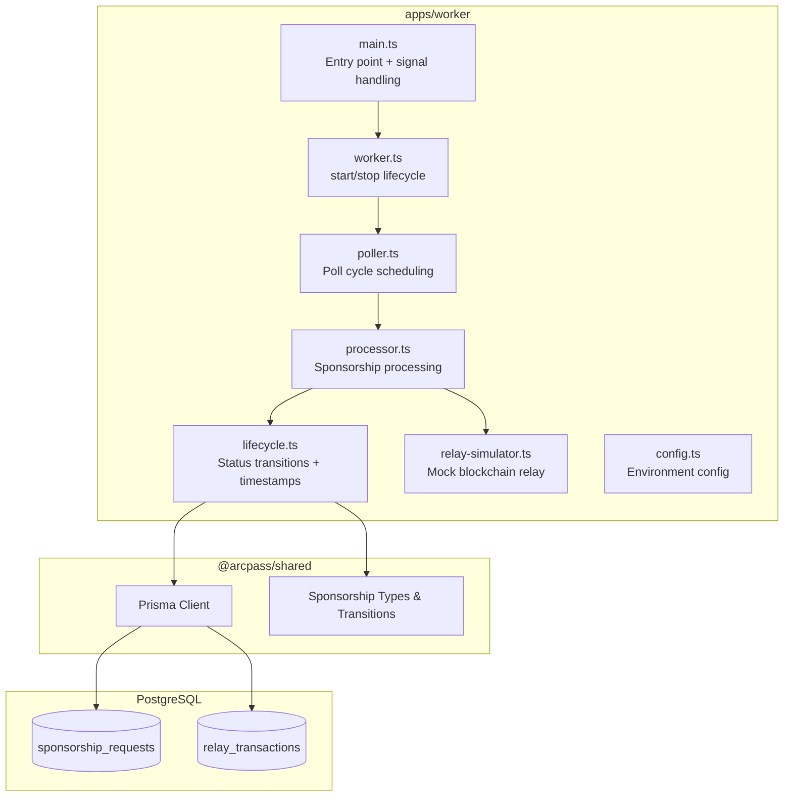
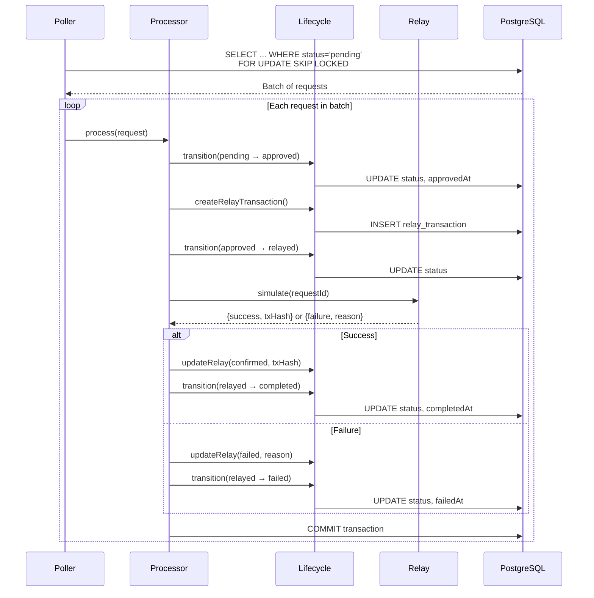
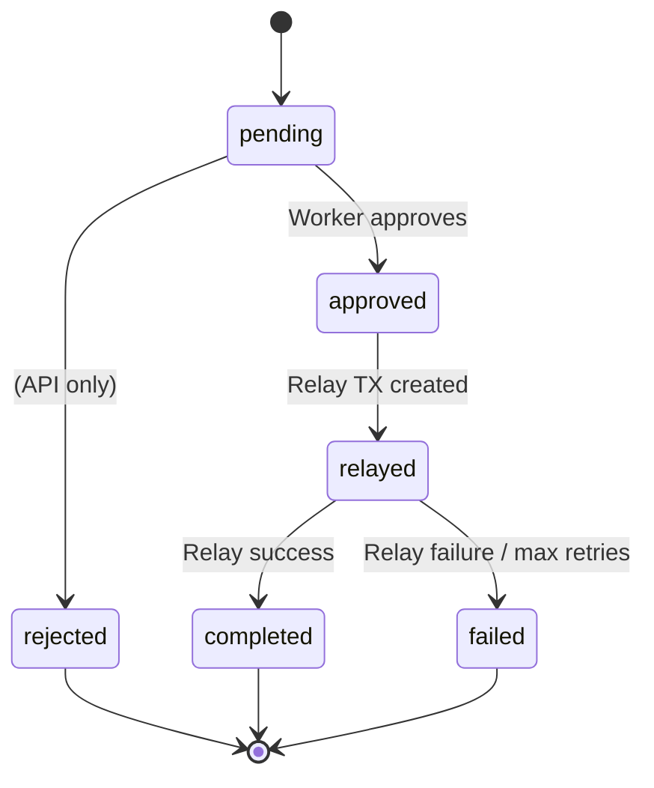
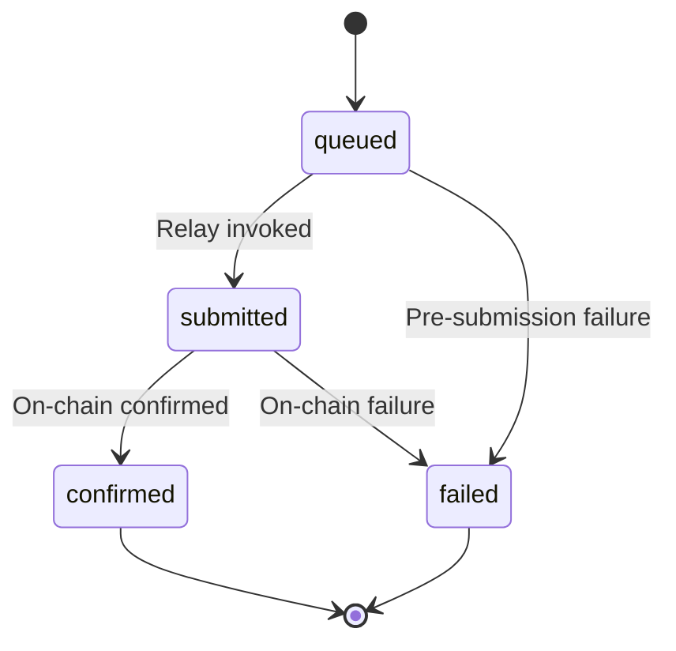
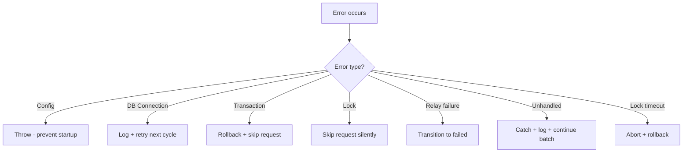

# Design Document: Sponsorship Worker

## Overview

The Sponsorship Worker is a standalone background service (`apps/worker`) that polls PostgreSQL for pending sponsorship requests and advances them through the full lifecycle: `pending → approved → relayed → completed/failed`. It operates independently of the API, using the same `@arcpass/shared` package for Prisma client access, type definitions, and transition validation.

The worker is designed for single-instance deployment with row-level locking to prevent duplicate processing, and uses a modular architecture that separates polling, processing, relay simulation, and lifecycle management into distinct modules. This enables future replacement of the mock relay simulator with real blockchain relay calls without structural changes.

### Key Design Decisions

1. **Sequential batch processing** — Requests within a batch are processed one at a time to simplify transaction management and lock handling. Parallelism can be added later if throughput demands it.
2. **SELECT FOR UPDATE SKIP LOCKED** — PostgreSQL row-level locking prevents duplicate processing across concurrent worker instances without requiring external coordination (Redis, etc.).
3. **Full lifecycle in one pass** — A single processing cycle advances a request from `pending` all the way through to `completed` or `failed`, reducing poll cycles needed per request.
4. **Transaction-per-request** — Each sponsorship request is processed within its own database transaction, isolating failures.
5. **TypeScript with ESM** — Consistent with the monorepo conventions established in `@arcpass/shared`.

## Architecture



### Data Flow



## Components and Interfaces

### Module: `config.ts`

Loads and validates environment variables at startup.

```typescript
export interface WorkerConfig {
  databaseUrl: string
  pollIntervalMs: number    // default: 5000, range: [1000, 60000]
  batchSize: number         // default: 20, range: [1, 100]
  maxRetries: number        // default: 5
  relayFailureRate: number  // default: 0.0, range: [0.0, 1.0]
  lockTimeoutMs: number     // default: 30000
  shutdownTimeoutMs: number // default: 10000
}

export function loadConfig(): WorkerConfig
```

### Module: `worker.ts`

Top-level lifecycle management exposing `start()` and `stop()`.

```typescript
export function start(): Promise<void>
export function stop(): Promise<void>
```

### Module: `poller.ts`

Manages the poll interval and dispatches batches to the processor.

```typescript
export interface Poller {
  start(): void
  stop(): Promise<void>
}

export function createPoller(config: WorkerConfig): Poller
```

### Module: `processor.ts`

Orchestrates the full lifecycle advancement of a single sponsorship request.

```typescript
export interface ProcessResult {
  requestId: string
  success: boolean
  finalStatus: SponsorshipStatusValue
  error?: string
}

export function processRequest(requestId: string, config: WorkerConfig): Promise<ProcessResult>
```

### Module: `lifecycle.ts`

Handles status transitions, timestamp management, and relay transaction CRUD.

```typescript
import { PrismaClient } from '@prisma/client'
import { SponsorshipStatusValue, RelayStatusValue } from '@arcpass/shared'

export interface TransitionResult {
  success: boolean
  error?: string
}

export function transitionSponsorshipStatus(
  tx: PrismaClient,  // transaction client
  requestId: string,
  newStatus: SponsorshipStatusValue
): Promise<TransitionResult>

export function createRelayTransaction(
  tx: PrismaClient,
  sponsorshipRequestId: string
): Promise<{ id: string; relayAttempt: number }>

export function updateRelayTransaction(
  tx: PrismaClient,
  relayTransactionId: string,
  status: RelayStatusValue,
  data?: { transactionHash?: string; failureReason?: string }
): Promise<TransitionResult>

export function getRetryCount(
  tx: PrismaClient,
  requestId: string
): Promise<number>
```

### Module: `relay-simulator.ts`

Mock blockchain relay that produces deterministic-ish transaction hashes.

```typescript
export interface RelayResult {
  success: boolean
  transactionHash: string | null
  failureReason: string | null
}

export function simulateRelay(
  sponsorshipRequestId: string,
  failureRate?: number
): Promise<RelayResult>
```

### Module: `main.ts`

Entry point that wires signal handlers and invokes `start()`.

```typescript
// Registers SIGTERM/SIGINT handlers
// Calls start() and handles exit codes
```

## Data Models

The worker operates on existing Prisma models defined in `@arcpass/shared`. No schema changes are required.

### SponsorshipRequest (existing)

| Field | Type | Worker Usage |
|-------|------|-------------|
| id | UUID | Primary key, used for locking |
| walletId | UUID | Read-only reference |
| status | SponsorshipRequestStatus | Transitioned through lifecycle |
| approvedAt | DateTime? | Set on pending→approved |
| completedAt | DateTime? | Set on relayed→completed |
| failedAt | DateTime? | Set on relayed→failed or retry limit |
| requestedAt | DateTime | Used for ordering (FIFO) |

### RelayTransaction (existing)

| Field | Type | Worker Usage |
|-------|------|-------------|
| id | UUID | Primary key |
| sponsorshipRequestId | UUID | FK to SponsorshipRequest |
| transactionHash | String? | Set on relay success |
| status | RelayTransactionStatus | Transitioned: queued→submitted→confirmed/failed |
| relayAttempt | Int | Auto-incremented per request |
| submittedAt | DateTime? | Set on queued→submitted |
| confirmedAt | DateTime? | Set on submitted→confirmed |
| failedAt | DateTime? | Set on →failed |
| failureReason | String? | Set on relay failure |

### State Machine: Sponsorship Request



### State Machine: Relay Transaction



### Locking Strategy

The worker uses PostgreSQL's `SELECT ... FOR UPDATE SKIP LOCKED` within a transaction to claim requests:

```sql
SELECT * FROM sponsorship_requests
WHERE status = 'pending'
ORDER BY "requestedAt" ASC
LIMIT :batchSize
FOR UPDATE SKIP LOCKED
```

This ensures:
- Only one worker instance processes a given request
- Locked rows are skipped (not blocked on) by concurrent workers
- The lock is held for the duration of the transaction (released on COMMIT/ROLLBACK)
- A 30-second timeout prevents permanent lock retention

## Correctness Properties

*A property is a characteristic or behavior that should hold true across all valid executions of a system — essentially, a formal statement about what the system should do. Properties serve as the bridge between human-readable specifications and machine-verifiable correctness guarantees.*

### Property 1: Configuration validation accepts only values within permitted ranges

*For any* numeric configuration value (batchSize, pollIntervalMs, relayFailureRate), the config loader SHALL accept the value if and only if it falls within the permitted range ([1,100] for batchSize, [1000,60000] for pollIntervalMs, [0.0,1.0] for relayFailureRate), and SHALL throw a descriptive error for values outside the range or for missing required environment variables.

**Validates: Requirements 1.2, 1.5, 8.4**

### Property 2: Poll query returns requests ordered by requestedAt ascending

*For any* set of pending sponsorship requests with distinct `requestedAt` timestamps, the poll query SHALL return them in strictly ascending `requestedAt` order.

**Validates: Requirements 1.1**

### Property 3: Sponsorship status transition succeeds if and only if it is in VALID_SPONSORSHIP_TRANSITIONS

*For any* pair of (currentStatus, newStatus) from the SponsorshipRequestStatus enum, the lifecycle manager SHALL accept the transition if and only if `newStatus` is present in `VALID_SPONSORSHIP_TRANSITIONS[currentStatus]`. Invalid transitions SHALL be rejected with the request status preserved unchanged.

**Validates: Requirements 2.5, 2.6**

### Property 4: Relay transaction status transition succeeds if and only if it is in VALID_RELAY_TRANSITIONS

*For any* pair of (currentRelayStatus, newRelayStatus) from the RelayTransactionStatus enum, the lifecycle manager SHALL accept the transition if and only if `newRelayStatus` is present in `VALID_RELAY_TRANSITIONS[currentRelayStatus]`. Invalid transitions SHALL be rejected with the relay transaction status preserved unchanged.

**Validates: Requirements 4.7**

### Property 5: Relay simulator result structure invariant

*For any* valid sponsorship request ID, the relay simulator SHALL return a result where: if `success` is true then `transactionHash` is a non-null string and `failureReason` is null; if `success` is false then `failureReason` is a non-null string (1-500 chars) and `transactionHash` is null. The two fields are mutually exclusive and exhaustive with respect to the `success` boolean.

**Validates: Requirements 3.1**

### Property 6: Successful relay simulation produces a correctly formatted transaction hash

*For any* valid sponsorship request ID where the relay simulator returns a successful result, the `transactionHash` SHALL match the pattern `0x[0-9a-f]{64}` (0x prefix followed by exactly 64 lowercase hex characters), and the first 8 hex characters after the prefix SHALL be deterministically derived from the sponsorship request ID.

**Validates: Requirements 3.2**

### Property 7: Relay simulator deterministic boundary behavior

*For any* valid sponsorship request ID, when the relay simulator is configured with failure rate 0.0 (or no failure rate), it SHALL return `success: true` for every invocation. When configured with failure rate 1.0, it SHALL return `success: false` for every invocation.

**Validates: Requirements 3.4, 3.5**

### Property 8: Relay attempt numbering is sequential

*For any* sponsorship request with N existing relay transactions (where N ≥ 0), creating a new relay transaction SHALL set `relayAttempt` to N + 1. The sequence is strictly monotonically increasing starting from 1.

**Validates: Requirements 4.2**

### Property 9: Lifecycle transitions set the correct timestamp field

*For any* valid sponsorship status transition to a status that has an associated timestamp field (approved→approvedAt, rejected→rejectedAt, completed→completedAt, failed→failedAt), the lifecycle manager SHALL set that timestamp field to the current UTC time with millisecond precision.

**Validates: Requirements 7.1, 7.2, 7.3, 7.5**

### Property 10: Lifecycle transitions preserve all previously set timestamps

*For any* sponsorship request with pre-existing timestamp values, when the lifecycle manager performs a valid transition and sets the new timestamp, all other previously set timestamp fields SHALL remain unchanged.

**Validates: Requirements 7.6**

### Property 11: Failed transitions preserve request status (rollback safety)

*For any* sponsorship request at any non-terminal status, if a database error occurs during a status transition, the request SHALL remain at its original status after error handling — no partial state changes are persisted.

**Validates: Requirements 6.1**

### Property 12: Maximum retry limit transitions request to failed

*For any* sponsorship request that has been retried 5 or more times without reaching a terminal status (rejected, completed, or failed), the processor SHALL transition it to "failed" status rather than attempting further processing.

**Validates: Requirements 6.6**

### Property 13: Relay simulator completes within time bound

*For any* valid sponsorship request ID and any failure rate configuration, the relay simulator SHALL complete execution and return a result within 100 milliseconds.

**Validates: Requirements 3.3**

## Error Handling

### Error Categories

| Category | Source | Handling Strategy |
|----------|--------|-------------------|
| Config errors | Missing/invalid env vars | Throw at startup, prevent worker from starting |
| Database connection errors | Prisma client | Log, retry on next poll cycle |
| Transaction errors | Prisma operations | Rollback transaction, leave request unchanged |
| Lock acquisition failures | SKIP LOCKED | Skip request silently, process next |
| Relay simulation errors | relay-simulator.ts | Transition to failed, record reason |
| Unhandled exceptions | Any module | Catch at processor level, log, continue batch |
| Lock timeout | Processing > 30s | Abort processing, rollback transaction |
| Shutdown timeout | stop() > 10s | Force exit with code 1 |

### Error Propagation



### Graceful Shutdown

1. SIGTERM/SIGINT received → `stop()` invoked
2. Polling interval cleared (no new poll cycles start)
3. Wait for in-progress request to complete (up to 10 seconds)
4. Disconnect Prisma client
5. Exit with code 0

If step 3 exceeds 10 seconds:
- Force-abort the in-progress transaction (rollback)
- Disconnect Prisma client
- Exit with code 1

### Logging Strategy

All errors are logged with structured context:
- `requestId` — the sponsorship request being processed
- `attemptedTransition` — the status change that failed
- `errorMessage` — the error description
- `timestamp` — when the error occurred

The worker uses `console.error` for errors and `console.info` for operational messages. A structured logger (pino) can be added later without architectural changes.

## Testing Strategy

### Test Framework

- **vitest** — consistent with the monorepo (`@arcpass/shared`, `apps/api`)
- **fast-check** — property-based testing library (already a devDependency in the monorepo)

### Test Structure

```
apps/worker/
├── tests/
│   ├── unit/
│   │   ├── config.test.ts
│   │   ├── lifecycle.test.ts
│   │   ├── relay-simulator.test.ts
│   │   ├── processor.test.ts
│   │   └── poller.test.ts
│   ├── property/
│   │   ├── config.property.test.ts
│   │   ├── lifecycle.property.test.ts
│   │   ├── relay-simulator.property.test.ts
│   │   └── processor.property.test.ts
│   └── integration/
│       ├── worker-lifecycle.test.ts
│       ├── locking.test.ts
│       └── batch-processing.test.ts
```

### Unit Tests

Focus on specific examples and edge cases:
- Processor handles non-existent request gracefully (2.7)
- Processor creates relay transaction on approval (2.2)
- Processor handles relay success path (2.3)
- Processor handles relay failure path (2.4)
- Relay transaction submittedAt set on submitted transition (4.5)
- Max relay attempts (3) prevents new transaction creation (4.6)
- Relay simulator throws on empty/undefined request ID (3.6)
- Consistent clock source within single operation (7.4)

### Property-Based Tests

Each property test runs a minimum of 100 iterations using `fast-check`. Tests are tagged with the property they validate:

```typescript
// Feature: sponsorship-worker, Property 3: Sponsorship status transition succeeds iff in VALID_SPONSORSHIP_TRANSITIONS
```

Property tests cover:
- **Property 1**: Config validation range checking
- **Property 2**: Poll ordering invariant
- **Property 3**: Sponsorship transition validation (valid ↔ accepted)
- **Property 4**: Relay transition validation (valid ↔ accepted)
- **Property 5**: Relay result structure invariant (success↔hash, failure↔reason)
- **Property 6**: Transaction hash format correctness
- **Property 7**: Deterministic boundary behavior (0.0 and 1.0 failure rates)
- **Property 8**: Relay attempt sequential numbering
- **Property 9**: Correct timestamp field set per transition
- **Property 10**: Timestamp preservation on transitions
- **Property 11**: Rollback preserves original status
- **Property 12**: Max retry limit enforcement
- **Property 13**: Relay simulator time bound

### Integration Tests

Test the full system with a real (test) database:
- Worker polls and processes a batch end-to-end
- SELECT FOR UPDATE SKIP LOCKED prevents duplicate processing
- Error in one request doesn't block others in batch
- Worker continues after errors, stops on signal
- Graceful shutdown completes within timeout
- Lock timeout triggers rollback after 30 seconds

### Mocking Strategy

- **Prisma client**: Mocked in unit and property tests using vitest mocks
- **Relay simulator**: Mocked in processor tests to control success/failure
- **Clock**: Use `vi.useFakeTimers()` for timestamp tests
- **Environment variables**: Set via `vi.stubEnv()` for config tests
- **Real database**: Used only in integration tests with test-specific schema

