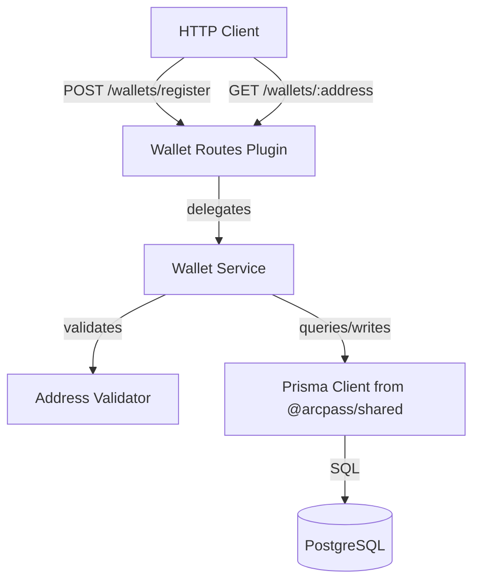

# Design Document: Wallet Registry

## Overview

The Wallet Registry is a REST API layer within the `apps/api` Fastify service that provides wallet registration, lookup, and blocked-wallet enforcement for the ArcPass gas sponsorship system. It is the first user-facing feature of the API and establishes the patterns for service-layer architecture, input validation, and error handling that subsequent features will follow.

The design follows the project's existing conventions:
- Business logic lives in a dedicated service module (`src/services/wallet.service.js`)
- Routes are registered as Fastify plugins with a prefix (`/wallets`)
- The Prisma singleton from `@arcpass/shared` is used for all database access
- Input validation uses Fastify's built-in JSON Schema support

## Architecture



### Layer Responsibilities

| Layer | Module | Responsibility |
|-------|--------|----------------|
| Routes | `src/routes/wallets.js` | HTTP concerns: request parsing, schema validation, response formatting, status codes |
| Service | `src/services/wallet.service.js` | Business logic: normalization, duplicate detection, blocked-wallet checks, orchestration |
| Validation | `src/lib/wallet-validation.js` | Pure functions: address format validation, normalization |
| Data | `@arcpass/shared` (Prisma) | Database access via the shared singleton |

### Request Flow

1. Fastify validates the request against the JSON schema attached to the route
2. Route handler extracts validated input and calls the wallet service
3. Wallet service normalizes the address, validates format, checks business rules
4. Wallet service calls Prisma for persistence/lookup
5. Route handler maps the service result to the appropriate HTTP response

## Components and Interfaces

### Wallet Validation (`src/lib/wallet-validation.js`)

```typescript
// Pure functions — no side effects, no I/O

/**
 * Validates that a string matches the Ethereum address format.
 * @returns true if the address matches /^0x[0-9a-fA-F]{40}$/
 */
export function isValidWalletAddress(address: string): boolean

/**
 * Normalizes a wallet address to lowercase.
 * Trims whitespace and lowercases the entire string.
 * @throws if address is not a valid wallet address
 */
export function normalizeWalletAddress(address: string): string
```

### Wallet Service (`src/services/wallet.service.js`)

```typescript
import { prisma } from '@arcpass/shared'

interface WalletRecord {
  id: string
  walletAddress: string
  firstSeenAt: Date
  lastSeenAt: Date
  sponsorshipCount: number
  isBlocked: boolean
}

interface RegisterResult {
  wallet: WalletRecord
  isNew: boolean
}

/**
 * Registers a wallet address. Creates a new record or updates an existing one.
 * @throws {BlockedWalletError} if the wallet is blocked
 * @throws {ValidationError} if the address format is invalid
 */
export async function registerWallet(rawAddress: string): Promise<RegisterResult>

/**
 * Looks up a wallet by address. Read-only — does not modify any fields.
 * @returns the wallet record or null if not found
 * @throws {ValidationError} if the address format is invalid
 */
export async function lookupWallet(rawAddress: string): Promise<WalletRecord | null>
```

### Custom Errors (`src/lib/errors.js`)

```typescript
export class ValidationError extends Error {
  constructor(message: string)
}

export class BlockedWalletError extends Error {
  constructor(message: string)
}

export class WalletNotFoundError extends Error {
  constructor(message: string)
}
```

### Wallet Routes Plugin (`src/routes/wallets.js`)

```typescript
export default async function walletRoutes(fastify, opts) {
  // POST /register — register or re-register a wallet
  fastify.post('/register', { schema: registerSchema }, registerHandler)

  // GET /:address — lookup a wallet by address
  fastify.get('/:address', { schema: lookupSchema }, lookupHandler)
}
```

### JSON Schemas (inline in routes)

**Register Request Schema:**
```json
{
  "body": {
    "type": "object",
    "required": ["walletAddress"],
    "properties": {
      "walletAddress": { "type": "string" }
    },
    "additionalProperties": false
  }
}
```

**Lookup Params Schema:**
```json
{
  "params": {
    "type": "object",
    "required": ["address"],
    "properties": {
      "address": { "type": "string" }
    }
  }
}
```

### Error Response Formatter

A Fastify `setErrorHandler` hook (or per-route error handling) maps service errors to the standard response format:

```typescript
// Standard error response shape
{ "error": string, "statusCode": number }
```

Mapping:
| Error Type | HTTP Status |
|-----------|-------------|
| `ValidationError` / Schema validation failure | 400 |
| `BlockedWalletError` | 403 |
| `WalletNotFoundError` | 404 |
| Unexpected / Prisma errors | 500 (message sanitized) |

## Data Models

The Wallet Registry uses the existing `Wallet` model from the shared Prisma schema. No schema modifications are required.

### Wallet Model (existing)

| Field | Type | Constraints | Description |
|-------|------|-------------|-------------|
| id | String (UUID) | PK, auto-generated | Unique identifier |
| walletAddress | String | Unique, VARCHAR(255) | Normalized (lowercase) Ethereum address |
| firstSeenAt | DateTime | Default: now() | First registration timestamp |
| lastSeenAt | DateTime | Default: now() | Most recent registration timestamp |
| sponsorshipCount | Int | Default: 0 | Number of re-registrations |
| isBlocked | Boolean | Default: false | Whether the wallet is blocked |
| blockReason | String? | VARCHAR(500), nullable | Reason for blocking |

### Database Operations

**Register (new wallet):**
```sql
INSERT INTO wallets (id, wallet_address, first_seen_at, last_seen_at, sponsorship_count, is_blocked)
VALUES (uuid, $normalized, now(), now(), 0, false)
```

**Register (existing wallet — not blocked):**
```sql
UPDATE wallets
SET last_seen_at = now(), sponsorship_count = sponsorship_count + 1
WHERE wallet_address = $normalized AND is_blocked = false
```

**Lookup:**
```sql
SELECT * FROM wallets WHERE wallet_address = $normalized
```

In Prisma terms, the register operation uses a `findUnique` followed by conditional `create`/`update` within the service logic to handle the blocked-wallet case explicitly. An `upsert` is not suitable here because we need to reject the operation (not update) when the wallet is blocked.

## Correctness Properties

*A property is a characteristic or behavior that should hold true across all valid executions of a system — essentially, a formal statement about what the system should do. Properties serve as the bridge between human-readable specifications and machine-verifiable correctness guarantees.*

### Property 1: Normalization to lowercase

*For any* valid wallet address string containing uppercase hex characters, the `normalizeWalletAddress` function SHALL return a string that is identical to the input converted entirely to lowercase, and the result SHALL still match the valid address pattern `/^0x[0-9a-f]{40}$/`.

**Validates: Requirements 2.1, 3.4**

### Property 2: Case-insensitive registration round-trip

*For any* valid wallet address, registering it with one casing and then looking it up with any other casing variant of the same address SHALL return the same wallet record (same `id`, same `walletAddress`, same `sponsorshipCount`).

**Validates: Requirements 2.2, 2.4, 5.3**

### Property 3: Invalid address rejection

*For any* string that does not match the pattern `/^0x[0-9a-fA-F]{40}$/` after trimming, submitting it to either the registration or lookup endpoint SHALL result in an HTTP 400 response, and no wallet record SHALL be created or modified.

**Validates: Requirements 1.5, 2.3, 3.1, 5.4**

### Property 4: New wallet registration creates correct record

*For any* valid wallet address that does not already exist in the system, registering it SHALL create a record where `walletAddress` equals the normalized (lowercase) input, `sponsorshipCount` equals 0, `firstSeenAt` and `lastSeenAt` are set, and the HTTP response status is 201.

**Validates: Requirements 1.1, 1.3**

### Property 5: Re-registration increments sponsorship count

*For any* valid wallet address that already exists in the system and is not blocked, registering it again SHALL increment `sponsorshipCount` by exactly 1, update `lastSeenAt` to a value greater than or equal to the previous `lastSeenAt`, leave `firstSeenAt` unchanged, and return HTTP 200.

**Validates: Requirements 1.2, 1.4**

### Property 6: Blocked wallet enforcement preserves state

*For any* wallet record where `isBlocked` is true, attempting to register that wallet SHALL return HTTP 403, and the wallet's `lastSeenAt` and `sponsorshipCount` fields SHALL remain identical to their values before the registration attempt.

**Validates: Requirements 1.6, 4.1, 4.2**

### Property 7: Lookup is read-only

*For any* registered wallet, performing a GET lookup SHALL return the wallet record with all fields matching the stored state, and SHALL NOT modify `lastSeenAt`, `sponsorshipCount`, or any other field. A subsequent lookup SHALL return identical values.

**Validates: Requirements 5.1, 5.5**

### Property 8: Error response shape consistency

*For any* request that triggers an error (validation failure, blocked wallet, not found, or server error), the response body SHALL be a JSON object containing exactly two fields: `error` (a non-empty string) and `statusCode` (a number matching the HTTP response status code).

**Validates: Requirements 8.1**

## Error Handling

### Error Classification

| Error Type | HTTP Status | Trigger | Response |
|-----------|-------------|---------|----------|
| Validation Error | 400 | Invalid address format, missing field, malformed JSON | `{ "error": "<description>", "statusCode": 400 }` |
| Blocked Wallet | 403 | Registration attempt on a blocked wallet | `{ "error": "Wallet is blocked", "statusCode": 403 }` |
| Not Found | 404 | Lookup for an unregistered address | `{ "error": "Wallet not found", "statusCode": 404 }` |
| Server Error | 500 | Prisma/DB failure, unexpected exceptions | `{ "error": "Internal server error", "statusCode": 500 }` |

### Error Handling Strategy

1. **Fastify schema validation** catches missing/malformed fields before the route handler runs. Fastify's default 400 response is intercepted by a custom error handler to conform to the standard shape.

2. **Service-layer errors** use custom error classes (`ValidationError`, `BlockedWalletError`, `WalletNotFoundError`) that the route handler catches and maps to the appropriate HTTP status.

3. **Unexpected errors** (Prisma failures, runtime exceptions) are caught by a Fastify `setErrorHandler` that:
   - Logs the full error with stack trace (via Pino)
   - Returns a sanitized 500 response that never exposes table names, SQL, column names, or stack traces

4. **Graceful shutdown** calls `prisma.$disconnect()` during the existing SIGTERM/SIGINT handler in `server.js`.

### Error Handler Implementation

```javascript
// Registered on the Fastify instance in server.js or as a plugin
app.setErrorHandler((error, request, reply) => {
  if (error.validation) {
    // Fastify schema validation error
    return reply.status(400).send({
      error: error.message,
      statusCode: 400,
    })
  }

  if (error instanceof ValidationError) {
    return reply.status(400).send({ error: error.message, statusCode: 400 })
  }

  if (error instanceof BlockedWalletError) {
    return reply.status(403).send({ error: error.message, statusCode: 403 })
  }

  if (error instanceof WalletNotFoundError) {
    return reply.status(404).send({ error: error.message, statusCode: 404 })
  }

  // Unexpected error — log and sanitize
  request.log.error(error)
  return reply.status(500).send({
    error: 'Internal server error',
    statusCode: 500,
  })
})
```

## Testing Strategy

### Dual Testing Approach

The wallet registry uses both unit tests and property-based tests for comprehensive coverage.

### Property-Based Tests

**Library:** `fast-check` (already a devDependency in both `apps/api` and `packages/shared`)

**Configuration:**
- Minimum 100 iterations per property test
- Each test tagged with: `Feature: wallet-registry, Property {N}: {title}`

**What property tests cover:**
- Address normalization correctness (Property 1)
- Case-insensitive round-trip behavior (Property 2)
- Invalid address rejection across the input space (Property 3)
- New registration record correctness (Property 4)
- Re-registration increment behavior (Property 5)
- Blocked wallet state preservation (Property 6)
- Lookup read-only invariant (Property 7)
- Error response shape consistency (Property 8)

**Generators needed:**
- Valid wallet address generator: `0x` + 40 random hex characters with random casing
- Invalid wallet address generator: strings that violate the format (wrong length, missing prefix, non-hex chars, empty, whitespace-only)
- Casing variant generator: takes a valid address and randomizes the case of each hex character

### Unit Tests (Example-Based)

**What unit tests cover:**
- Missing `walletAddress` field returns 400 (Req 3.2)
- Malformed JSON body returns 400 (Req 3.3)
- Database failure returns sanitized 500 (Req 6.3, 8.4)
- New wallet that doesn't exist is not treated as blocked (Req 4.3)
- Lookup of non-existent address returns 404 (Req 5.2)
- Correct HTTP status code mapping for each error type (Req 8.2)

### Integration/Smoke Tests

- Wallet routes are registered under `/wallets` prefix (Req 7.1)
- Route plugin exports correct function signature (Req 7.2)
- Schema validation is attached to routes (Req 7.3)
- Prisma singleton from `@arcpass/shared` is used (Req 6.1, 6.2)
- Shutdown handler calls `prisma.$disconnect()` (Req 6.4)

### Test File Organization

```
apps/api/tests/
├── wallet-validation.property.test.js   # Properties 1, 3
├── wallet-service.property.test.js      # Properties 2, 4, 5, 6, 7
├── wallet-routes.property.test.js       # Property 8
├── wallet-routes.unit.test.js           # Example-based route tests
└── wallet-service.unit.test.js          # Example-based service tests
```

### Mocking Strategy

- **Property tests for pure functions** (validation, normalization): No mocks needed
- **Property tests for service logic**: Mock Prisma client using an in-memory store to avoid DB dependency while testing business logic
- **Integration tests**: Use a test database (Docker PostgreSQL) with Prisma migrations applied

