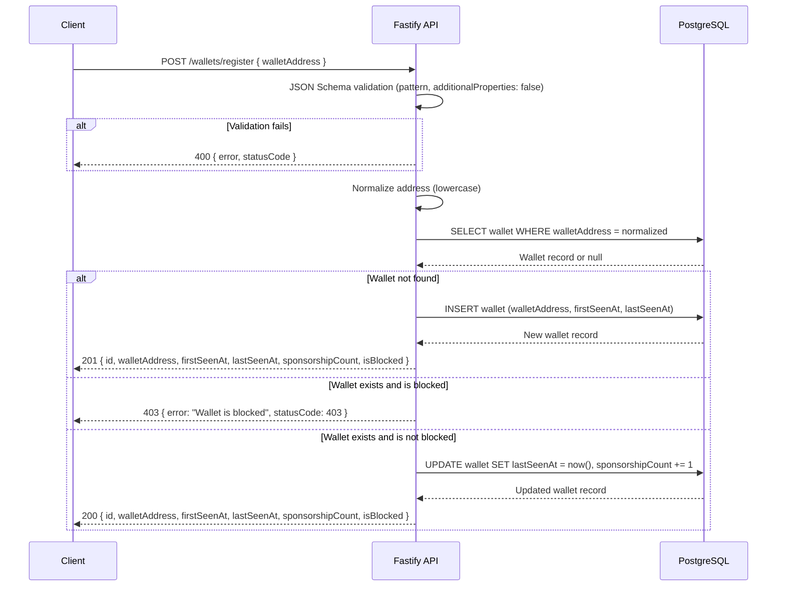
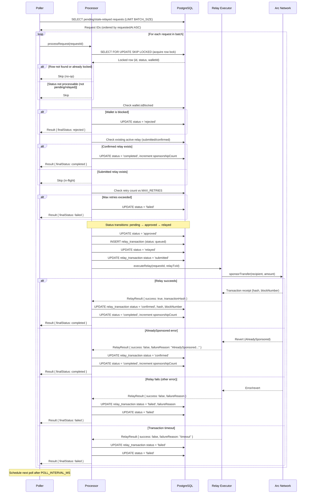

# Runtime Flow

This document describes the runtime execution paths for ArcPass, covering both nominal and error scenarios. It includes sequence diagrams for the wallet registration and sponsorship execution flows, plus detailed worker operational mechanics.

## Wallet Registration Flow

The wallet registration endpoint (`POST /wallets/register`) validates the incoming address, normalizes it to lowercase, and either creates a new wallet record or updates an existing one. Blocked wallets are rejected with HTTP 403.



### Validation Rules

The JSON Schema enforces:

- `walletAddress` is required
- Pattern: `^0x[0-9a-fA-F]{40}$` (exactly 42 characters)
- `additionalProperties: false` rejects unknown fields
- Invalid requests receive a 400 response with field-level error messages

## Sponsorship Execution Flow

The worker processes sponsorship requests through a multi-stage pipeline: poll discovery, row-level lock acquisition, status transitions, on-chain relay, and receipt confirmation.



### Stale-Relayed Recovery

Requests stuck in `relayed` status without an active relay transaction (submitted or confirmed) are recovered on the next poll cycle. The poller query includes:

```sql
SELECT sr.id FROM sponsorship_requests sr
WHERE sr.status = 'pending'
   OR (sr.status = 'relayed' AND NOT EXISTS (
     SELECT 1 FROM relay_transactions rt
     WHERE rt.sponsorshipRequestId = sr.id
       AND rt.status IN ('submitted', 'confirmed')
   ))
ORDER BY sr.requestedAt ASC
LIMIT ${BATCH_SIZE}
```

This handles crash recovery scenarios where the worker terminated after transitioning to `relayed` but before the relay transaction completed.

## Worker Operational Mechanics

### Poll Interval (`POLL_INTERVAL_MS`)

The worker uses `setTimeout` (not `setInterval`) to schedule poll cycles, preventing overlapping executions. After each cycle completes, the next is scheduled after `POLL_INTERVAL_MS` milliseconds.

| Parameter | Default | Range | Description |
|-----------|---------|-------|-------------|
| `POLL_INTERVAL_MS` | 5000 | 1000–60000 | Delay between poll cycles in milliseconds |

The first poll cycle starts immediately on worker startup. Subsequent cycles are scheduled only after the previous cycle finishes processing all batch items.

### Batch Size (`BATCH_SIZE`)

Each poll cycle fetches up to `BATCH_SIZE` pending or stale-relayed requests, ordered by `requestedAt ASC` (oldest first). Requests are processed sequentially within a batch — each wrapped in its own try/catch so a failure in one does not prevent processing of remaining items.

| Parameter | Default | Range | Description |
|-----------|---------|-------|-------------|
| `BATCH_SIZE` | 20 | 1–100 | Maximum requests fetched per poll cycle |

### Row-Level Locking (`SELECT FOR UPDATE SKIP LOCKED`)

The processor acquires an exclusive row-level lock on each sponsorship request within a database transaction:

```sql
SELECT id, status, "walletId" FROM sponsorship_requests
WHERE id = $1
FOR UPDATE SKIP LOCKED
```

Key behaviors:

- **Exclusive lock**: Only one processor instance can work on a given request at a time
- **SKIP LOCKED**: If the row is already locked by another transaction, the query returns zero rows and the processor skips it (no blocking)
- **Transaction-scoped**: The lock is held for the duration of the Prisma `$transaction` block, which includes the full relay execution
- **Timeout**: The transaction has a configurable timeout (`LOCK_TIMEOUT_MS`, default 30000ms) to prevent indefinite lock holding

This pattern enables safe concurrent processing if multiple worker instances are deployed, without requiring external coordination.

### Stale-Relayed Recovery

Requests can become stuck in `relayed` status if the worker crashes after creating a relay transaction but before receiving confirmation. The recovery mechanism:

1. The poller query includes `relayed` requests that have no relay transaction in `submitted` or `confirmed` status
2. The processor creates a new relay transaction with an incremented `relayAttempt` number
3. Processing continues through the normal relay execution path
4. The `MAX_RETRIES` limit (default 5) prevents infinite retry loops

### Graceful Shutdown (SIGTERM/SIGINT)

The worker registers handlers for both `SIGTERM` and `SIGINT` signals. On receiving either signal:

1. **Set shutdown flag**: The `isRunning` flag is set to `false`, preventing new poll cycles from starting
2. **Clear pending timeout**: If a poll cycle is scheduled but not yet running, the timeout is cleared and shutdown completes immediately
3. **Wait for in-progress work**: If a poll cycle is actively processing, the shutdown waits for it to complete
4. **Bounded drain timeout**: A `setTimeout` enforces `SHUTDOWN_TIMEOUT_MS` (default 10000ms). If the in-progress work does not complete within this window:
   - A warning is logged: "Shutdown timed out, in-progress relay may need manual reconciliation"
   - The process exits with code 1
5. **Prisma disconnect**: On successful drain, the Prisma client is disconnected before exit

| Parameter | Default | Range | Description |
|-----------|---------|-------|-------------|
| `SHUTDOWN_TIMEOUT_MS` | 10000 | 5000–60000 | Maximum time to wait for in-progress work during shutdown |

<Warning>If the shutdown timeout fires during an active relay, the on-chain transaction may have been submitted but not yet confirmed. The stale-relayed recovery mechanism handles this on the next startup.</Warning>

### Chain ID Verification at Startup

Before the worker begins polling, it verifies that the configured `CHAIN_ID` matches the chain ID reported by the RPC endpoint. This catches misconfiguration early (e.g., pointing at testnet when mainnet is expected).

The verification flow:

1. Worker calls `publicClient.getChainId()` against the configured `CHAIN_RPC_URL`
2. The call races against a timeout of `CHAIN_ID_VERIFY_TIMEOUT_MS` (default 10000ms)
3. If the RPC does not respond in time, a `ChainIdVerificationTimeoutError` is thrown and the worker exits with code 1
4. If the returned chain ID does not match `CHAIN_ID`, a `ChainIdMismatchError` is thrown and the worker exits with code 1
5. On success, the worker logs the verified chain ID and proceeds to initialize contract clients and start polling

| Parameter | Default | Range | Description |
|-----------|---------|-------|-------------|
| `CHAIN_ID` | — (required) | positive integer | Expected chain ID for the target network |
| `CHAIN_ID_VERIFY_TIMEOUT_MS` | 10000 | 1000–30000 | Timeout for the RPC chain ID check |

<Note>Chain ID verification is a startup-only check. If the RPC endpoint switches networks after startup (unlikely but possible with misconfigured load balancers), the worker will not detect it until the next restart.</Note>

## Related Documentation

- [System Overview](./system-overview.md) — full request flow and sponsorship lifecycle
- [Database Architecture](../backend/database.md) — status transitions and schema details
- [Security Model](../security/security-model.md) — row-level locking and hardening measures
- [Runbooks](../operations/runbooks.md) — recovery procedures for stuck requests
