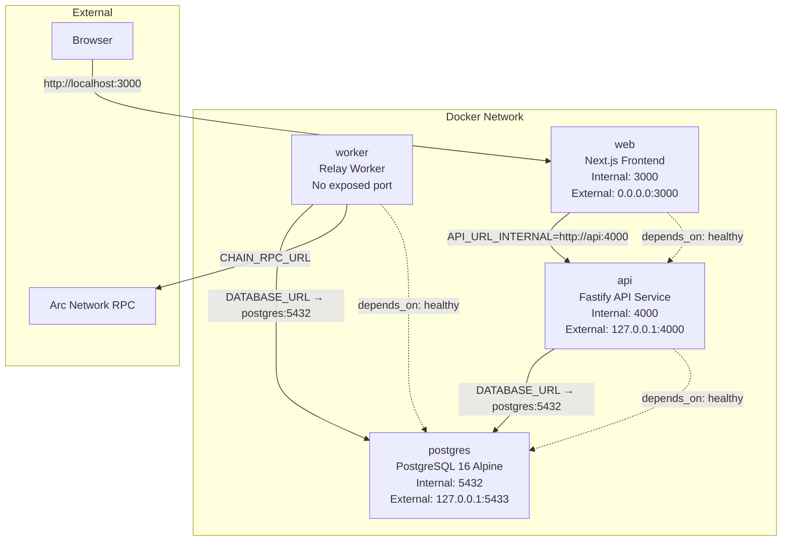
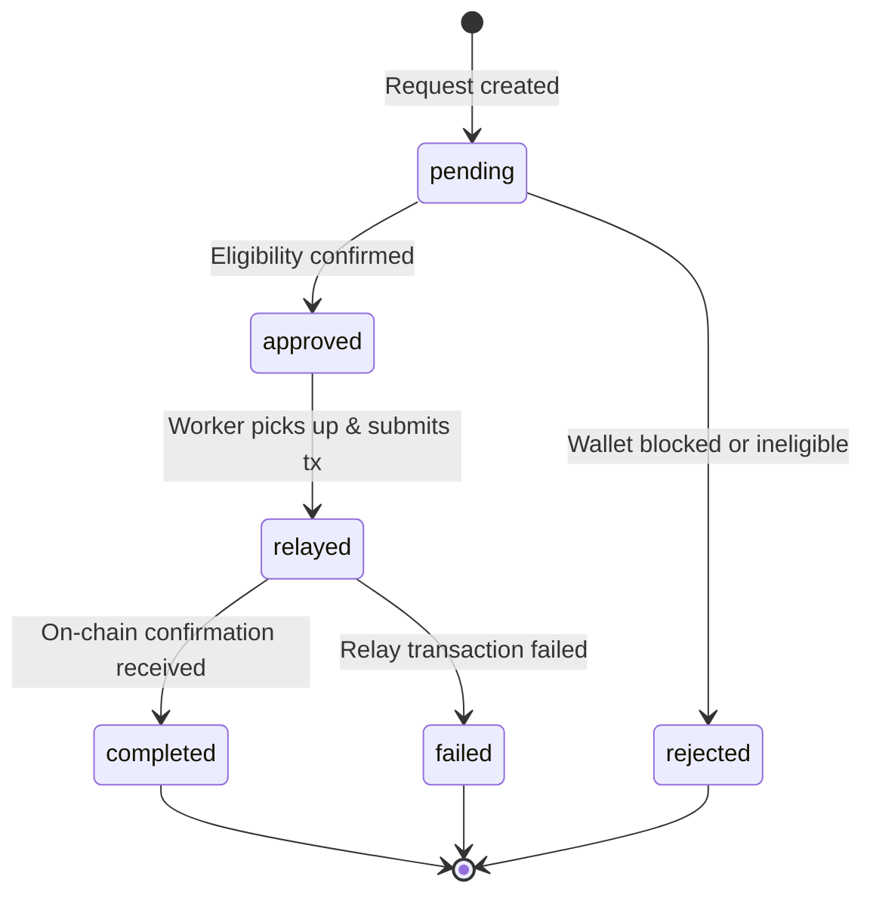

# System Overview

ArcPass is a modular sponsorship relay system that handles the full lifecycle of onboarding transactions on Arc Network. This document describes the end-to-end request flow, container networking, the Next.js API proxy pattern, and the sponsorship state machine.

## Request Flow

Every sponsorship request passes through a multi-stage pipeline from client submission to on-chain confirmation:

```
Client → Fastify API → PostgreSQL → Worker → SponsorVault → Confirmation
```

### Stage Breakdown

1. **Client Request** — The browser submits a sponsorship request via the Next.js frontend, which proxies it to the Fastify API.

2. **Fastify API (Validation & Protection)** — The API applies an ordered chain of protections before processing:
   - **CORS** — Handles OPTIONS preflight and enforces allowed origins
   - **Security Headers** — Attaches X-Content-Type-Options, X-Frame-Options, X-XSS-Protection, Content-Security-Policy, and Cache-Control headers
   - **Correlation ID** — Generates or validates an X-Request-ID for request tracing (128-character maximum)
   - **Content-Type Check** — Validates that POST requests include `application/json`
   - **Replay Protection** — Rejects duplicate submissions within a 5-second deduplication window using a composite key of `{walletAddress}:{clientIp}`
   - **IP Rate Limiting** — Enforces a sliding-window counter (default: 10 requests per 3,600,000ms window) with auto-block behavior (900,000ms block duration)
   - **Wallet Rate Limiting** — Enforces per-wallet request limits (default: 5 requests per window)

3. **PostgreSQL Persistence** — The validated request is written to the `sponsorship_requests` table with status `pending`. The wallet record is created or updated in the `wallets` table.

4. **Worker Pickup** — The worker polls for `approved` sponsorship requests using `SELECT FOR UPDATE SKIP LOCKED` to acquire row-level locks, preventing duplicate processing across worker instances.

5. **On-Chain Relay via SponsorVault** — The worker constructs and submits a `sponsorTransfer` transaction to the SponsorVault contract on Arc Network. The sponsorship request status transitions to `relayed`.

6. **Confirmation & Status Update** — Upon transaction confirmation, the worker updates the sponsorship request to `completed` and records the transaction hash, block number, and event data. If the relay fails, the status transitions to `failed` with a failure reason.

## Docker Networking

All ArcPass services run as Docker containers orchestrated by Docker Compose. Containers communicate over the default Docker bridge network using service names as hostnames.



### Container Details

| Service | Image / Build | Exposed Port | Internal Port | Depends On | Health Check |
|---------|--------------|--------------|---------------|------------|--------------|
| postgres | `postgres:16-alpine` | `127.0.0.1:5433` | `5432` | — | `pg_isready -U arcpass -d arcpass_dev` |
| api | `apps/api/Dockerfile` | `127.0.0.1:4000` | `4000` | postgres (healthy) | `wget http://127.0.0.1:4000/health` |
| worker | `apps/worker/Dockerfile` | None | — | postgres (healthy) | — |
| web | `apps/web/Dockerfile` | `0.0.0.0:3000` | `3000` | api (healthy) | `wget http://127.0.0.1:3000` |

### Startup Order

Docker Compose enforces the following dependency chain:

1. **postgres** starts first and must pass its health check (`pg_isready`)
2. **api** starts after postgres is healthy
3. **worker** starts after postgres is healthy (runs in parallel with api)
4. **web** starts after api is healthy

### Volume Mounts

- `arcpass_pgdata` — Named volume mounted at `/var/lib/postgresql/data` for persistent PostgreSQL storage

### Internal Communication

- **web → api**: The Next.js frontend connects to the Fastify API using the internal Docker hostname `http://api:4000` via the `API_URL_INTERNAL` environment variable
- **api → postgres**: The API connects to PostgreSQL at `postgres:5432` using the internal service name in `DATABASE_URL`
- **worker → postgres**: The worker connects to PostgreSQL at `postgres:5432` using the same internal service name
- **worker → Arc Network**: The worker connects to the external Arc RPC endpoint via `CHAIN_RPC_URL`

## Next.js API Proxy Pattern

The web frontend uses a catch-all API route to proxy all browser requests to the internal Fastify API. This pattern avoids CORS issues and keeps the backend URL private.

### Request Path

```
Browser → /api/backend/* → Next.js Server-Side Route → Fastify API (http://api:4000)
```

### How It Works

The catch-all route handler at `apps/web/src/app/api/backend/[...path]/route.ts` intercepts all requests matching `/api/backend/*` and forwards them to the Fastify backend:

1. **Client-side**: The browser makes requests to the relative path `/api/backend/{endpoint}` (same origin, no CORS needed)
2. **Server-side**: The Next.js route handler resolves the backend URL from `API_URL_INTERNAL` (defaults to `http://localhost:4000` in local dev, `http://api:4000` in Docker)
3. **Forwarding**: The handler strips hop-by-hop headers, forwards query parameters, preserves the HTTP method and body, and passes the client IP via `x-forwarded-for`
4. **Response**: The backend response (status, headers, body) is returned to the browser transparently

### Supported Methods

The proxy handles all standard HTTP methods: GET, POST, PUT, DELETE, PATCH, and OPTIONS.

### Error Handling

If the backend is unreachable, the proxy returns a `502 Bad Gateway` response with `{ "error": "Backend service unavailable" }`.

<Note>This proxy pattern replaces Next.js rewrites, which are unreliable in standalone Docker builds. The explicit server-side proxy provides consistent behavior across all deployment environments.</Note>

## Sponsorship Lifecycle

Every sponsorship request follows a state machine with well-defined transitions. The `SponsorshipRequestStatus` enum defines the valid states.

### State Machine



### States

| State | Description |
|-------|-------------|
| `pending` | Initial state when a sponsorship request is created via `POST /sponsorship/request` |
| `approved` | The wallet passed eligibility checks (not blocked, within rate limits, no existing active sponsorship) |
| `rejected` | The wallet failed eligibility checks (blocked wallet or ineligible at processing time) |
| `relayed` | The worker has submitted the `sponsorTransfer` transaction to Arc Network |
| `completed` | The relay transaction was confirmed on-chain with a valid receipt |
| `failed` | The relay transaction failed (reverted, timed out, or exceeded max retries) |

### Valid Transitions

| From | To | Trigger |
|------|-----|---------|
| `pending` | `approved` | API validates wallet eligibility and approves the request |
| `pending` | `rejected` | Wallet is blocked or fails eligibility validation |
| `approved` | `relayed` | Worker acquires lock, constructs transaction, and submits to chain |
| `relayed` | `completed` | Transaction receipt confirms successful execution |
| `relayed` | `failed` | Transaction reverts, times out, or exceeds retry limit |

### Terminal States

The states `completed`, `failed`, and `rejected` are terminal — no further transitions are possible from these states.

### Related: Relay Transaction Lifecycle

Each sponsorship request may have associated `RelayTransaction` records that track the on-chain submission:

| State | Description |
|-------|-------------|
| `queued` | Transaction created, awaiting submission |
| `submitted` | Transaction sent to the network, awaiting confirmation |
| `confirmed` | Transaction confirmed with a valid receipt |
| `failed` | Transaction failed (reverted or timed out) |

## Related Documentation

- [Runtime Flow](./runtime-flow.md) — Sequence diagrams for wallet registration and sponsorship execution
- [API Architecture](../backend/api-architecture.md) — Fastify plugin chain and validation details
- [Docker Architecture](../infrastructure/docker-architecture.md) — Detailed container configuration and environment variables
- [Database](../backend/database.md) — Prisma schema, migrations, and status transition details
- [Security Model](../security/security-model.md) — Rate limiting, replay protection, and trust boundaries
