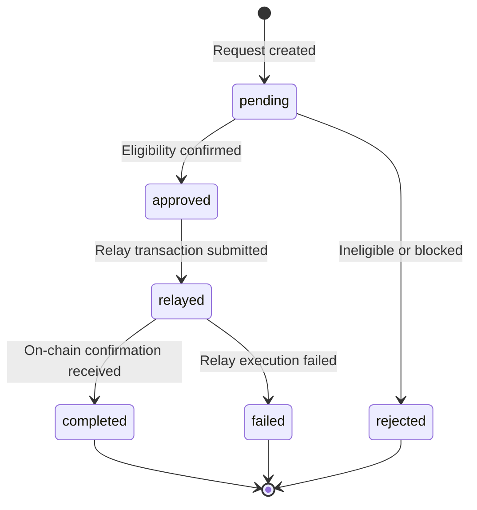
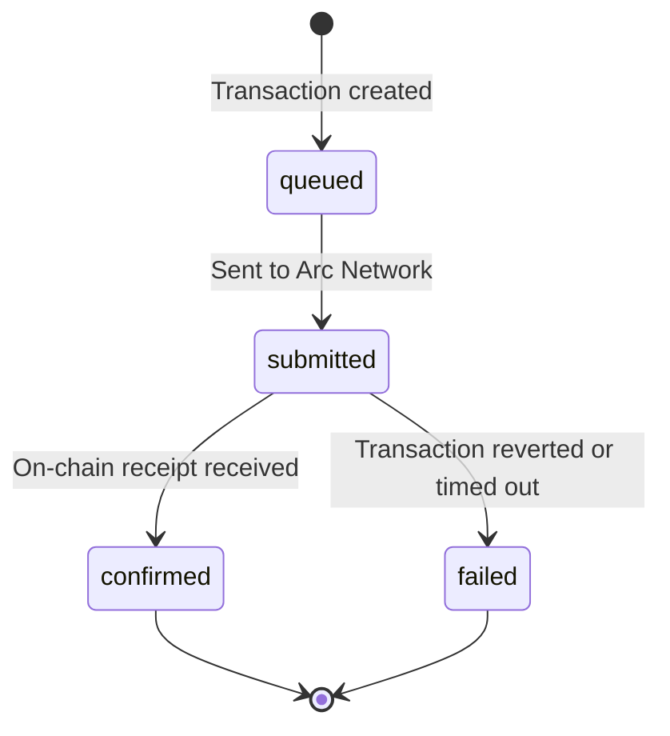
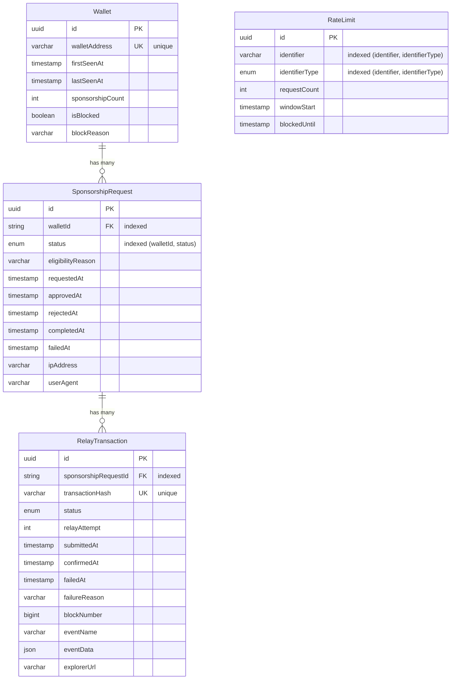

# Database Architecture

ArcPass uses PostgreSQL as its primary data store, managed through Prisma ORM. The database tracks wallets, sponsorship requests, relay transactions, and rate limiting state.

## Prisma ORM Usage

### Schema Location

The Prisma schema lives at:

```
packages/shared/prisma/schema.prisma
```

This schema is part of the `@arcpass/shared` package, making the generated Prisma Client available to all workspaces (API, Worker) via the shared package dependency.

### Client Generation

Generate the Prisma Client after any schema change:

```bash
# From the repository root
pnpm db:generate

# Or directly in the shared package
pnpm --filter @arcpass/shared generate
```

This runs `prisma generate` which reads the schema and produces the typed client in `node_modules/.prisma/client`. The shared package re-exports the client instance from `packages/shared/src/db.ts`.

### Migration Workflow

Prisma Migrate manages database schema changes through versioned SQL migration files stored in `packages/shared/prisma/migrations/`.

#### Creating a Migration

After modifying `schema.prisma`, create a new migration:

```bash
# From the repository root
pnpm db:migrate

# Or directly
pnpm --filter @arcpass/shared migrate:dev
```

This runs `prisma migrate dev` which:

1. Diffs the current schema against the database state
2. Generates a timestamped migration folder (e.g., `20260510053112_init/`)
3. Writes the SQL to `migration.sql` inside that folder
4. Applies the migration to the development database
5. Regenerates the Prisma Client

#### Naming Conventions

Migration folders follow the pattern `{timestamp}_{descriptive_name}`:

```
migrations/
├── 20260510053112_init/
│   └── migration.sql
├── 20260510055610_add_sponsorship_indexes/
│   └── migration.sql
├── 20260510060000_add_relay_fields_and_duplicate_index/
│   └── migration.sql
└── migration_lock.toml
```

Use descriptive snake_case names that summarize the change (e.g., `add_sponsorship_indexes`, `add_relay_fields_and_duplicate_index`).

#### Applying Migrations in Production

For production deployments, use `migrate deploy` which applies pending migrations without generating new ones:

```bash
pnpm --filter @arcpass/shared migrate:deploy
```

#### Resetting the Database

To drop and recreate the database with all migrations reapplied:

```bash
pnpm db:reset
```

<Warning>This destroys all data. Only use in development environments.</Warning>

## Data Models

### Wallet

Stores registered wallet addresses and their metadata.

| Field | Type | Constraints |
|-------|------|-------------|
| id | String (UUID) | Primary key, auto-generated |
| walletAddress | VarChar(255) | Unique |
| firstSeenAt | DateTime | Default: now() |
| lastSeenAt | DateTime | Default: now() |
| sponsorshipCount | Int | Default: 0 |
| isBlocked | Boolean | Default: false |
| blockReason | VarChar(500) | Nullable |

**Relations**: One-to-many → SponsorshipRequest

### SponsorshipRequest

Tracks sponsorship lifecycle from initial request through relay to completion.

| Field | Type | Constraints |
|-------|------|-------------|
| id | String (UUID) | Primary key, auto-generated |
| walletId | String | Foreign key → Wallet.id |
| status | SponsorshipRequestStatus | Default: pending |
| eligibilityReason | VarChar(500) | Nullable |
| requestedAt | DateTime | Default: now() |
| approvedAt | DateTime | Nullable |
| rejectedAt | DateTime | Nullable |
| completedAt | DateTime | Nullable |
| failedAt | DateTime | Nullable |
| ipAddress | VarChar(45) | Nullable |
| userAgent | VarChar(1024) | Nullable |

**Relations**: Many-to-one → Wallet, One-to-many → RelayTransaction

**Indexes**:
- `(walletId, status)` — composite index for status-based wallet queries
- `(walletId)` — single-column index for wallet lookups
- Partial unique index on `(walletId) WHERE status IN ('pending', 'approved', 'relayed')` — enforces one non-terminal sponsorship request per wallet

### RelayTransaction

Records on-chain relay attempts and their outcomes.

| Field | Type | Constraints |
|-------|------|-------------|
| id | String (UUID) | Primary key, auto-generated |
| sponsorshipRequestId | String | Foreign key → SponsorshipRequest.id |
| transactionHash | VarChar(255) | Unique, nullable |
| status | RelayTransactionStatus | Default: queued |
| relayAttempt | Int | Default: 1 |
| submittedAt | DateTime | Nullable |
| confirmedAt | DateTime | Nullable |
| failedAt | DateTime | Nullable |
| failureReason | VarChar(1000) | Nullable |
| blockNumber | BigInt | Nullable |
| eventName | VarChar(100) | Nullable |
| eventData | Json | Nullable |
| explorerUrl | VarChar(512) | Nullable |

**Relations**: Many-to-one → SponsorshipRequest

**Indexes**:
- `(sponsorshipRequestId)` — index for request-based lookups
- Unique constraint on `transactionHash`

### RateLimit

Tracks request rate limiting state per identifier.

| Field | Type | Constraints |
|-------|------|-------------|
| id | String (UUID) | Primary key, auto-generated |
| identifier | VarChar(255) | Not null |
| identifierType | RateLimitIdentifierType | Not null |
| requestCount | Int | Default: 0 |
| windowStart | DateTime | Default: now() |
| blockedUntil | DateTime | Nullable |

**Indexes**:
- `(identifier, identifierType)` — composite index for rate limit lookups

**Standalone model** — no foreign key relationships to other tables.

## Enums

### SponsorshipRequestStatus

```
pending | approved | rejected | relayed | completed | failed
```

### RelayTransactionStatus

```
queued | submitted | confirmed | failed
```

### RateLimitIdentifierType

```
ip | wallet | user_agent
```

## Status Transitions

### SponsorshipRequest Lifecycle



**Transition rules**:

| From | To | Trigger |
|------|----|---------|
| pending | approved | Worker picks up request, wallet passes eligibility check |
| pending | rejected | Wallet is blocked or fails eligibility at processing time |
| approved | relayed | RelayTransaction created and submitted to the network |
| relayed | completed | Transaction confirmed on-chain with receipt |
| relayed | failed | Transaction reverted or relay execution error |

Terminal states: `completed`, `failed`, `rejected`. Once a request reaches a terminal state, no further transitions occur.

### RelayTransaction Lifecycle



**Transition rules**:

| From | To | Trigger |
|------|----|---------|
| queued | submitted | Transaction broadcast to the network |
| submitted | confirmed | Block confirmation with valid receipt |
| submitted | failed | Revert, timeout, or execution error |

Terminal states: `confirmed`, `failed`.

## Entity-Relationship Diagram



### Index Summary

| Table | Index | Columns | Type |
|-------|-------|---------|------|
| wallets | wallets_walletAddress_key | walletAddress | Unique |
| sponsorship_requests | sponsorship_requests_walletId_status_idx | walletId, status | Composite |
| sponsorship_requests | sponsorship_requests_walletId_idx | walletId | Single |
| sponsorship_requests | sponsorship_requests_wallet_non_terminal | walletId (WHERE status IN pending, approved, relayed) | Partial unique |
| relay_transactions | relay_transactions_transactionHash_key | transactionHash | Unique |
| relay_transactions | relay_transactions_sponsorshipRequestId_idx | sponsorshipRequestId | Single |
| rate_limits | rate_limits_identifier_identifierType_idx | identifier, identifierType | Composite |

## Foreign Key Constraints

All foreign keys use `ON DELETE RESTRICT` to prevent accidental cascading deletions:

- `sponsorship_requests.walletId` → `wallets.id`
- `relay_transactions.sponsorshipRequestId` → `sponsorship_requests.id`

This ensures referential integrity — a wallet cannot be deleted while it has sponsorship requests, and a sponsorship request cannot be deleted while it has relay transactions.

## Related Documentation

- [API Architecture](api-architecture.md) — service layer that queries these models
- [System Overview](../architecture/system-overview.md) — full request flow through the database
- [Security Model](../security/security-model.md) — row-level locking and rate limiting details
