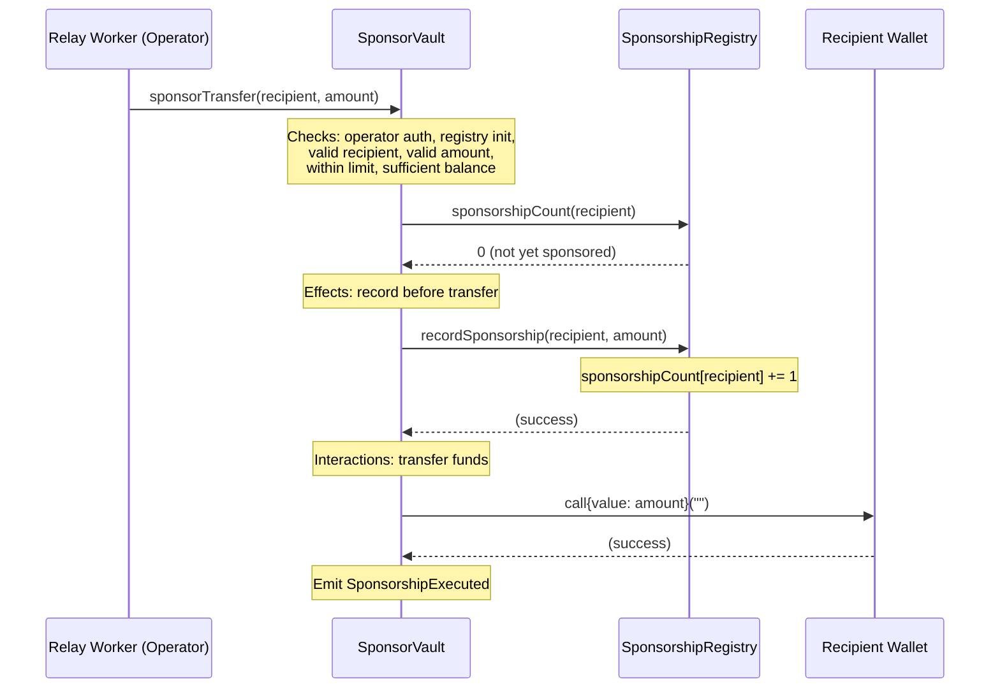

# Smart Contracts Overview

ArcPass uses two Solidity contracts deployed on Arc Network to manage on-chain sponsorship execution and accounting. Together, they form a minimal trust surface for the relay worker to sponsor eligible wallets.

## Contract Architecture

### SponsorVault

**Purpose**: Holds the native token treasury and executes authorized sponsorship transfers to eligible recipients.

**Public Functions**:

| Function | Access | Description |
|----------|--------|-------------|
| `sponsorTransfer(address recipient, uint256 amount)` | Operator only | Executes a sponsorship transfer to the recipient |
| `initializeRegistry(address _registry)` | Owner only (one-time) | Sets the SponsorshipRegistry address |
| `setOperator(address newOperator)` | Owner only | Updates the authorized operator address |
| `setPerTransactionLimit(uint256 limit)` | Owner only | Updates the per-transaction limit |
| `emergencyWithdraw(address to, uint256 amount)` | Owner only | Withdraws funds to a specified address |
| `receive()` | Anyone | Allows the contract to receive native tokens for funding |

**Events**:

| Event | Parameters | Emitted When |
|-------|-----------|--------------|
| `SponsorshipExecuted` | `recipient` (indexed), `amount` | A sponsorship transfer completes |
| `OperatorUpdated` | `previousOperator` (indexed), `newOperator` (indexed) | The operator address changes |
| `PerTransactionLimitUpdated` | `previousLimit`, `newLimit` | The per-transaction limit changes |
| `RegistryUpdated` | `registry` (indexed) | The registry address is set |
| `EmergencyWithdrawal` | `to` (indexed), `amount` | An emergency withdrawal executes |

**Custom Errors**:

| Error | Condition |
|-------|-----------|
| `Unauthorized()` | Caller is not the owner or operator for the requested action |
| `ExceedsLimit(requested, limit)` | Transfer amount exceeds the per-transaction limit |
| `InsufficientBalance(requested, available)` | Vault balance is less than the requested amount |
| `AlreadySponsored(recipient)` | Recipient has already been sponsored |
| `InvalidRecipient()` | Recipient address is the zero address |
| `InvalidAmount()` | Amount is zero |
| `RegistryAlreadyInitialized()` | `initializeRegistry` called more than once |
| `RegistryNotInitialized()` | `sponsorTransfer` called before registry is set |

### SponsorshipRegistry

**Purpose**: On-chain accounting and verification of sponsorships. Maintains a count of sponsorships per wallet and provides a public view for eligibility checks.

**Public Functions**:

| Function | Access | Description |
|----------|--------|-------------|
| `recordSponsorship(address recipient, uint256 amount)` | Vault only | Records a sponsorship for the recipient |
| `isSponsored(address wallet)` | Public (view) | Returns whether a wallet has been sponsored |
| `sponsorshipCount(address wallet)` | Public (view) | Returns the sponsorship count for a wallet |
| `vault()` | Public (view) | Returns the immutable vault address |

**Events**:

| Event | Parameters | Emitted When |
|-------|-----------|--------------|
| `SponsorshipGranted` | `recipient` (indexed), `amount`, `timestamp` | A sponsorship is recorded |

**Custom Errors**:

| Error | Condition |
|-------|-----------|
| `Unauthorized()` | Caller is not the configured vault address |

## Owner/Operator Authorization Model

The contracts use a two-role access control pattern that separates administrative control from operational execution:

### Owner-Only Functions

The owner (deployer) manages contract configuration and has exclusive access to:

- `initializeRegistry(address)` — Sets the registry address (one-time, irreversible)
- `setOperator(address)` — Updates which address can execute sponsorships
- `setPerTransactionLimit(uint256)` — Adjusts the maximum transfer amount
- `emergencyWithdraw(address, uint256)` — Recovers funds from the vault

### Operator-Only Functions

The operator (typically the relay worker's hot wallet) has a single capability:

- `sponsorTransfer(address, uint256)` — Executes a sponsorship transfer

This separation ensures the relay worker can only perform its intended function (sponsoring wallets) and cannot modify contract configuration or withdraw funds. If the operator key is compromised, the owner can immediately replace it via `setOperator` without redeploying contracts.

## Relay Assumptions

### Checks-Effects-Interactions Pattern

The `sponsorTransfer` function follows the checks-effects-interactions pattern to prevent reentrancy:

1. **Checks**: Validates all preconditions (operator authorization, registry initialized, valid recipient, valid amount, within limit, sufficient balance, not already sponsored)
2. **Effects**: Calls `registry.recordSponsorship(recipient, amount)` to update on-chain state before transferring funds
3. **Interactions**: Transfers native tokens to the recipient via `recipient.call{value: amount}("")`

By recording the sponsorship in the registry before transferring funds, the contract ensures that even if the recipient is a contract with a fallback function, re-entering `sponsorTransfer` would fail the `AlreadySponsored` check.

### AlreadySponsored Guard

Before executing a transfer, `sponsorTransfer` checks:

```solidity
if (registry.sponsorshipCount(recipient) != 0) revert AlreadySponsored(recipient);
```

This prevents duplicate sponsorship for the same recipient address. Each wallet can only receive one sponsorship through the system, enforcing the one-per-wallet onboarding model.

## Security Mechanisms

### Per-Transaction Limit

Every `sponsorTransfer` call enforces a configurable maximum amount:

```solidity
if (amount > perTransactionLimit) revert ExceedsLimit(amount, perTransactionLimit);
```

The limit is set at deployment (default: 0.001 ETH / 1e15 wei) and can be adjusted by the owner via `setPerTransactionLimit`. This caps the maximum loss from any single relay execution, even if the operator is compromised.

### Emergency Withdrawal

The owner can recover all funds from the vault at any time via `emergencyWithdraw`. This provides a circuit breaker if the system is under attack or needs to be decommissioned. The function validates the recipient address and requested amount before transferring.

### Immutable Vault Address

The `SponsorshipRegistry` stores the vault address as an `immutable` state variable set at construction:

```solidity
address public immutable vault;
```

This cannot be changed after deployment. It guarantees that only the original SponsorVault contract can ever record sponsorships in the registry, preventing unauthorized writes even if other contracts attempt to call `recordSponsorship`.

### Vault-Only Write Restriction

The `recordSponsorship` function in `SponsorshipRegistry` enforces that only the configured vault can write:

```solidity
if (msg.sender != vault) {
    revert Unauthorized();
}
```

Combined with the immutable vault address, this creates a permanent, tamper-proof write restriction on the registry.

## Contract Interaction Flow

The following diagram shows the interaction flow when the relay worker calls `sponsorTransfer`:



## Deployment Process

The deployment follows a deterministic 4-phase process defined in `contracts/script/Deploy.s.sol`:

### Phase 1: Deploy SponsorVault

```solidity
SponsorVault vault = new SponsorVault(operator, perTxLimit);
```

Deploys the vault with the operator address and per-transaction limit. The registry is not set yet — it will be linked in Phase 3.

### Phase 2: Deploy SponsorshipRegistry

```solidity
SponsorshipRegistry registry = new SponsorshipRegistry(address(vault));
```

Deploys the registry with the vault address as an immutable constructor parameter. The registry now knows which vault is authorized to write to it.

### Phase 3: Initialize Registry in Vault

```solidity
vault.initializeRegistry(address(registry));
```

Links the registry to the vault via a one-time owner call. After this call, `sponsorTransfer` can execute because the registry reference is set.

### Phase 4: Validate Deployment

The script verifies deployment integrity by checking:

- Vault owner matches the deployer address
- Vault operator matches the configured operator
- Vault registry points to the deployed registry
- Registry vault points to the deployed vault (bidirectional linkage)
- Per-transaction limit matches the configured value
- All addresses are non-zero

### Configuration

| Environment Variable | Default | Description |
|---------------------|---------|-------------|
| `DEPLOYER_PRIVATE_KEY` | (required) | Private key for the deploying account |
| `OPERATOR_ADDRESS` | Deployer address | Address authorized to call `sponsorTransfer` |
| `PER_TRANSACTION_LIMIT_WEI` | `1000000000000000` (0.001 ETH) | Maximum amount per sponsorship transfer |

## Two-Phase Initialization Pattern

The SponsorVault and SponsorshipRegistry have a circular dependency:

- The **vault** needs to call `recordSponsorship` on the registry
- The **registry** needs to know the vault address to enforce the vault-only write restriction

This cannot be resolved in constructors because neither contract exists when the other is being deployed. The two-phase initialization pattern breaks this cycle:

1. **Phase 1**: Deploy SponsorVault without a registry reference (registry is `address(0)`)
2. **Phase 2**: Deploy SponsorshipRegistry with the vault address (set as `immutable`)
3. **Phase 3**: Call `vault.initializeRegistry(registryAddress)` to complete the link

The `initializeRegistry` function includes a guard that prevents it from being called more than once:

```solidity
if (address(registry) != address(0)) revert RegistryAlreadyInitialized();
```

This ensures the registry reference in the vault is effectively write-once — set during initialization and never changed afterward. The combination of the immutable vault address in the registry and the one-time registry initialization in the vault creates a permanent, bidirectional trust relationship between the two contracts.

<Note>
The `sponsorTransfer` function will revert with `RegistryNotInitialized` if called before Phase 3 completes. The deployment script executes all phases atomically in a single transaction batch.
</Note>

## Related Documentation

- [System Architecture](../architecture/system-overview.md)
- [Security Model](../security/security-model.md)
- [API Endpoints](../api/endpoints.md)
- [Runtime Flow](../architecture/runtime-flow.md)
