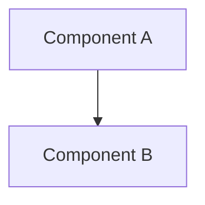

# Development Guidelines

This document describes the coding standards, architecture principles, and contribution conventions for the ArcPass monorepo. All contributors should follow these guidelines to maintain consistency and quality across the codebase.

## Coding Standards

ArcPass uses TypeScript across the entire stack — frontend, backend, worker, shared packages, and tooling. All source code must be written in TypeScript with strict type checking enabled.

### Core Principles

- **Keep functions small and modular** — each function should do one thing well
- **Prefer composition over large files** — break complex logic into composable units rather than monolithic modules
- **Avoid unnecessary dependencies** — evaluate whether a dependency is truly needed before adding it; prefer standard library solutions when practical
- **Prioritize readability and maintainability** — code is read far more often than it is written
- **Build production-ready code** — write scalable, robust implementations rather than throwaway prototypes

### TypeScript Conventions

- Enable strict mode in all `tsconfig.json` files
- Use explicit return types on exported functions
- Prefer `interface` for object shapes and `type` for unions/intersections
- Use `const` by default; use `let` only when reassignment is necessary
- Avoid `any` — use `unknown` with type narrowing when the type is genuinely uncertain

## Architecture Principles

### Service Layer Separation

The backend follows a strict layered architecture:

```
routes/ → services/ → lib/
```

- **Routes** (`routes/`) — HTTP handler registration, request/response schema definitions, and delegation to services. Routes must not contain business logic.
- **Services** (`services/`) — Business logic, orchestration, and data access. Services encapsulate domain rules and interact with the database via Prisma.
- **Libraries** (`lib/`) — Utility functions, validation helpers, and reusable infrastructure code.

<Warning>Never place business logic directly in route handlers. Routes should validate input, call a service, and return the result.</Warning>

### Blockchain Logic Isolation

All blockchain interaction code (RPC calls, transaction construction, contract interaction, chain ID verification) must be isolated in dedicated service modules under `services/` or `lib/`. This ensures:

- Blockchain logic can be tested independently
- Swapping RPC providers or chain configurations does not require changes across the codebase
- Non-blockchain services remain decoupled from on-chain concerns

### Server-Side Validation

- Validate all input on the server using JSON Schema with `additionalProperties: false`
- Never trust client-side validation alone
- Use environment variables for all configuration — never hardcode secrets or connection strings

### Modular Design

- Each module should have a single, clear responsibility
- Prefer small, focused files over large multi-purpose ones
- Use explicit imports/exports to make dependencies visible
- Avoid circular dependencies between modules

## Monorepo Rules

### Workspace Structure

The monorepo uses [pnpm workspaces](https://pnpm.io/workspaces) with the following layout:

```
apps/
  api/       → Fastify sponsorship API service
  worker/    → Blockchain relay worker
  web/       → Next.js public onboarding frontend

packages/
  shared/    → Shared types, utilities, and database client
  sdk/       → Developer SDK (future)
  ui/        → Reusable UI components
```

### Shared Logic in `packages/shared`

Any logic, types, or utilities used by more than one app must live in `packages/shared`. This includes:

- Database client and Prisma schema
- Shared TypeScript types and interfaces
- Common utility functions
- Sponsorship-related type definitions

<Note>Do not duplicate shared logic across apps. If two apps need the same code, move it to `packages/shared`.</Note>

### pnpm Workspaces

The workspace configuration is defined in `pnpm-workspace.yaml`:

```yaml
packages:
  - "apps/*"
  - "packages/*"
```

- Use `pnpm --filter <package>` to run commands in specific workspaces
- Add workspace dependencies with `pnpm add <dep> --filter <package>`
- Use `workspace:*` protocol for internal package references

### Turborepo Build Orchestration

Build tasks are orchestrated by [Turborepo](https://turbo.build) with the following configuration:

```json
{
  "tasks": {
    "build": {
      "dependsOn": ["^build"],
      "outputs": ["dist/**", ".next/**"]
    },
    "dev": {
      "cache": false,
      "persistent": true
    }
  }
}
```

The `dependsOn: ["^build"]` directive ensures that when building any package, its workspace dependencies are built first. This guarantees `packages/shared` is compiled before `apps/api` or `apps/worker` consume it.

- Run all builds: `pnpm build`
- Run all dev servers: `pnpm dev`
- Turborepo caches build outputs in `dist/**` and `.next/**`

## Commit Conventions

### Commit Message Format

Use type-prefixed commit messages:

```
<type>: <short description>
```

**Allowed types:**

| Type | Purpose |
|------|---------|
| `feat` | New feature or capability |
| `fix` | Bug fix |
| `chore` | Maintenance, dependency updates, config changes |
| `docs` | Documentation changes |
| `refactor` | Code restructuring without behavior change |
| `test` | Adding or updating tests |

**Examples:**

```
feat: add wallet eligibility check endpoint
fix: handle duplicate sponsorship request race condition
chore: update turbo to v2.9
docs: add API endpoint reference
refactor: extract relay logic into dedicated service
test: add validation tests for sponsorship lifecycle
```

### Branch Naming

Use category-prefixed branch names with a descriptive slug:

```
<category>/<descriptive-slug>
```

**Branch categories:**

| Prefix | Purpose |
|--------|---------|
| `feature/` | New features and capabilities |
| `fix/` | Bug fixes |
| `docs/` | Documentation updates |
| `chore/` | Maintenance and tooling |

**Examples:**

```
feature/wallet-registration-api
fix/stale-pending-recovery
docs/api-endpoint-reference
chore/upgrade-fastify-5
```

## Documentation Conventions

When adding or updating documentation in the `/docs` directory, follow these conventions:

### Mintlify Frontmatter

Every documentation page must include YAML frontmatter with `title` and `description` fields:

```yaml
---
title: "Page Title"
description: "A concise description of the page content, max 160 characters."
---
```

- `title` must be 60 characters or fewer
- `description` must be 160 characters or fewer

### Cross-Links

Use relative paths for all links between documentation pages:

```markdown
[API Architecture](../backend/api-architecture.md)
[Installation Guide](../getting-started/installation.md)
```

Never use absolute paths or URLs for internal documentation links.

### Mermaid Diagrams

Use fenced Mermaid code blocks for all architectural and sequence diagrams:

````markdown

````

Mermaid diagrams render natively on GitHub and are supported by Mintlify.

### Callouts

Use Mintlify component syntax for callouts:

```markdown
<Note>Important information.</Note>
<Warning>Critical warning.</Warning>
<Info>Helpful context.</Info>
<Tip>Useful suggestion.</Tip>
```

## Testing Expectations

### Before Submitting Changes

Run the full validation suite before submitting any changes:

```bash
pnpm validate
```

This executes all validation tests via Vitest and confirms that your changes do not introduce regressions.

### No Regressions Policy

- All existing validation tests must continue to pass after your changes
- If your change intentionally alters behavior covered by a test, update the test to reflect the new expected behavior
- Do not disable or skip tests without explicit approval

### Writing Tests

- Add tests for new functionality in the appropriate `tests/` directory
- Use descriptive test names that explain the expected behavior
- Test both success paths and error conditions
- Keep tests focused and independent — each test should verify one thing

<Tip>Run `pnpm validate` early and often during development to catch issues before they accumulate.</Tip>
