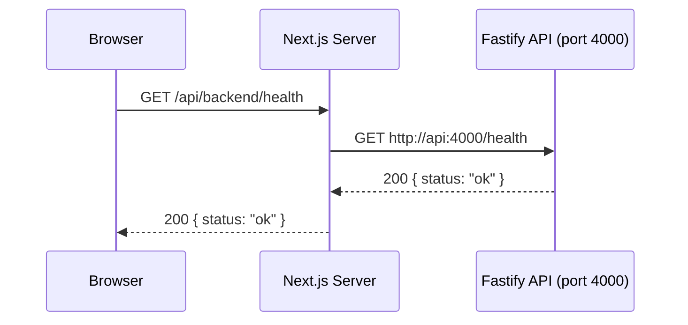

# Frontend Architecture

The ArcPass web frontend (`apps/web`) is a Next.js 16 application using the App Router with file-based routing in the `app/` directory. It provides a public onboarding interface for wallet registration, sponsorship requests, and infrastructure monitoring.

## App Router Structure

The application uses the Next.js App Router convention where the `app/` directory defines all routes through file-system hierarchy:

```
apps/web/src/app/
├── layout.tsx                        # Root layout (Header, Footer, fonts)
├── page.tsx                          # Landing page (/)
├── globals.css                       # Global styles
├── dashboard/
│   └── page.tsx                      # Dashboard page (/dashboard)
├── request/
│   └── page.tsx                      # Sponsorship request page (/request)
├── infrastructure/
│   └── page.tsx                      # Infrastructure status page (/infrastructure)
└── api/
    ├── backend/
    │   └── [...path]/
    │       └── route.ts              # Catch-all proxy to Fastify API
    └── config/
        └── route.ts                  # Runtime config endpoint
```

### Page Routes vs API Route Handlers

- **Page routes** (`page.tsx`) render UI and are associated with a URL path. They export a default React component and optionally a `metadata` object for SEO.
- **API route handlers** (`route.ts`) export named HTTP method functions (`GET`, `POST`, `PUT`, `DELETE`, `PATCH`, `OPTIONS`) and return `NextResponse` objects. They do not render UI — they handle server-side logic like proxying requests or serving runtime configuration.

## Client/Server Component Boundary

Next.js App Router defaults all components to **server components** unless explicitly marked otherwise. The ArcPass frontend uses this boundary strategically:

### Server Components (Default)

Server components handle data fetching and static rendering. They run only on the server and can use `async/await` directly:

- **`app/dashboard/page.tsx`** — Uses `export const dynamic = 'force-dynamic'` to fetch live sponsorship metrics and health status from the API at request time. Calls `checkHealth()` from the API client server-side and renders metric cards, health indicators, and a data table.
- **`app/page.tsx`** — Landing page that renders static content and contract addresses from the `config` module.
- **`app/request/page.tsx`** — Renders the page shell and delegates interactivity to the `<RequestForm />` client component.
- **`app/infrastructure/page.tsx`** — Renders the page shell and delegates health checking to the `<InfraRefresh />` client component.
- **`app/layout.tsx`** — Root layout that wraps all pages with `<Header />` and `<Footer />` layout components, applies fonts (Geist Sans, Geist Mono), and sets global metadata.

### Client Components (`"use client"`)

Client components are marked with the `"use client"` directive at the top of the file. They are used for interactive UI that requires React hooks (`useState`, `useEffect`, `useCallback`) or browser APIs:

- **`components/features/request-form.tsx`** — Multi-step sponsorship request form with wallet address validation, submission, and status polling via `setInterval`.
- **`components/features/infra-refresh.tsx`** — Infrastructure health checker that polls API, database, worker, and RPC status on mount and via manual refresh button.
- **`components/features/dashboard-refresh.tsx`** — Refresh button that calls `router.refresh()` to re-fetch server component data without a full page reload.
- **`components/features/landing-status.tsx`** — Landing page health indicator that checks API connectivity on mount with a 5-second timeout.
- **`components/layout/header.tsx`** — Navigation header with mobile menu toggle using `useState` and active route detection via `usePathname()`.

<Note>The pattern is consistent: server components own the page shell and data fetching, while client components handle user interactions (forms, buttons, polling, navigation state).</Note>

## API Proxy Pattern

The frontend uses a catch-all API route handler to proxy all browser requests to the internal Fastify API service. This avoids CORS issues and keeps the backend port unexposed to the public internet.

### Implementation

The proxy lives at `app/api/backend/[...path]/route.ts` and exports handlers for all HTTP methods (`GET`, `POST`, `PUT`, `DELETE`, `PATCH`, `OPTIONS`):

```typescript
// Simplified proxy logic
async function proxyRequest(request: NextRequest, params: { path: string[] }) {
  const backendUrl = process.env.API_URL_INTERNAL || 'http://localhost:4000'
  const path = params.path.join('/')
  const url = new URL(`/${path}`, backendUrl)

  // Forward query parameters, headers (skip hop-by-hop), and client IP
  // Return the backend response with forwarded headers
}
```

### Request Flow



### URL Resolution

The centralized environment configuration module (`config/env.ts`) resolves the API URL based on execution context:

| Context | API URL | Reason |
|---------|---------|--------|
| Browser (client-side) | `/api/backend` | Relative path — requests go through the Next.js proxy on the same origin |
| Server-side (SSR/RSC) | `API_URL_INTERNAL` env var (default: `http://localhost:4000`) | Direct service-to-service communication in Docker |

```typescript
function resolveApiUrl(): string {
  if (typeof window !== 'undefined') {
    return '/api/backend'  // Browser: same-origin proxy
  }
  return process.env.API_URL_INTERNAL || 'http://localhost:4000'  // Server: direct
}
```

In Docker, `API_URL_INTERNAL` is set to `http://api:4000` for container-to-container networking via Docker service names.

### Proxy Behavior

- Forwards all query parameters from the original request
- Forwards request headers (excluding hop-by-hop headers: `host`, `connection`, `keep-alive`, `transfer-encoding`, `te`, `trailer`, `upgrade`)
- Sets `x-forwarded-for` header with the client IP for backend rate limiting
- Returns a `502 Backend service unavailable` response if the Fastify service is unreachable

## State Management

The application uses lightweight state management patterns without external state libraries:

### React Hooks for Local State

All interactive components manage their own state using React hooks:

- **`useState`** — Form values, loading states, validation states, polling results
- **`useEffect`** — Side effects on mount (health checks, polling setup, cleanup)
- **`useCallback`** — Memoized event handlers and async functions to prevent unnecessary re-renders
- **`useRef`** — Mutable references for interval IDs, in-flight request guards, and retry counters

### Centralized API Client (`lib/api-client.ts`)

All data fetching is centralized in a single module. No components call `fetch` directly — they use typed functions from the API client:

```typescript
// Typed API functions with timeout and error handling
export async function checkHealth(): Promise<HealthResponse>
export async function registerWallet(address: string): Promise<WalletResponse>
export async function createSponsorshipRequest(address: string): Promise<SponsorshipResponse>
export async function getSponsorshipStatus(id: string): Promise<SponsorshipDetailResponse>
export async function lookupWallet(address: string): Promise<WalletResponse>
export async function getWalletHistory(address: string, cursor?: string, limit?: number): Promise<WalletHistoryResponse>
export async function getRelayByHash(hash: string): Promise<RelayResponse>
export async function getRelayById(id: string): Promise<RelayResponse>
```

The API client includes:

- **Timeout handling** via `AbortController` (default 10 seconds)
- **Typed error classes**: `ApiError` (HTTP errors with status code), `NetworkError` (connectivity failures), `TimeoutError` (request deadline exceeded)
- **Wallet address validation**: `validateWalletAddress()` using the pattern `^0x[0-9a-fA-F]{40}$`

### Environment Configuration (`config/env.ts`)

A centralized `AppConfig` object provides all environment-dependent values. Components import `config` rather than accessing `process.env` directly:

```typescript
export const config: AppConfig = {
  apiUrl: resolveApiUrl(),                    // Context-aware API URL
  sponsorVaultAddress: string | null,         // NEXT_PUBLIC_SPONSOR_VAULT_ADDRESS
  sponsorshipRegistryAddress: string | null,  // NEXT_PUBLIC_SPONSORSHIP_REGISTRY_ADDRESS
  explorerUrl: string,                        // NEXT_PUBLIC_EXPLORER_URL
  githubUrl: string | null,                   // NEXT_PUBLIC_GITHUB_URL
  chainId: 5042002,                           // Arc testnet chain ID
}
```

### Server Component Re-fetching (`router.refresh()`)

For pages rendered as server components (like the dashboard), client component islands use `router.refresh()` from `next/navigation` to trigger a server-side re-fetch without a full page navigation:

```typescript
// components/features/dashboard-refresh.tsx
const router = useRouter()
router.refresh()  // Re-runs server component data fetching
```

This pattern keeps data fetching in server components while allowing client-initiated refreshes.

## Infrastructure Dashboard

The infrastructure page (`/infrastructure`) displays real-time health status of all ArcPass system components. It uses a server component page shell with a client component (`InfraRefresh`) that performs health checks.

### Component Status

The dashboard monitors four system components:

| Component | Label | Health Derivation |
|-----------|-------|-------------------|
| API Service | "API Service" | Direct call to `GET /health` via the API client |
| PostgreSQL Database | "PostgreSQL Database" | Derived from API health (API depends on database connectivity) |
| Relay Worker | "Relay Worker" | Derived from API health with secondary `/api/backend/health` check |
| RPC Connectivity | "RPC Connectivity" | Derived from API health (API connects to RPC at startup) |

Each component displays one of three states: **Operational** (healthy), **Degraded**, or **Offline**.

### Network Configuration

Below the status grid, the dashboard displays runtime network configuration fetched from the `/api/config` endpoint:

- **Chain ID** — Arc testnet chain identifier (5042002)
- **SponsorVault** — Deployed contract address or "Not configured"
- **SponsorshipRegistry** — Deployed contract address or "Not configured"

The runtime config endpoint (`app/api/config/route.ts`) reads `NEXT_PUBLIC_*` environment variables at request time, solving the problem of Docker standalone builds where contract addresses may not be known at build time.

## Directory Conventions

The component directory follows a three-tier organization:

```
apps/web/src/components/
├── ui/              # Reusable presentational components
├── features/        # Domain-specific interactive components
└── layout/          # Page-level structural components
```

### `components/ui/` — Presentational Components

Generic, reusable UI primitives with no domain logic. They accept props for customization and are used across multiple features:

- `button.tsx` — Button with loading state and variants (primary, secondary)
- `badge.tsx` — Status badge displaying sponsorship states with color coding
- `status-card.tsx` — Card displaying a label, value, and optional health status indicator
- `data-table.tsx` — Generic table component with typed column definitions
- `form-input.tsx` — Form input with label, validation state, and error message display

### `components/features/` — Domain Components

Interactive components tied to specific ArcPass functionality. These are client components that use hooks and the API client:

- `request-form.tsx` — Wallet registration and sponsorship request form with validation, submission, and status polling
- `infra-refresh.tsx` — Infrastructure health checker with manual refresh
- `dashboard-refresh.tsx` — Dashboard data refresh button using `router.refresh()`
- `landing-status.tsx` — Landing page health indicator

### `components/layout/` — Structural Components

Page-level components that define the application shell:

- `header.tsx` — Navigation header with desktop/mobile responsive menu and active route highlighting
- `footer.tsx` — Page footer

## Related Documentation

- [System Overview](../architecture/system-overview.md) — Full request flow including the API proxy pattern in the broader architecture context
- [API Endpoints](../api/endpoints.md) — Complete endpoint reference consumed by the API client
- [Docker Architecture](../infrastructure/docker-architecture.md) — Container networking and `API_URL_INTERNAL` configuration
