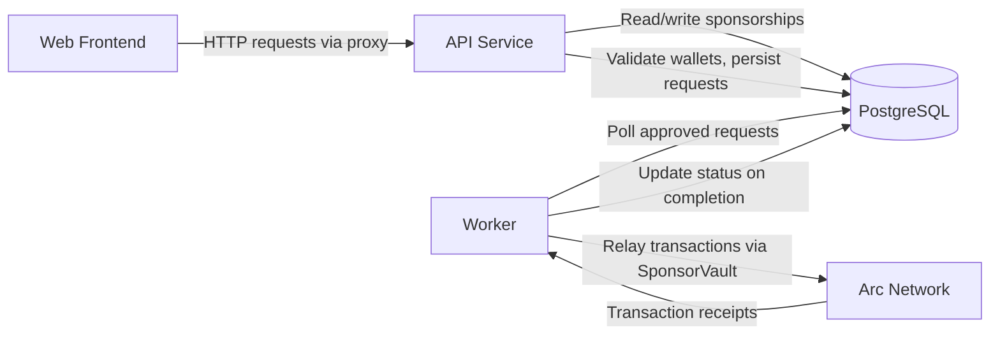

# Project Structure

ArcPass is organized as a pnpm monorepo managed by [Turborepo](../contributing/development-guidelines.md). The repository contains three application workspaces, three package workspaces, and a Foundry-based smart contracts directory.

## Workspace Layout

```
arcpass/
├── apps/
│   ├── api/          # Sponsorship API service
│   ├── worker/       # Blockchain relay worker
│   └── web/          # Public onboarding frontend
├── packages/
│   ├── shared/       # Shared types, Prisma client, and utilities
│   ├── sdk/          # Developer integration SDK (planned)
│   └── ui/           # Reusable UI components (planned)
├── contracts/        # Solidity smart contracts (Foundry)
├── turbo.json        # Turborepo task configuration
└── pnpm-workspace.yaml
```

## Workspace Responsibilities

| Workspace | Description |
|-----------|-------------|
| `apps/api` | Fastify 5.x HTTP service that handles wallet registration, sponsorship requests, rate limiting, and replay protection. |
| `apps/worker` | Background process that polls for approved sponsorship requests and relays them on-chain via the SponsorVault contract. |
| `apps/web` | Next.js 16 frontend providing the public onboarding interface and infrastructure dashboard. |
| `packages/shared` | Shared Prisma client, database schema, TypeScript types, and utility functions consumed by both `api` and `worker`. |
| `packages/sdk` | Planned developer SDK for third-party integrations with the ArcPass sponsorship API. |
| `packages/ui` | Planned reusable UI component library for consistent styling across ArcPass frontends. |
| `contracts` | Foundry project containing SponsorVault and SponsorshipRegistry Solidity contracts deployed to Arc Network. |

## Dependency Graph

Both `apps/api` and `apps/worker` depend on `@arcpass/shared` for database access and shared types. The `apps/web` frontend also imports from `@arcpass/shared`. Turborepo ensures packages are built before dependent apps via `dependsOn: ["^build"]` task ordering.

## Runtime Relationships

The following diagram shows how workspaces interact at runtime, including external systems:



### Data Flow Summary

1. **Web → API**: The Next.js frontend proxies all backend requests through a catch-all route handler (`/api/backend/[...path]`) to the internal Fastify API service.
2. **API → PostgreSQL**: The API service validates incoming requests and persists wallet registrations, sponsorship requests, and rate-limit state to PostgreSQL via Prisma.
3. **Worker → PostgreSQL**: The worker polls the database for approved sponsorship requests using row-level locking (`SELECT FOR UPDATE SKIP LOCKED`) to prevent duplicate processing.
4. **Worker → Arc Network**: The worker relays approved sponsorships on-chain by calling `sponsorTransfer()` on the SponsorVault contract, then records the transaction receipt.
5. **Arc Network → Worker**: Transaction receipts confirm successful relay execution, triggering a status update from `relayed` to `completed`.

## Related Documentation

- [Installation Guide](./installation.md) — local development setup and prerequisites
- [System Overview](../architecture/system-overview.md) — full request flow and Docker networking
- [API Architecture](../backend/api-architecture.md) — Fastify plugin system and service layer
- [Contracts Overview](../contracts/contracts-overview.md) — SponsorVault and SponsorshipRegistry details
