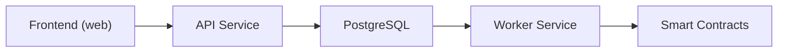

# ArcPass Documentation

ArcPass is the public onboarding infrastructure layer for Arc Network. It solves the cold-start gas problem by sponsoring the first transaction for eligible wallets, enabling frictionless onboarding without requiring new users to acquire gas tokens before interacting with the network.

## Vision

Every new wallet on Arc Network should be able to submit its first transaction without friction. ArcPass removes the cold-start barrier by providing a sponsored relay service that covers gas costs for eligible onboarding transactions, making Arc accessible from the very first interaction.

## Core Goals

- **Solve the cold-start gas problem** — New wallets receive sponsored gas for their first transaction, eliminating the need to bridge or purchase tokens before onboarding.
- **Relay execution** — A background worker picks up approved sponsorship requests, relays them on-chain through the SponsorVault contract, and tracks confirmation status end-to-end.
- **Developer integration** — A clean API and future SDK allow ecosystem developers to integrate ArcPass sponsorship into their own onboarding flows.

## Architecture Overview

The system follows a request-driven pipeline: the frontend submits sponsorship requests through the API, which validates and persists them in PostgreSQL. The worker service polls for approved requests, relays them on-chain via the SponsorVault and SponsorshipRegistry smart contracts, and updates their status upon confirmation.

## Documentation Sections

- [Getting Started](./getting-started/installation.md) — Local development setup, prerequisites, and project structure
- [Architecture](./architecture/system-overview.md) — System design, request flow, and runtime behavior
- [Backend](./backend/api-architecture.md) — Fastify API architecture, plugins, and database layer
- [Frontend](./frontend/frontend-architecture.md) — Next.js App Router, component patterns, and API integration
- [Contracts](./contracts/contracts-overview.md) — Smart contract design, deployment, and security model
- [Infrastructure](./infrastructure/docker-architecture.md) — Docker services, networking, and cloud deployment
- [API Reference](./api/endpoints.md) — Complete endpoint documentation with schemas and examples
- [Security](./security/security-model.md) — Rate limiting, replay protection, and trust boundaries
- [Operations](./operations/runbooks.md) — Runbooks, troubleshooting, and recovery procedures
- [Roadmap](./roadmap/technical-roadmap.md) — Completed milestones and planned work
- [Contributing](./contributing/development-guidelines.md) — Coding standards, commit conventions, and testing
