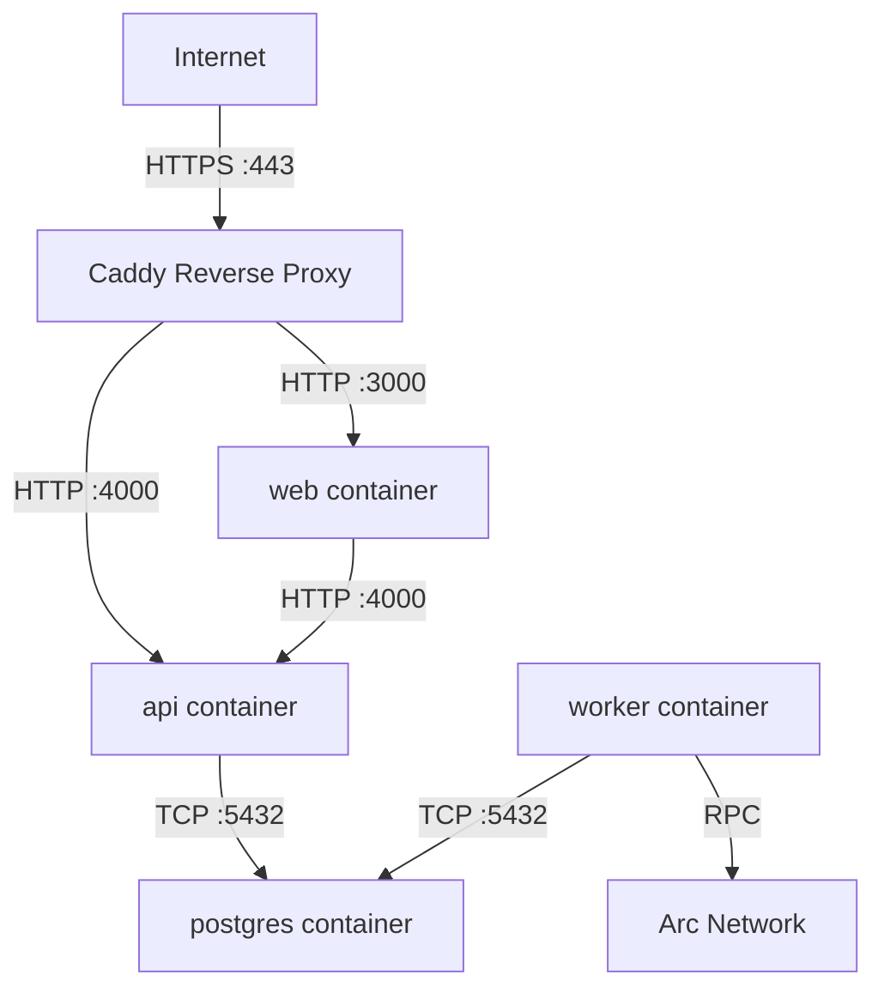

# GCP VPS Deployment

ArcPass runs as a set of Docker containers on a GCP Compute Engine virtual private server. This document covers the deployment procedures, domain routing, HTTPS configuration, and the production deployment checklist.

## VPS Deployment Procedures

### Infrastructure Overview

The production environment runs on a single GCP Compute Engine instance with Docker Compose orchestrating all services. This approach provides full control over the runtime environment while keeping operational complexity low for the MVP phase.



### Prerequisites

Before deploying, ensure the GCP Compute Engine instance has:

- Ubuntu 22.04 LTS (or later) as the base OS
- Docker Engine 24+ and Docker Compose v2 installed
- At least 2 vCPUs and 4 GB RAM
- A static external IP address assigned
- Firewall rules allowing inbound TCP on ports 80 and 443
- SSH access configured for deployment operators

### Initial Server Setup

1. **SSH into the VPS**:

```bash
gcloud compute ssh arcpass-prod --zone=us-central1-a
```

2. **Install Docker and Docker Compose**:

```bash
sudo apt-get update
sudo apt-get install -y docker.io docker-compose-v2
sudo systemctl enable docker
sudo usermod -aG docker $USER
```

3. **Clone the repository**:

```bash
git clone https://github.com/your-org/arcpass.git /opt/arcpass
cd /opt/arcpass
```

4. **Configure environment variables**:

```bash
cp .env.example .env
# Edit .env with production values
```

<Warning>Never commit the production `.env` file. Store secrets in GCP Secret Manager or a secure vault and inject them at deploy time.</Warning>

### Production Environment Variables

The following variables must be set for production deployment:

| Variable | Required | Description |
|----------|----------|-------------|
| `DATABASE_URL` | Yes | PostgreSQL connection string (use internal service name `postgres`) |
| `CHAIN_RPC_URL` | Yes | Arc Network RPC endpoint |
| `SPONSOR_PRIVATE_KEY` | Yes | Relay operator private key (64 hex chars) |
| `CONTRACT_ADDRESS_SPONSOR_VAULT` | Yes | Deployed SponsorVault contract address |
| `CONTRACT_ADDRESS_SPONSORSHIP_REGISTRY` | Yes | Deployed SponsorshipRegistry contract address |
| `CHAIN_ID` | Yes | Arc Network chain ID (default: `5042002`) |
| `CORS_ALLOWED_ORIGINS` | Yes | Comma-separated allowed origins for the production domain |
| `NEXT_PUBLIC_SPONSOR_VAULT_ADDRESS` | Yes | SponsorVault address for frontend display |
| `NEXT_PUBLIC_SPONSORSHIP_REGISTRY_ADDRESS` | Yes | SponsorshipRegistry address for frontend display |

### Deploying with Docker Compose

Start all services in detached mode:

```bash
cd /opt/arcpass
docker compose up -d --build
```

Verify all containers are running and healthy:

```bash
docker compose ps
docker compose logs --tail=50
```

<Note>The `api` and `worker` containers automatically run Prisma migrations on startup via their entrypoint commands. No separate migration step is needed for initial deployment.</Note>

### Updating a Running Deployment

To deploy a new version with zero-downtime intent:

```bash
cd /opt/arcpass
git pull origin main
docker compose build
docker compose up -d
```

Docker Compose recreates only containers whose images have changed, preserving the PostgreSQL volume.

## Domain Routing and HTTPS/TLS Configuration

### Domain Provider Configuration

Configure DNS records at your domain registrar (e.g., Google Domains, Cloudflare, Namecheap) to point to the GCP VPS static IP address.

| Record Type | Host | Value | TTL |
|-------------|------|-------|-----|
| A | `@` (root domain) | VPS static external IP | 300 |
| A | `www` | VPS static external IP | 300 |
| A | `api` (optional subdomain) | VPS static external IP | 300 |

<Info>Use an **A record** pointing to the static IPv4 address of the Compute Engine instance. If IPv6 is configured, add a corresponding AAAA record.</Info>

### TLS Certificate Provisioning with Caddy

ArcPass uses [Caddy](https://caddyserver.com/) as a reverse proxy for automatic HTTPS. Caddy provisions and renews TLS certificates from Let's Encrypt without manual intervention.

**Install Caddy on the VPS**:

```bash
sudo apt install -y debian-keyring debian-archive-keyring apt-transport-https
curl -1sLf 'https://dl.cloudsmith.io/public/caddy/stable/gpg.key' | sudo gpg --dearmor -o /usr/share/keyrings/caddy-stable-archive-keyring.gpg
curl -1sLf 'https://dl.cloudsmith.io/public/caddy/stable/debian.deb.txt' | sudo tee /etc/apt/sources.list.d/caddy-stable.list
sudo apt update
sudo apt install caddy
```

**Configure the Caddyfile** at `/etc/caddy/Caddyfile`:

```
arcpass.example.com {
    handle /api/* {
        reverse_proxy localhost:4000
    }

    handle {
        reverse_proxy localhost:3000
    }
}
```

<Tip>Replace `arcpass.example.com` with your actual production domain. Caddy automatically obtains a Let's Encrypt certificate on first request and handles renewal.</Tip>

**Start Caddy**:

```bash
sudo systemctl enable caddy
sudo systemctl start caddy
```

### TLS Certificate Lifecycle

- **Provisioning**: Caddy uses the ACME protocol to obtain certificates from Let's Encrypt automatically when the domain first receives traffic.
- **Renewal**: Certificates are renewed automatically before expiration (Let's Encrypt certificates are valid for 90 days; Caddy renews at ~30 days remaining).
- **Verification**: Confirm HTTPS is active:

```bash
curl -I https://arcpass.example.com/api/health
```

The response should include valid TLS headers and return HTTP 200 from the API health endpoint.

## Deployment Checklist

Follow this checklist for every production deployment:

### 1. Container Image Build

- [ ] Pull latest code from the deployment branch:
  ```bash
  cd /opt/arcpass && git pull origin main
  ```
- [ ] Build all container images:
  ```bash
  docker compose build --no-cache
  ```
- [ ] Verify images built successfully:
  ```bash
  docker compose images
  ```

### 2. Database Migration

- [ ] Create a database backup before migration:
  ```bash
  docker compose exec postgres pg_dump -U arcpass arcpass_dev > backup_$(date +%Y%m%d_%H%M%S).sql
  ```
- [ ] Start services (migrations run automatically on container startup):
  ```bash
  docker compose up -d
  ```
- [ ] Verify migrations applied successfully:
  ```bash
  docker compose logs api | grep -i "prisma migrate"
  ```

<Warning>Always back up the database before deploying migrations. The backup enables rollback if a migration introduces issues.</Warning>

### 3. Health Verification

- [ ] Confirm PostgreSQL is accepting connections:
  ```bash
  docker compose exec postgres pg_isready -U arcpass -d arcpass_dev
  ```
- [ ] Confirm API returns healthy:
  ```bash
  curl -f http://localhost:4000/health
  ```
- [ ] Confirm worker is polling (check logs for poll activity):
  ```bash
  docker compose logs --tail=20 worker | grep -i "poll"
  ```
- [ ] Confirm web frontend is serving pages:
  ```bash
  curl -f -o /dev/null -s -w "%{http_code}" http://localhost:3000
  ```
- [ ] Confirm HTTPS is terminating correctly:
  ```bash
  curl -I https://arcpass.example.com/api/health
  ```

### 4. Rollback Procedure

If the deployment introduces issues, roll back to the previous version:

1. **Stop the current deployment**:
   ```bash
   docker compose down
   ```

2. **Revert to the previous code version**:
   ```bash
   git checkout <previous-commit-sha>
   ```

3. **Restore the database backup** (if migrations were applied):
   ```bash
   docker compose up -d postgres
   docker compose exec -T postgres psql -U arcpass arcpass_dev < backup_YYYYMMDD_HHMMSS.sql
   ```

4. **Rebuild and restart with the previous version**:
   ```bash
   docker compose build
   docker compose up -d
   ```

5. **Verify rollback health**:
   ```bash
   curl -f http://localhost:4000/health
   docker compose ps
   ```

<Warning>If a migration has been applied that is not backward-compatible, you must restore from the database backup. Forward-only migrations cannot be rolled back with `prisma migrate` alone.</Warning>

## Monitoring and Maintenance

### Log Access

View real-time logs for all services:

```bash
docker compose logs -f
```

View logs for a specific service:

```bash
docker compose logs -f api
docker compose logs -f worker
```

### Resource Monitoring

Monitor container resource usage:

```bash
docker stats
```

### Automatic Restarts

All application services in `docker-compose.yml` are configured with `restart: unless-stopped`, ensuring they recover automatically from crashes without manual intervention.

## Related Documentation

- [Docker Architecture](./docker-architecture.md) — detailed Docker Compose service configuration
- [Runbooks](../operations/runbooks.md) — operational procedures and troubleshooting
- [System Overview](../architecture/system-overview.md) — full architecture and request flow
